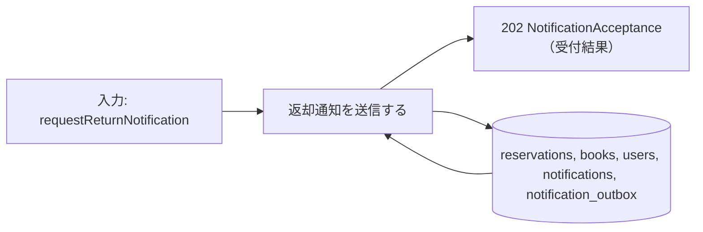
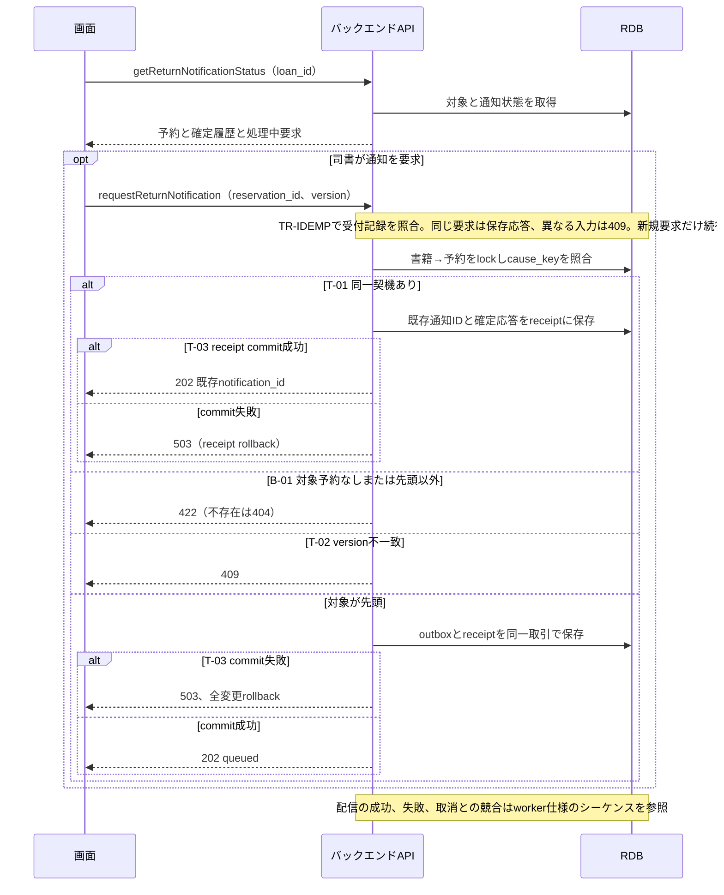

# 返却通知を送信する

## 概要

返却時または先頭予約の取消時に選ばれた利用者へ、返却通知を配信する。司書は貸出IDから受付状況と送信結果を確認する。

## データフロー



## シーケンス



## 分岐条件の接続

| 分岐ID | 条件の正本 | 結果 |
|---|---|---|
| B-01 | [返却通知対象判定](../../../../../../rdra/latest/条件.tsv) | 先頭予約→要求保存、対象外→422。自動要求で予約なしなら要求を作らない |
| T-01 | [TR-MQ](../../../_cross-cutting/technical-rules.md#TR-MQ) | 同じcause_keyあり→既存notification_id |
| T-02 | [TR-TX](../../../_cross-cutting/technical-rules.md#TR-TX) | version不一致→409 |
| T-03 | [TR-TX](../../../_cross-cutting/technical-rules.md#TR-TX) | 成功→202、失敗→rollbackして503 |

## 状態遷移参照

[状態](../../../../../../rdra/latest/状態.tsv)の予約の状態、遷移UC「返却通知を送信する」を参照する。
原子的な更新は[_model-summary.yaml](_model-summary.yaml)の操作を参照する。

## 関連 RDRA モデル

| モデル | 要素 | 適用箇所 |
|---|---|---|
| [BUC](../../../../../../rdra/latest/BUC.tsv) | 貸出業務 / 書籍を返却するフロー / 返却通知を送信する | 所属と入力契機 |
| [アクター](../../../../../../rdra/latest/アクター.tsv) | 司書 | 操作主体 |
| [情報](../../../../../../rdra/latest/情報.tsv) | 予約, 利用者, 通知, 書籍 | データ操作と契約 |

## E2E 完了条件（BDD）

```gherkin
Feature: 返却通知を送信する
  Scenario: 返却通知が成功する
    Given 返却済み貸出L-001の書籍が予約待ちで、予約R-001が先頭の予約中である
    When R-001の返却通知をworkerが送信し、メール配信サービスが受理する
    Then 通知の成功記録を保存し、R-001は通知済みになる

  Scenario: 同じ通知契機を再要求する
    Given R-001の返却通知ID=N-001がqueuedである
    When 司書が新しいHTTP操作キーでR-001の通知を要求する
    Then 既存N-001の受付結果を返し、通知要求は増えない

  Scenario: 配信結果が不明になる
    Given メール配信サービスが受理したか判断できないタイムアウトが起きた
    When workerが送信結果を保存する
    Then 通知をunknownとして照会でき、自動再送で同じメールを増やさない
```

## ティア別仕様

- [tier-backend-api.md](tier-backend-api.md)
- [tier-frontend-staff.md](tier-frontend-staff.md)
- [tier-worker.md](tier-worker.md)
- [API索引](_api-summary.yaml)のrequestReturnNotification
