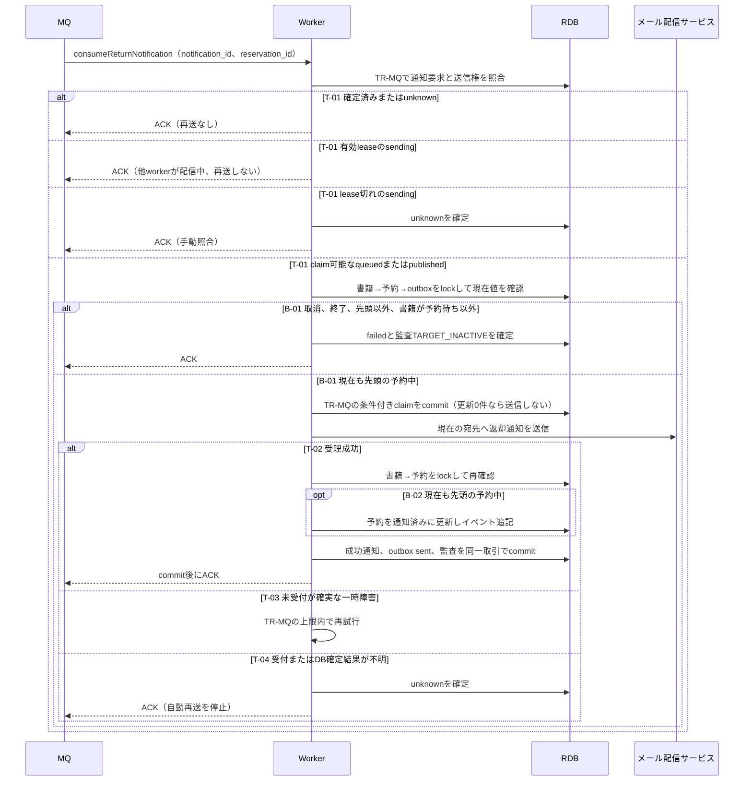

# 返却通知を送信するworker仕様

## 責務

consumeReturnNotificationの通知IDに対応する返却通知を送信し、結果を保存する。

## 契約

[API索引](_api-summary.yaml)のconsumeReturnNotificationを参照する。
配送と再送は[TR-MQ](../../../_cross-cutting/technical-rules.md#TR-MQ)を適用する。

## シーケンス



## 分岐と結果

| 分岐 | 判定 | 結果 |
|---|---|---|
| T-01 | TR-MQのclaim条件 | 確定済み・有効lease→ACK、lease切れ→unknown、claim可能→現在状態を確認 |
| B-01 | spec.mdの返却通知対象判定と、取消や貸出の後の現在状態 | 現在の通知対象だけ送信する |
| B-02 | 予約が現在も先頭の予約中 | 通知済みに遷移する。それ以外は状態を維持する |
| T-02/T-03/T-04 | TR-MQの配信結果 | 成功記録、限定再試行、結果不明の手動照合 |

## データ操作

| 対象 | 操作 |
|---|---|
| notifications | 成功または確定失敗だけINSERTする。queuedを成功として記録しない |
| notification_outbox | 送信権、配信結果、試行回数をUPDATEする |
| reservationsとreservations_events | 条件付きの通知済み更新とイベントINSERT |
| audit_logs | 結果保存と同じ取引でINSERTする |

messageのreservation_idとoutboxの対象予約IDが違う場合はDLQへ隔離する。
件名は「予約書籍の返却のお知らせ」とし、本文に書籍名と来館による貸出の案内を含める。
通知の内容と宛先には送信直前の利用者情報を用いる。

## ティア完了条件

```gherkin
Feature: 返却通知worker
  Scenario: 送信中に取り消された予約を上書きしない
    Given N-001の送信開始後にR-001が取り消された
    When メール配信サービスが受理を返す
    Then 通知の成功を保存するがR-001を通知済みに戻さない

  Scenario: DB確定に失敗した受理済み通知
    Given 配信サービスがN-001を受理した
    When 結果保存のDB取引が失敗する
    Then lease切れの復旧でunknownとし、自動再送せず事業者の履歴を照合する
```

## 配信権の完了条件

```gherkin
Feature: 返却通知を送信するの配信権
  Scenario: 配信中の通知を別workerが受信する
    Given N-001はsendingでlease_untilが現在時刻より後である
    When 別workerが同じN-001を受信する
    Then 外部送信せずACKし、先行workerのclaimを維持する

  Scenario: 対象外抑止後に再配信される
    Given N-001は対象外としてfailedと監査TARGET_INACTIVEが保存済みである
    When 同じN-001を受信する
    Then メールと通知履歴を増やさずACKする
```

```gherkin
Feature: 返却通知を送信するの結果確定
  Scenario: 送信権を失ったworkerが結果を保存する
    Given N-001のclaimが既にunknownへ移り元のclaim条件に一致しない
    When 元のworkerが成功通知を保存してoutboxを条件付き更新する
    Then 更新件数0を検出して通知と業務状態の変更をrollbackする

  Scenario: ACK済みの重複後に送信workerが停止する
    Given 重複受信が有効leaseを確認してACKし、元workerが停止した
    When lease切れ後の毎分復旧走査がN-001を検出する
    Then N-001をunknownへ変更し自動再送を停止する
```
