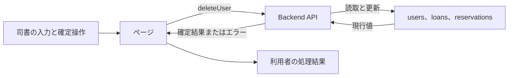
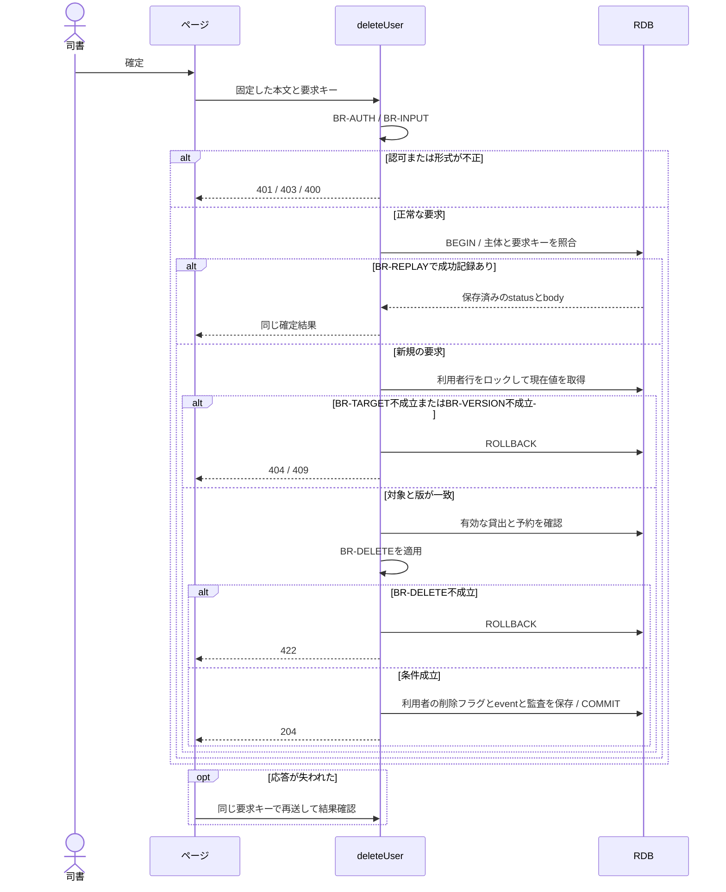

# 利用者を削除する

## 概要

司書が利用を終了した利用者を一覧から除外する。
貸出履歴と通知の参照関係を保持する。

## データフロー



## シーケンス



## 分岐の接続

| 分岐ID | 条件の正本 | 成立時 | 不成立時 |
|---|---|---|---|
| BR-AUTH | [TR-AUTH](../../../_cross-cutting/technical-rules.md#tr-auth-認証と参照範囲)とdeleteUserの許可ロール | 利用者の更新へ進む | 認証不成立401、許可外403 |
| BR-INPUT | [分割契約](../../../_cross-cutting/api/openapi.yaml)のdeleteUser | 対象の確認へ進む | 400 INVALID_INPUT、業務変更なし |
| BR-TARGET | 利用者の識別子が一致しdeleted=false | 対象を処理する | 404 NOT_FOUND、業務変更なし |
| BR-DELETE | [条件](../../../../../rdra/latest/条件.tsv)の利用者削除可否判定 | 有効な取引がない対象を削除する | 422 BUSINESS_RULE_VIOLATION、削除なし |
| BR-REPLAY | [TR-IDEMP](../../../_cross-cutting/technical-rules.md#tr-idemp-再送と結果の回復) | 同じ要求の成功結果を返す | 未処理は新規実行、異なるhashは409 |
| BR-VERSION | If-Matchが利用者のversionと一致 | 版を更新してcommitする | 409 VERSION_CONFLICT、業務変更なし |

## 状態遷移参照

[情報](../../../../../rdra/latest/情報.tsv)の「利用者」を参照する。
本UCは貸出と予約の業務状態を変更しない。

永続化対象は[_model-summary.yaml](_model-summary.yaml)の操作を参照する。

## 関連RDRAモデル

| 種類 | 要素の参照先 |
|---|---|
| 情報 | [利用者](../../../../../rdra/latest/情報.tsv) の「利用者」 |
| 画面 | [利用者削除確認画面](../../../../../rdra/latest/BUC.tsv) の「利用者削除確認画面」 |
| アクター | [司書](../../../../../rdra/latest/アクター.tsv) |

## E2E完了条件

```gherkin
Feature: 利用者を削除する
  Scenario: 利用者を削除するの業務結果
    Given 利用者U-001には返却済み貸出だけがあり、有効予約はない
    When 削除を確定する
    Then U-001が利用者一覧から除外され、過去の貸出履歴は保持される

  Scenario: 利用者を削除するの不成立時
    Given 利用者U-002に未返却貸出が1件ある
    When 削除を確定する
    Then 削除は422となり、利用者と貸出が維持される

  Scenario Outline: 継続中の取引がある利用者を保持する
    Given U-001に<取引>が1件ある
    When 利用者削除を要求する
    Then 422となり、返却または予約取消を案内し、利用者を保持する
    Examples:
      | 取引 |
      | 貸出中の貸出 |
      | 延滞の貸出 |
      | 予約中の予約 |
      | 通知済みの予約 |
```

## ティア別仕様

- [tier-frontend-staff](tier-frontend-staff.md)
- [tier-backend-api](tier-backend-api.md)
