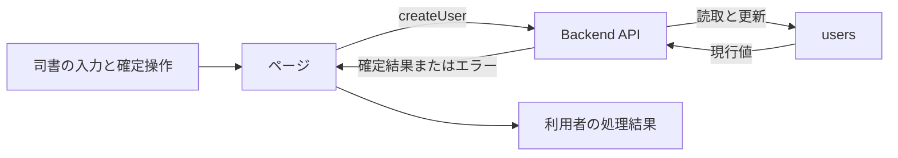
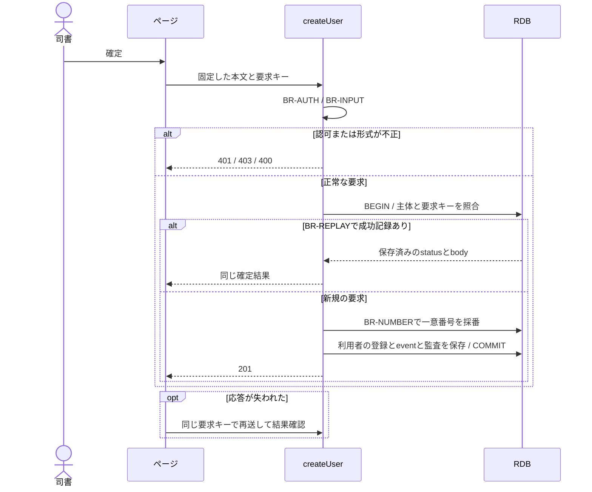

# 利用者を登録する

## 概要

司書が氏名と連絡先を登録し、貸出や予約で使用する一意の利用者番号を確認する。

## データフロー



## シーケンス



## 分岐の接続

| 分岐ID | 条件の正本 | 成立時 | 不成立時 |
|---|---|---|---|
| BR-AUTH | [TR-AUTH](../../../_cross-cutting/technical-rules.md#tr-auth-認証と参照範囲)とcreateUserの許可ロール | 利用者の更新へ進む | 認証不成立401、許可外403 |
| BR-INPUT | [分割契約](../../../_cross-cutting/api/openapi.yaml)のcreateUser | 登録値の確認へ進む | 400 INVALID_INPUT、業務変更なし |
| BR-NUMBER | RDBの利用者番号一意制約 | 採番した番号で登録する | 409 VERSION_CONFLICTでrollbackし、別の番号へ再採番しない |
| BR-REPLAY | [TR-IDEMP](../../../_cross-cutting/technical-rules.md#tr-idemp-再送と結果の回復) | 同じ要求の成功結果を返す | 未処理は新規実行、異なるhashは409 |

## 状態遷移参照

[情報](../../../../../rdra/latest/情報.tsv)の「利用者」を参照する。
本UCは貸出と予約の業務状態を変更しない。

永続化対象は[_model-summary.yaml](_model-summary.yaml)の操作を参照する。

## 関連RDRAモデル

| 種類 | 要素の参照先 |
|---|---|
| 情報 | [利用者](../../../../../rdra/latest/情報.tsv) の「利用者」 |
| 画面 | [利用者登録画面](../../../../../rdra/latest/BUC.tsv) の「利用者登録画面」 |
| アクター | [司書](../../../../../rdra/latest/アクター.tsv) |

## E2E完了条件

```gherkin
Feature: 利用者を登録する
  Scenario: 利用者を登録するの業務結果
    Given 氏名「山田花子」、メール「hanako@example.com」、電話番号と住所は空欄、利用者区分「利用者」を入力している
    When 登録を確定する
    Then 利用者番号が1つ表示され、その番号で利用者を参照できる

  Scenario: 利用者を登録するの不成立時
    Given メールアドレスが「hanako」である
    When 登録を確定する
    Then 登録は400となり、利用者は作成されない

  Scenario Outline: 利用者区分を保存する
    Given 氏名「山田花子」、メール「hanako@example.com」、区分<区分>を入力している
    When 登録を確定する
    Then 一意な利用者番号と区分<区分>が保存される
    Examples:
      | 区分 |
      | 司書 |
      | 利用者 |

  Scenario: 利用者の氏名と連絡先を保存する
    Given 氏名「山田花子」、メール「hanako@example.com」、電話「090-1234-5678」、住所「東京都」を入力している
    When 登録を確定する
    Then 再取得した同一利用者番号の氏名と3つの連絡先が入力値と一致する

  Scenario: 利用者の登録日時を記録する
    Given サーバー時刻が2026-09-06T01:00:00Zである
    When 利用者を登録する
    Then registered_atとupdated_atが両方2026-09-06T01:00:00Zになる
```

## ティア別仕様

- [tier-frontend-staff](tier-frontend-staff.md)
- [tier-backend-api](tier-backend-api.md)
