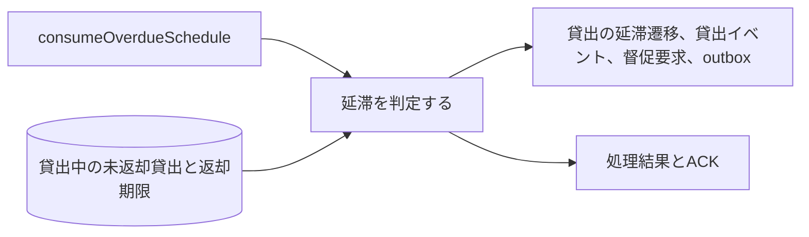
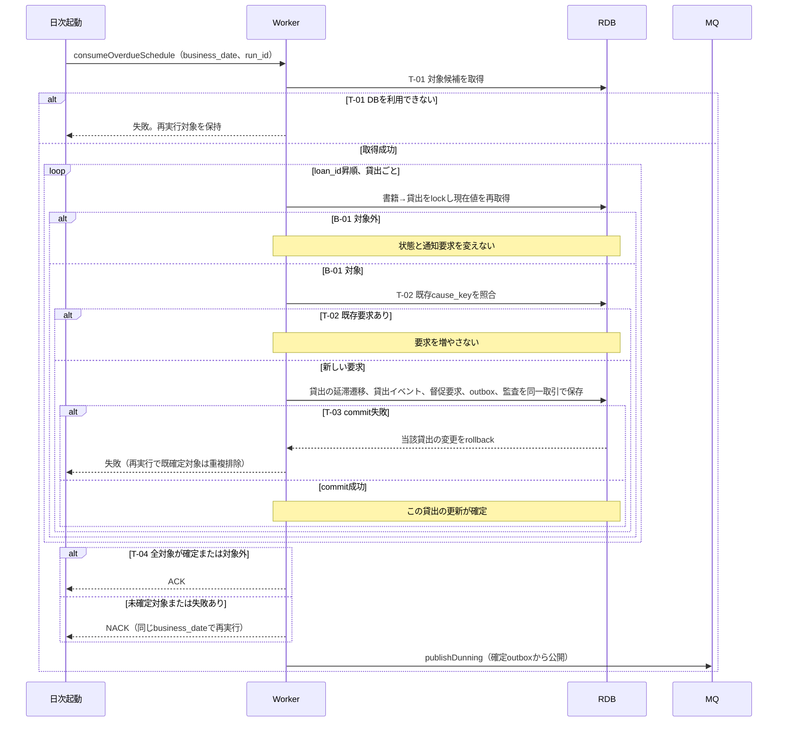

# 延滞を判定する

## 概要

日次処理が返却期限を過ぎた未返却貸出を延滞にする。状態変更と同時に督促要求を保存する。

## データフロー



## シーケンス



## 分岐条件の接続

| 分岐ID | 正本 | 結果 |
|---|---|---|
| B-01 | [条件](../../../../../rdra/latest/条件.tsv)の延滞判定 | 成立→要求保存、不成立→当該貸出をスキップ |
| T-01 | [TR-DATE](../../../_cross-cutting/technical-rules.md#TR-DATE) | DB取得失敗→処理失敗、正常→走査 |
| T-02 | [TR-MQ](../../../_cross-cutting/technical-rules.md#TR-MQ)のcause_key | 既存あり→追加なし、なし→要求作成 |
| T-04 | worker仕様の再開 | 全対象確定または対象外→ACK、失敗あり→NACK |
| T-03 | [TR-TX](../../../_cross-cutting/technical-rules.md#TR-TX) | 失敗→当該取引rollback、成功→次の対象 |

## 状態遷移参照

[状態](../../../../../rdra/latest/状態.tsv)の貸出の状態、遷移UC「延滞を判定する」を参照する。

## 関連 RDRA モデル

| モデル | 要素 | 適用箇所 |
|---|---|---|
| [BUC](../../../../../rdra/latest/BUC.tsv) | 期限管理業務 / 延滞者に督促するフロー / 延滞を判定する | 日次起動と処理責任 |
| [情報](../../../../../rdra/latest/情報.tsv) | 貸出, 利用者 | 取得と保存 |
| [外部システム](../../../../../rdra/latest/外部システム.tsv) | メール配信サービス | 配信workerの外部送信 |

## E2E 完了条件（BDD）

```gherkin
Feature: 延滞を判定する
  Scenario: 期限を過ぎた貸出を延滞にする
    Given business_date=2026-09-06、返却期限2026-09-05のL-001が貸出中である
    When 延滞判定を実行する
    Then L-001を延滞にし、督促要求を1件保存する

  Scenario: 期限当日は延滞にしない
    Given business_date=2026-09-06、返却期限2026-09-06のL-002が貸出中である
    When 延滞判定を実行する
    Then L-002は貸出中のまま、督促要求を作らない

  Scenario: 返却との競合
    Given L-001の返却が書籍lockを先に獲得して確定した
    When 同じ貸出の延滞判定がlock後に状態を読む
    Then 返却済みを維持し、督促要求を作らない
```

## ティア別仕様

- [worker仕様](tier-worker.md)
- [契約索引](_api-summary.yaml)のconsumeOverdueSchedule
