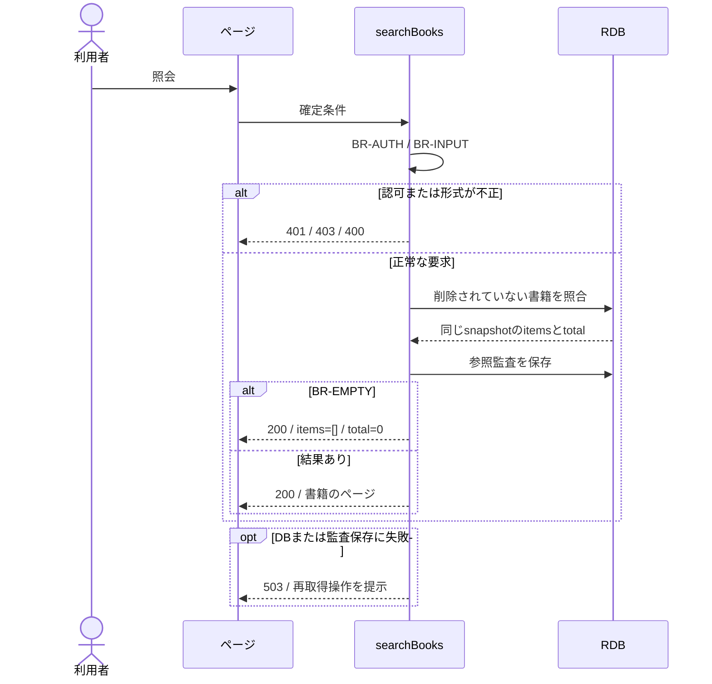

# 書籍を検索する

## 概要

利用者または司書が検索条件を指定し、該当する書籍と在庫状況を確認する。

## データフロー


## シーケンス



## 分岐の接続

| 分岐ID | 条件の正本 | 成立時 | 不成立時 |
|---|---|---|---|
| BR-AUTH | [TR-AUTH](../../../_cross-cutting/technical-rules.md#tr-auth-認証と参照範囲)とsearchBooksの許可ロール | 書籍の照会へ進む | 認証不成立401、許可外403 |
| BR-INPUT | [分割契約](../../../_cross-cutting/api/openapi.yaml)のsearchBooks | 対象の確認へ進む | 400 INVALID_INPUT、業務変更なし |
| BR-FILTER | [条件](../../../../../rdra/latest/条件.tsv)の書籍検索条件判定、[TR-SEARCH](../../../_cross-cutting/technical-rules.md#tr-search-検索条件の結合) | 一致する書籍を結果へ含める | 一致しない書籍を除外する |
| BR-EMPTY | 同じ検索条件の総件数が0件 | 200、items=[]、total=0 | 200、指定ページと総件数 |

## 状態遷移参照

[状態](../../../../../rdra/latest/状態.tsv)の「書籍の状態」を表示対象として参照する。
本UCは在庫状態を変更しない。

永続化対象は[_model-summary.yaml](_model-summary.yaml)の操作を参照する。

## 関連RDRAモデル

| 種類 | 要素の参照先 |
|---|---|
| 情報 | [書籍](../../../../../rdra/latest/情報.tsv) の「書籍」 |
| 情報 | [ジャンル](../../../../../rdra/latest/情報.tsv) の「ジャンル」 |
| 条件 | [書籍検索条件判定](../../../../../rdra/latest/条件.tsv) の「書籍検索条件判定」 |
| 条件 | [在庫状況判定](../../../../../rdra/latest/条件.tsv) の「在庫状況判定」 |
| 画面 | [蔵書検索画面](../../../../../rdra/latest/BUC.tsv) の「蔵書検索画面」 |
| 画面 | [窓口蔵書検索画面](../../../../../rdra/latest/BUC.tsv) の「窓口蔵書検索画面」 |
| アクター | [利用者、司書](../../../../../rdra/latest/アクター.tsv) |

## E2E完了条件

```gherkin
Feature: 書籍を検索する
  Scenario: 書籍を検索するの業務結果
    Given ISBN「9784101010014」の書籍B-001とISBN「9784101010137」の書籍B-002が登録されている
    When ISBN「9784101010014」で検索する
    Then B-001だけが結果に表示され、選択するとその書籍の詳細へ遷移する

  Scenario: 書籍を検索するの不成立時
    Given 検索条件に一致する書籍が0件
    When ISBN「9784101010014」で検索する
    Then 検索条件を保持したまま該当書籍なしを表示する

  Scenario Outline: 属性に対応した検索を行う
    Given B-001のタイトルは「こころ」、著者は「夏目漱石」、ISBNは「9784101010137」、ジャンルはG-LITである
    When 種別<種別>、query<検索値>で検索する
    Then B-001が結果に含まれる
    Examples:
      | 種別 | 検索値 |
      | キーワード | 夏目 |
      | タイトル | ここ |
      | 著者 | 漱石 |
      | ISBN | 9784101010137 |

  Scenario Outline: ジャンル区分に一致する書籍を取得する
    Given ジャンル<区分>に属する書籍B-001があり、そのgenre_idをlistGenresから取得している
    When 種別ジャンルでgenre_idsに取得したIDを指定する
    Then B-001が含まれ、別ジャンルの書籍は含まれない
    Examples:
      | 区分 |
      | 文学 |
      | 社会科学 |
      | 自然科学 |
      | 技術 |
      | 芸術 |
      | 歴史 |
      | 児童書 |
      | その他 |

  Scenario: 複数条件を結合する
    Given B-001は文学で貸出中、B-002は技術で在庫あり、B-003は歴史で貸出中である
    When 文学と技術を選択し状態を貸出中に限定する
    Then B-001だけが表示される
```


```gherkin
Feature: 検索語がない検索
  Scenario: すべての条件が空
    Given 登録済みで未削除の蔵書が3冊ある
    When kind=キーワードでqueryとフィルターを省略して検索する
    Then 200となりtotalは3になる

  Scenario: ジャンルだけを選択する
    Given G-LITの書籍が2冊、G-SCIの書籍が1冊ある
    When kind=ジャンルでgenre_ids=G-LITを指定しqueryを省略する
    Then 200となりG-LITの2冊だけを返す
```

## ティア別仕様

- [tier-frontend-user](tier-frontend-user.md)
- [tier-frontend-staff](tier-frontend-staff.md)
- [tier-backend-api](tier-backend-api.md)
