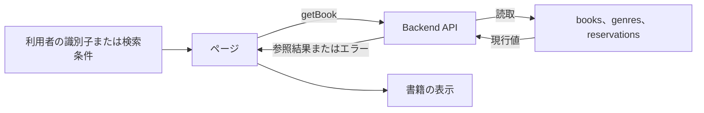
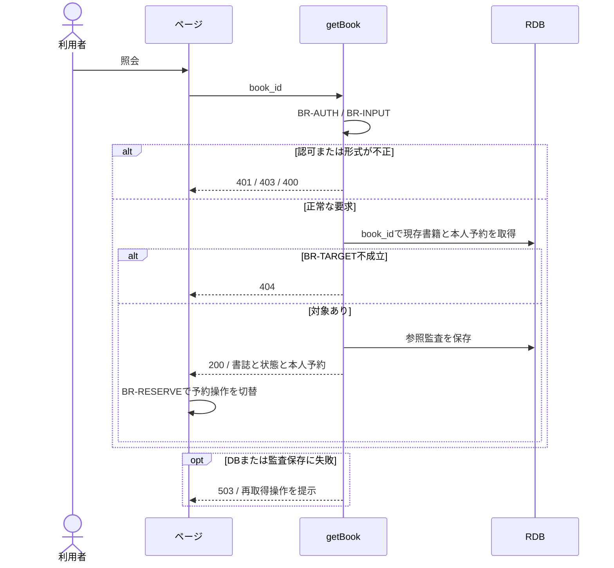

# 書籍詳細を参照する

## 概要

利用者が書籍IDから書誌情報と在庫状況を確認し、その書籍の予約操作へ進む。

## データフロー



## シーケンス



## 分岐の接続

| 分岐ID | 条件の正本 | 成立時 | 不成立時 |
|---|---|---|---|
| BR-AUTH | [TR-AUTH](../../../_cross-cutting/technical-rules.md#tr-auth-認証と参照範囲)とgetBookの許可ロール | 書籍の照会へ進む | 認証不成立401、許可外403 |
| BR-INPUT | [分割契約](../../../_cross-cutting/api/openapi/openapi.yaml)のgetBook | 対象の確認へ進む | 400 INVALID_INPUT、業務変更なし |
| BR-TARGET | 書籍の識別子が一致しdeleted=false | 対象を処理する | 404 NOT_FOUND、業務変更なし |
| BR-RESERVE | [条件](../../../../../rdra/latest/条件.tsv)の予約可否判定と媒体種別判定 | 紙の貸出中または予約待ちは予約画面へ進める | 詳細は200で表示し予約操作を無効化する |

## 状態遷移参照

[状態](../../../../../rdra/latest/状態.tsv)の「書籍の状態」を表示対象として参照する。
本UCは在庫状態を変更しない。

永続化対象は[_model-summary.yaml](_model-summary.yaml)の操作を参照する。

## 関連RDRAモデル

| 種類 | 要素の参照先 |
|---|---|
| 情報 | [書籍](../../../../../rdra/latest/情報.tsv) の「書籍」 |
| 情報 | [ジャンル](../../../../../rdra/latest/情報.tsv) の「ジャンル」 |
| 情報 | [予約](../../../../../rdra/latest/情報.tsv) の「予約」 |
| 条件 | [在庫状況判定](../../../../../rdra/latest/条件.tsv) の「在庫状況判定」 |
| 画面 | [書籍詳細・在庫状況画面](../../../../../rdra/latest/BUC.tsv) の「書籍詳細・在庫状況画面」 |
| アクター | [利用者](../../../../../rdra/latest/アクター.tsv) |

## E2E完了条件

```gherkin
Feature: 書籍詳細を参照する
  Scenario: 書籍詳細を参照するの業務結果
    Given 書籍B-001「こころ」が紙で予約待ちである
    When 書籍詳細を表示する
    Then 書誌情報と予約待ちが表示され、B-001を対象に予約画面へ進める

  Scenario: 書籍詳細を参照するの不成立時
    Given 書籍B-MISSINGが存在しない
    When 書籍詳細を表示する
    Then 対象なしを表示し、予約操作を利用できない

  Scenario Outline: 予約操作の可否を表示する
    Given B-001の媒体種別は<媒体>で状態は<状態>である
    When 書籍詳細を開く
    Then 予約ボタンは<操作>になる
    Examples:
      | 媒体 | 状態 | 操作 |
      | 紙 | 貸出中 | 有効 |
      | 紙 | 予約待ち | 有効 |
      | 紙 | 在庫あり | 無効 |
      | 電子 | 貸出中 | 無効 |

  Scenario: 本人の予約順位だけを表示する
    Given U-001がB-001を2位で予約中で総予約数が3件である
    When U-001としてB-001の詳細を取得する
    Then 自分の順位2と予約中と総数3が表示され、他人の利用者番号は返されない
```

## ティア別仕様

- [tier-frontend-user](tier-frontend-user.md)
- [tier-backend-api](tier-backend-api.md)
