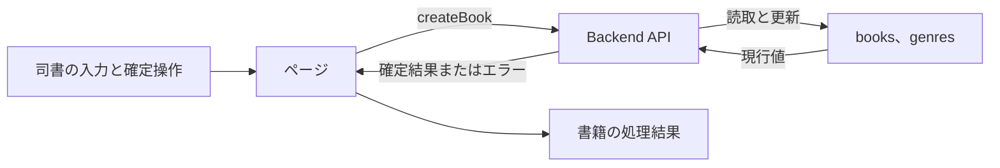
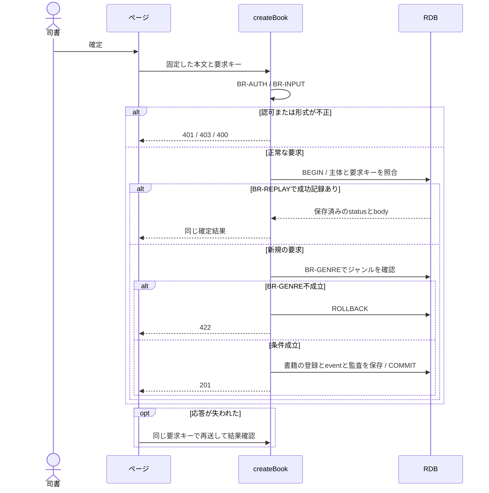

# 書籍を登録する

## 概要

司書が書誌情報を入力し、書籍を蔵書へ追加して採番された書籍IDを確認する。

## データフロー



## シーケンス



## 分岐の接続

| 分岐ID | 条件の正本 | 成立時 | 不成立時 |
|---|---|---|---|
| BR-AUTH | [TR-AUTH](../../../_cross-cutting/technical-rules.md#tr-auth-認証と参照範囲)とcreateBookの許可ロール | 書籍の更新へ進む | 認証不成立401、許可外403 |
| BR-INPUT | [分割契約](../../../_cross-cutting/api/openapi/openapi.yaml)のcreateBook | 登録値の確認へ進む | 400 INVALID_INPUT、業務変更なし |
| BR-GENRE | 指定genre_idがgenresに存在する | 書籍を採番して登録する | 422 BUSINESS_RULE_VIOLATION、登録なし |
| BR-MEDIA | [条件](../../../../../rdra/latest/条件.tsv)の媒体種別判定 | 紙と電子を登録対象として扱う | 未定義の媒体値はBR-INPUTで400 |
| BR-REPLAY | [TR-IDEMP](../../../_cross-cutting/technical-rules.md#tr-idemp-再送と結果の回復) | 同じ要求の成功結果を返す | 未処理は新規実行、異なるhashは409 |

## 状態遷移参照

[状態](../../../../../rdra/latest/状態.tsv)の状態モデル「書籍の状態」、遷移UC「書籍を登録する」を適用する。

永続化対象は[_model-summary.yaml](_model-summary.yaml)の操作を参照する。

## 関連RDRAモデル

| 種類 | 要素の参照先 |
|---|---|
| 情報 | [書籍](../../../../../rdra/latest/情報.tsv) の「書籍」 |
| 情報 | [ジャンル](../../../../../rdra/latest/情報.tsv) の「ジャンル」 |
| 条件 | [媒体種別判定](../../../../../rdra/latest/条件.tsv) の「媒体種別判定」 |
| 画面 | [書籍登録画面](../../../../../rdra/latest/BUC.tsv) の「書籍登録画面」 |
| アクター | [司書](../../../../../rdra/latest/アクター.tsv) |

## E2E完了条件

```gherkin
Feature: 書籍を登録する
  Scenario: 書籍を登録するの業務結果
    Given ジャンルG-LIT「文学」が登録済みで、タイトル「吾輩は猫である」、著者「夏目漱石」、ISBN「9784101010014」、出版社「新潮社」、媒体「紙」を入力している
    When 登録を確定する
    Then 一意の書籍IDが表示され、その書籍を在庫ありとして蔵書一覧から参照できる

  Scenario: 書籍を登録するの不成立時
    Given 指定したジャンルG-MISSINGが存在しない
    When 登録を確定する
    Then 登録は422となり、新しい書籍は作成されない

  Scenario Outline: 媒体種別を登録する
    Given タイトル「資料1」、著者「著者1」、ジャンルG-LIT、ISBNと出版社はnull、媒体種別が<媒体>である
    When 書籍を登録する
    Then 採番された書籍に媒体種別<媒体>が保存され、在庫ありとして返される
    Examples:
      | 媒体 |
      | 紙 |
      | 電子 |

  Scenario: 書誌項目を保存する
    Given タイトル「こころ」、著者「夏目漱石」、ISBN「9784101010137」、出版社「新潮社」、ジャンルG-LITを入力している
    When 登録する
    Then 成功応答と再取得結果の5項目が入力値と一致する

  Scenario: 登録と更新の日時を確定する
    Given サーバー時刻が2026-09-06T01:00:00Zである
    When 書籍を登録する
    Then registered_atとupdated_atが両方2026-09-06T01:00:00Zになる
```

## ティア別仕様

- [tier-frontend-staff](tier-frontend-staff.md)
- [tier-backend-api](tier-backend-api.md)
