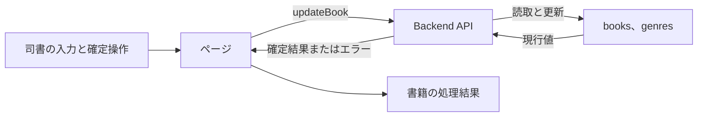
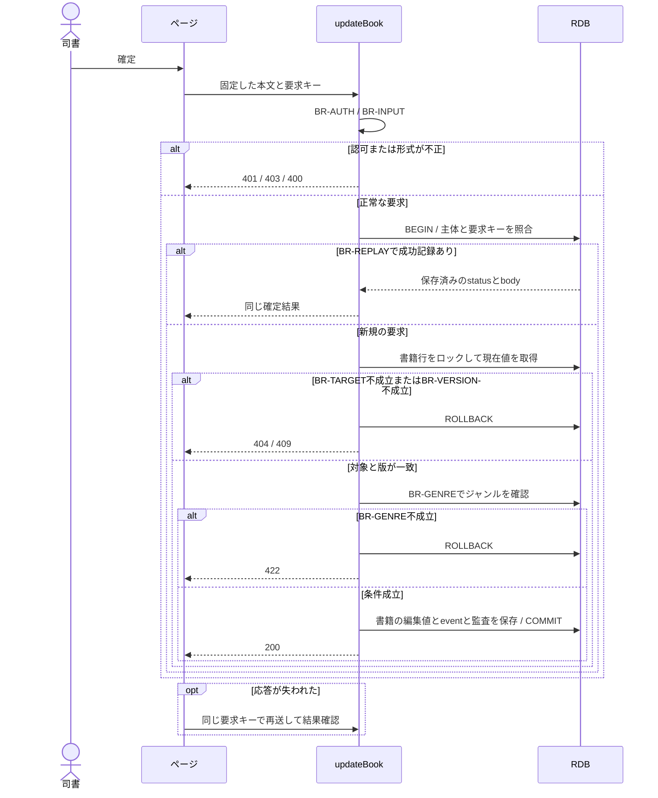

# 書籍を編集する

## 概要

司書が既存書籍の書誌情報を修正し、在庫の状態を維持したまま変更を保存する。

## データフロー



## シーケンス



## 分岐の接続

| 分岐ID | 条件の正本 | 成立時 | 不成立時 |
|---|---|---|---|
| BR-AUTH | [TR-AUTH](../../../_cross-cutting/technical-rules.md#tr-auth-認証と参照範囲)とupdateBookの許可ロール | 書籍の更新へ進む | 認証不成立401、許可外403 |
| BR-INPUT | [分割契約](../../../_cross-cutting/api/openapi.yaml)のupdateBook | 対象の確認へ進む | 400 INVALID_INPUT、業務変更なし |
| BR-TARGET | 書籍の識別子が一致しdeleted=false | 対象を処理する | 404 NOT_FOUND、業務変更なし |
| BR-GENRE | 指定genre_idがgenresに存在する | 書誌情報を更新する | 422 BUSINESS_RULE_VIOLATION、更新なし |
| BR-REPLAY | [TR-IDEMP](../../../_cross-cutting/technical-rules.md#tr-idemp-再送と結果の回復) | 同じ要求の成功結果を返す | 未処理は新規実行、異なるhashは409 |
| BR-VERSION | If-Matchが書籍のversionと一致 | 版を更新してcommitする | 409 VERSION_CONFLICT、業務変更なし |

## 状態遷移参照

[状態](../../../../../rdra/latest/状態.tsv)の「書籍の状態」を表示対象として参照する。
本UCは在庫状態を変更しない。

永続化対象は[_model-summary.yaml](_model-summary.yaml)の操作を参照する。

## 関連RDRAモデル

| 種類 | 要素の参照先 |
|---|---|
| 情報 | [書籍](../../../../../rdra/latest/情報.tsv) の「書籍」 |
| 情報 | [ジャンル](../../../../../rdra/latest/情報.tsv) の「ジャンル」 |
| 条件 | [媒体種別判定](../../../../../rdra/latest/条件.tsv) の「媒体種別判定」 |
| 画面 | [書籍編集画面](../../../../../rdra/latest/BUC.tsv) の「書籍編集画面」 |
| アクター | [司書](../../../../../rdra/latest/アクター.tsv) |

## E2E完了条件

```gherkin
Feature: 書籍を編集する
  Scenario: 書籍を編集するの業務結果
    Given 貸出中の書籍B-001のversionが3でタイトルが「こころ」である
    When 出版社を「新潮社」に変更して保存する
    Then 出版社が「新潮社」になり、書籍の状態は貸出中のまま維持される

  Scenario: 書籍を編集するの不成立時
    Given 取得したversion 3が保存前に4へ更新される
    When 出版社を「新潮社」に変更して保存する
    Then 変更は409となり、先行する更新内容が保持される

  Scenario: 書籍の登録日時を保持する
    Given B-001のregistered_atが2026-09-01T01:00:00Zである
    When 2026-09-06T01:00:00Zに出版社を更新する
    Then registered_atは維持されupdated_atが2026-09-06T01:00:00Zになる
```

## ティア別仕様

- [tier-frontend-staff](tier-frontend-staff.md)
- [tier-backend-api](tier-backend-api.md)
