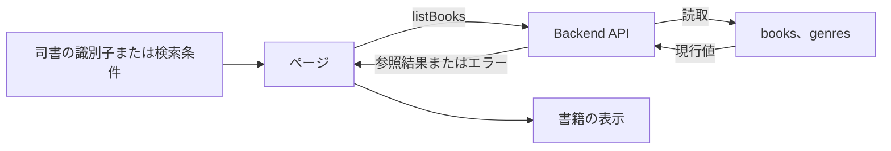
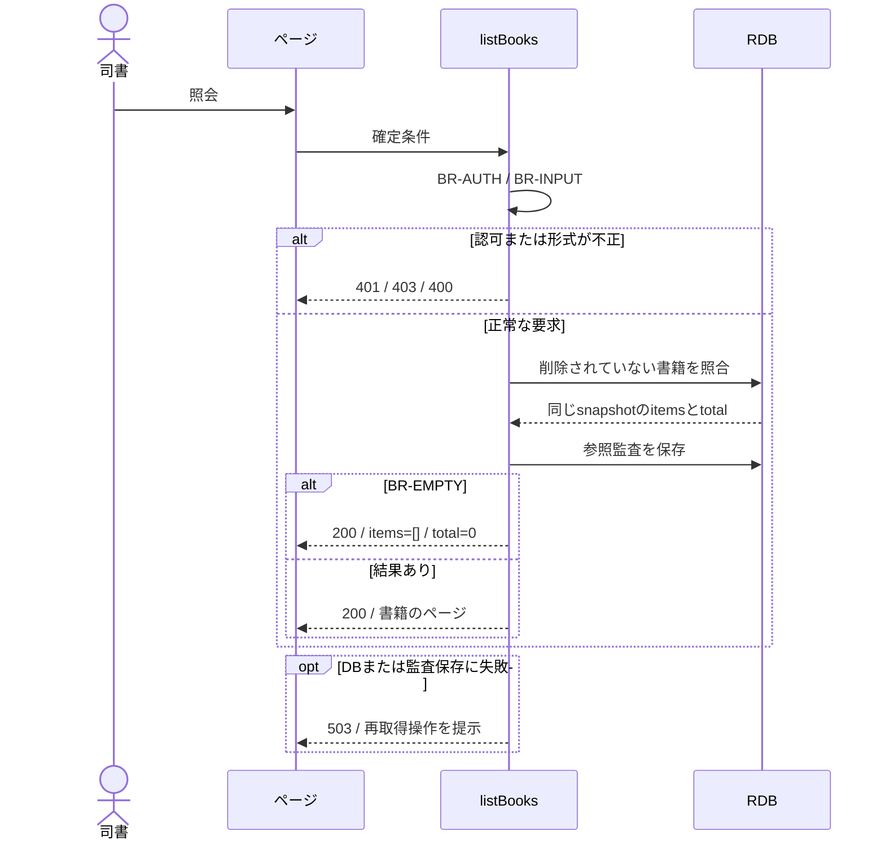

# 書籍一覧を参照する

## 概要

登録済みの蔵書とその在庫状況を一覧で確認し、編集、削除、予約状況照会の対象を選ぶ。

## データフロー



## シーケンス



## 分岐の接続

| 分岐ID | 条件の正本 | 成立時 | 不成立時 |
|---|---|---|---|
| BR-AUTH | [TR-AUTH](../../../_cross-cutting/technical-rules.md#tr-auth-認証と参照範囲)とlistBooksの許可ロール | 書籍の照会へ進む | 認証不成立401、許可外403 |
| BR-INPUT | [分割契約](../../../_cross-cutting/api/openapi.yaml)のlistBooks | 対象の確認へ進む | 400 INVALID_INPUT、業務変更なし |
| BR-FILTER | [条件](../../../../../rdra/latest/条件.tsv)の書籍検索条件判定、[TR-SEARCH](../../../_cross-cutting/technical-rules.md#tr-search-検索条件の結合) | 一致する書籍を結果へ含める | 一致しない書籍を除外する |
| BR-EMPTY | 同じ検索条件の総件数が0件 | 200、items=[]、total=0 | 200、指定ページと総件数 |

## 状態遷移参照

[状態](../../../../../rdra/latest/状態.tsv)の「書籍の状態」を表示対象として参照する。
本UCは在庫状態を変更しない。

永続化対象は[_model-summary.yaml](_model-summary.yaml)の操作を参照する。

## 関連RDRAモデル

| 種類 | 要素の参照先 |
|---|---|
| 情報 | [書籍](../../../../../rdra/latest/情報.tsv) の「書籍」 |
| 情報 | [ジャンル](../../../../../rdra/latest/情報.tsv) の「ジャンル」 |
| 条件 | [在庫状況判定](../../../../../rdra/latest/条件.tsv) の「在庫状況判定」 |
| 条件 | [媒体種別判定](../../../../../rdra/latest/条件.tsv) の「媒体種別判定」 |
| 画面 | [蔵書一覧画面](../../../../../rdra/latest/BUC.tsv) の「蔵書一覧画面」 |
| アクター | [司書](../../../../../rdra/latest/アクター.tsv) |

## E2E完了条件

```gherkin
Feature: 書籍一覧を参照する
  Scenario: 書籍一覧を参照するの業務結果
    Given 書籍B-001「吾輩は猫である」が在庫あり、B-002「こころ」が貸出中で登録されている
    When 蔵書一覧の1ページ目を表示する
    Then 2冊の識別子と状態が表示され、B-001の削除操作だけが有効になる

  Scenario: 書籍一覧を参照するの不成立時
    Given 条件に合う書籍が0件
    When 蔵書一覧の1ページ目を表示する
    Then 検索結果0件として表示し、登録操作を利用できる

  Scenario: ジャンルの識別子と表示名を取得する
    Given ジャンルG-LITの名称が文学で説明が文学作品である
    When listGenresの1ページ目を取得する
    Then G-LITと文学と文学作品が同じ要素として返される

  Scenario: 登録日時と書誌情報を一覧表示する
    Given 書籍B-001の登録日時が2026-09-06T01:00:00Zである
    When 書籍一覧を表示する
    Then B-001の登録日として2026/9/6が表示される
```

## ティア別仕様

- [tier-frontend-staff](tier-frontend-staff.md)
- [tier-backend-api](tier-backend-api.md)
