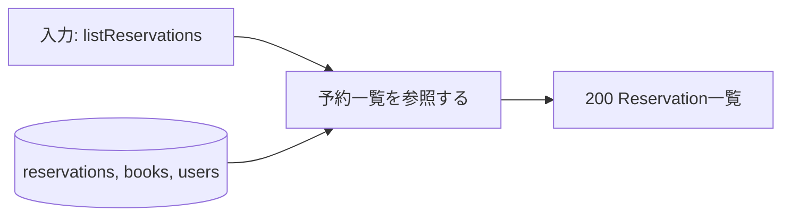
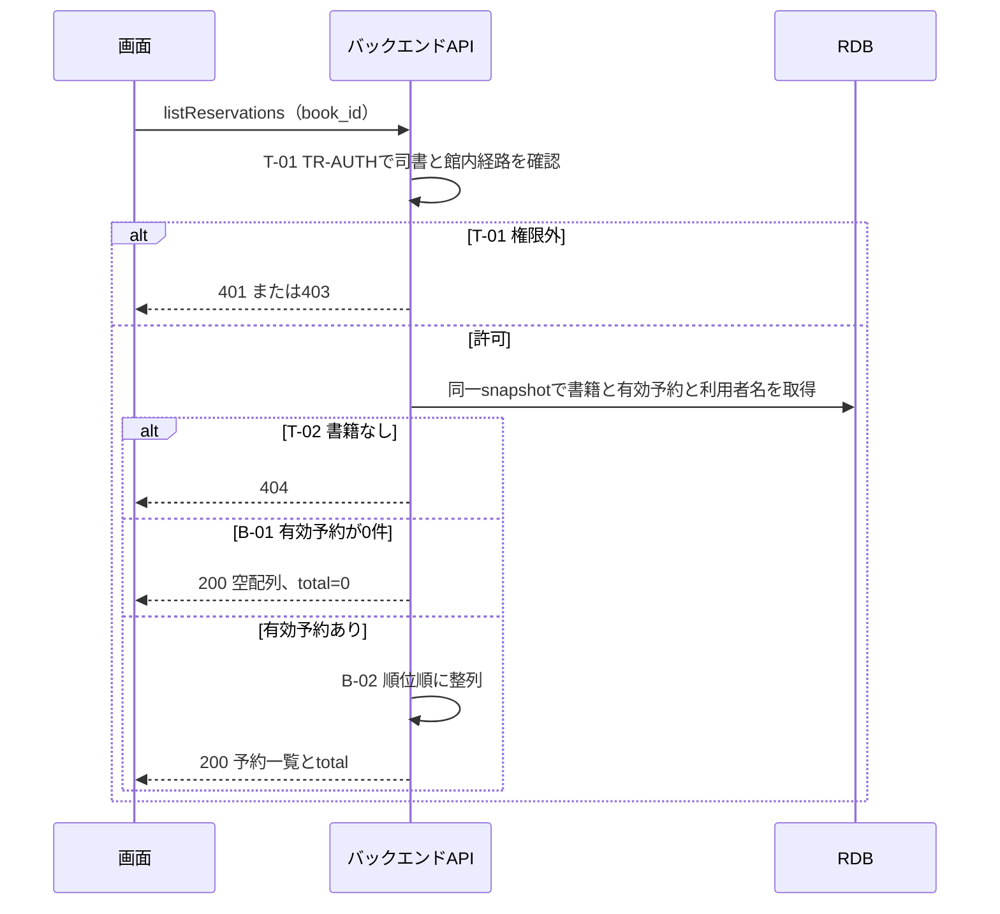

# 予約一覧を参照する

## 概要

司書が書籍を選び、その書籍の予約者と現在の順位を確認する。先頭から順に予約状況を表示する。

## データフロー



## シーケンス



## 分岐条件の接続

| 分岐ID | 条件の正本 | 結果 |
|---|---|---|
| B-01 | [対象](tier-backend-api.md) | 有効予約0件→200の空配列 |
| B-02 | [予約順位決定](../../../../../rdra/latest/条件.tsv) | 有効予約を現在順位の昇順に表示 |
| T-01 | [TR-AUTH](../../../_cross-cutting/technical-rules.md#TR-AUTH) | 許可→照会、認証不成立401/権限外403 |
| T-02 | [TR-ERROR](../../../_cross-cutting/technical-rules.md#TR-ERROR) | 書籍なし→404 |

## 関連 RDRA モデル

| モデル | 要素 | 適用箇所 |
|---|---|---|
| [BUC](../../../../../rdra/latest/BUC.tsv) | 貸出業務 / 書籍を予約するフロー / 予約一覧を参照する | 所属と入力契機 |
| [アクター](../../../../../rdra/latest/アクター.tsv) | 司書 | 操作主体 |
| [情報](../../../../../rdra/latest/情報.tsv) | 予約, 書籍, 利用者 | データ操作と契約 |

## E2E 完了条件（BDD）

```gherkin
Feature: 予約一覧を参照する
  Scenario: 順位順で確認する
    Given B-000101に順位2のR-002と順位1のR-001がある
    When 司書が書籍別予約一覧を開く
    Then R-001、R-002の順に利用者番号と予約状態を表示する

  Scenario: 有効予約がない
    Given B-000101に有効予約がない
    When 司書が書籍別予約一覧を開く
    Then 200の空配列を返し、予約なしと表示する
```

## ティア別仕様

- [tier-backend-api.md](tier-backend-api.md)
- [tier-frontend-staff.md](tier-frontend-staff.md)
- [API索引](_api-summary.yaml)のlistReservations
