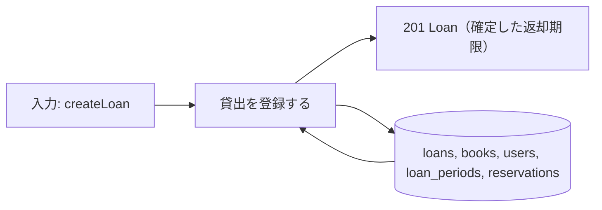
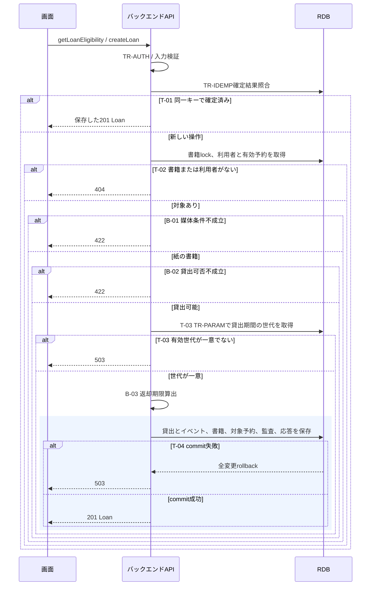

# 貸出を登録する

## 概要

司書が利用者番号と書籍IDを確認して貸出を確定する。貸出記録と返却期限を保存し、書籍を貸出中にする。

## データフロー



## シーケンス



## 分岐条件の接続

| 分岐ID | 条件の正本 | 結果 |
|---|---|---|
| B-01 | [媒体種別判定](../../../../../rdra/latest/条件.tsv) | 成立→B-02、不成立→422 |
| B-02 | [貸出可否判定](../../../../../rdra/latest/条件.tsv) | 成立→T-03、不成立→422 |
| B-03 | [返却期限算出](../../../../../rdra/latest/条件.tsv) | 有効な期間を貸出日に加算し保存へ進む |
| T-01 | [TR-IDEMP](../../../_cross-cutting/technical-rules.md#TR-IDEMP) | 確定済み→保存応答、未実行→対象照合 |
| T-02 | [TR-ERROR](../../../_cross-cutting/technical-rules.md#TR-ERROR) | 対象なし→404 |
| T-03 | [TR-PARAM](../../../_cross-cutting/technical-rules.md#TR-PARAM) | 有効世代が一意→B-03、それ以外→503 |
| T-04 | [TR-TX](../../../_cross-cutting/technical-rules.md#TR-TX) | 成功→201、失敗→rollbackして503 |

## 状態遷移参照

[状態](../../../../../rdra/latest/状態.tsv)の書籍の状態、貸出の状態、予約の状態、遷移UC「貸出を登録する」を参照する。
原子的な更新は[_model-summary.yaml](_model-summary.yaml)の操作を参照する。

## 関連 RDRA モデル

| モデル | 要素 | 適用箇所 |
|---|---|---|
| [BUC](../../../../../rdra/latest/BUC.tsv) | 貸出業務 / 書籍を貸し出すフロー / 貸出を登録する | 所属と入力契機 |
| [アクター](../../../../../rdra/latest/アクター.tsv) | 司書 | 操作主体 |
| [情報](../../../../../rdra/latest/情報.tsv) | 貸出, 書籍, 利用者, 貸出期間 | データ操作と契約 |

## E2E 完了条件（BDD）

```gherkin
Feature: 貸出を登録する
  Scenario: 在庫書籍を貸し出す
    Given 登録済み利用者U-000123、紙の在庫書籍B-000101、2026-09-06に適用する貸出期間14日がある
    When 司書が2026-09-06に貸出を確定する
    Then 返却期限2026-09-20の貸出が1件でき、書籍は貸出中になる

  Scenario: 予約待ちの先頭以外を拒否する
    Given 紙の予約待ち書籍B-000101の先頭予約者はU-000123である
    When 司書がU-000124への貸出を確定する
    Then 422を返し、貸出件数、予約順位、書籍状態は変わらない

  Scenario: 競合する二つの貸出
    Given 同じ在庫書籍B-000101に未完了の貸出がない
    When 二人の司書が異なるキーで同時に貸出する
    Then 一方だけ201となり、他方は再判定で422となる
```

## ティア別仕様

- [tier-backend-api.md](tier-backend-api.md)
- [tier-frontend-staff.md](tier-frontend-staff.md)
- [API索引](_api-summary.yaml)のcreateLoan

## 同時更新の完了条件

```gherkin
Feature: 貸出を登録すると利用者削除
  Scenario: 利用者削除が先に確定する
    Given 対象利用者の削除が利用者行lockを取得して確定した
    When 新規取引が同じ利用者行lockを取得する
    Then deleted=trueを検出して404を返し、有効取引を作らない

  Scenario: 新規取引が先に確定する
    Given 新規取引が利用者行lockを取得して確定した
    When 利用者削除が同じlockを取得する
    Then 有効取引を検出して削除を422で拒否する
```
