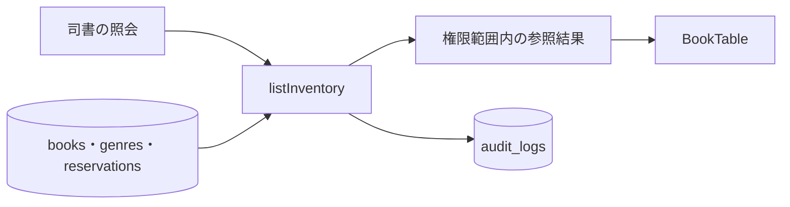
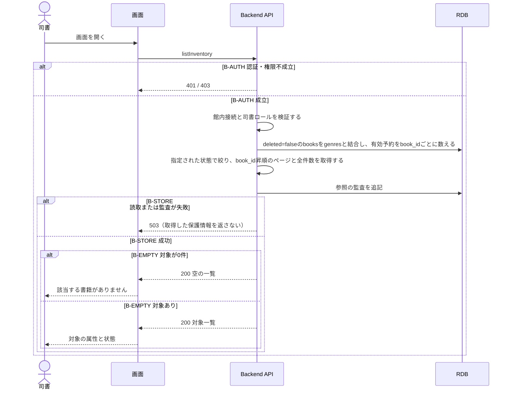

# 在庫状況一覧を参照する

## 概要

司書は在庫状況一覧を開き、各書籍の在庫・貸出・予約待ちの状態と予約人数を確認する。

## データフロー



## シーケンス



## 分岐条件の接続

| 分岐ID | 条件の正本 | 行先 |
|---|---|---|
| B-AUTH | [TR-AUTH](../../../_cross-cutting/technical-rules.md#TR-AUTH) | 不成立は401/403、成立は参照処理 |
| B-STORE | [TR-AUDIT](../../../_cross-cutting/technical-rules.md#TR-AUDIT)、[保存境界](tier-backend-api.md#read-transaction) | 失敗は503、成功は確定した参照結果 |
| B-EMPTY | [空結果](tier-backend-api.md#empty-result) | 0件は空状態、それ以外は一覧 |

## 関連 RDRA モデル

| 対象 | 参照 |
|---|---|
| 所属業務・UC | [BUC.tsv](../../../../../rdra/latest/BUC.tsv)の運営分析業務 / 蔵書の利用状況を分析するフロー / 在庫状況一覧を参照する |
| 業務条件 | [在庫状況判定](../../../../../rdra/latest/条件.tsv) |
| 情報 | [情報.tsv](../../../../../rdra/latest/情報.tsv)の書籍・ジャンル・予約 |
| 状態の表示 | [状態.tsv](../../../../../rdra/latest/状態.tsv)の書籍の状態。参照操作による状態遷移はない |

## E2E完了条件

```gherkin
Feature: 在庫状況一覧を参照する
  Scenario: 書籍の状態と有効予約数を表示する
    Given B1は在庫あり、B2は貸出中、B3は予約待ちで有効予約が2件ある
    When 司書が在庫状況一覧を開く
    Then 在庫ありB1、貸出中B2、予約待ちB3が各状態とともに表示される

  Scenario: 許可されない主体へ情報を返さない
    Given 利用者ロールのU1が館外からアクセスしている
    When listInventoryを要求する
    Then 403となり集計結果を返さない
```

## ティア別仕様

- [画面との接続](tier-frontend-staff.md)
- [APIと参照処理](tier-backend-api.md)
