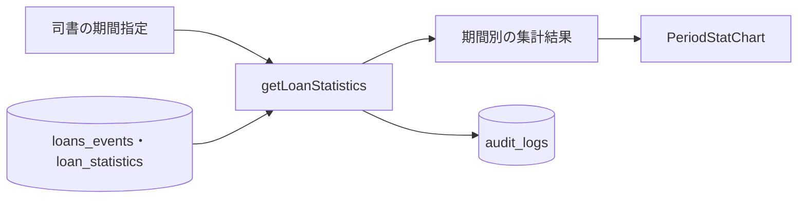
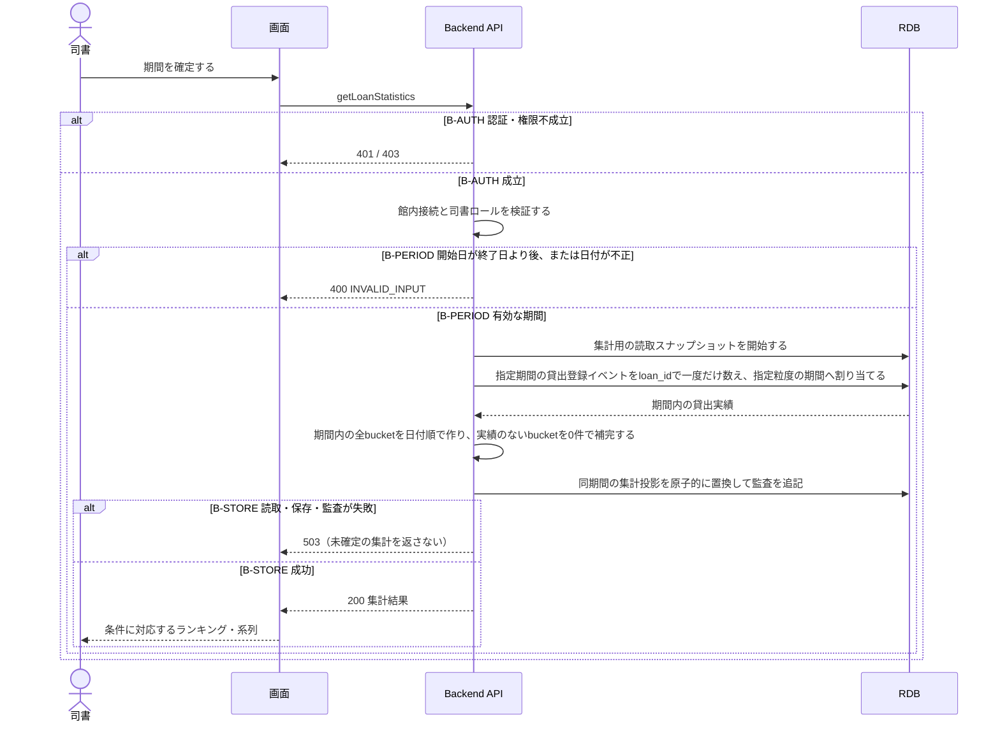

# 期間別貸出統計を参照する

## 概要

司書は日・月・年の集計単位と期間を指定し、貸出件数の推移と期間合計を確認する。

## データフロー



## シーケンス



## 分岐条件の接続

| 分岐ID | 条件の正本 | 行先 |
|---|---|---|
| B-AUTH | [TR-AUTH](../../../_cross-cutting/technical-rules.md#TR-AUTH) | 不成立は401/403、成立は参照処理 |
| B-STORE | [TR-AUDIT](../../../_cross-cutting/technical-rules.md#TR-AUDIT)、[保存境界](tier-backend-api.md#read-transaction) | 失敗は503、成功は確定した参照結果 |
| B-PERIOD | [集計期間判定](../../../../../rdra/latest/条件.tsv)、[TR-DATE](../../../_cross-cutting/technical-rules.md#TR-DATE) | 無効な日付範囲は400、有効範囲は集計 |

## 関連 RDRA モデル

| 対象 | 参照 |
|---|---|
| 所属業務・UC | [BUC.tsv](../../../../../rdra/latest/BUC.tsv)の運営分析業務 / 蔵書の利用状況を分析するフロー / 期間別貸出統計を参照する |
| 業務条件 | [集計期間判定](../../../../../rdra/latest/条件.tsv) |
| 情報 | [情報.tsv](../../../../../rdra/latest/情報.tsv)の貸出統計・貸出・書籍 |

## E2E完了条件

```gherkin
Feature: 期間別貸出統計を参照する
  Scenario: 貸出のない日を0件で表示する
    Given 9月1日に2件、9月3日に1件の貸出があり、9月2日の貸出はない
    When 司書が9月1日から3日の日別統計を取得する
    Then 日別の系列が9月1日2件・9月2日0件・9月3日1件となり、合計3件が表示される

  Scenario: 許可されない主体へ情報を返さない
    Given 利用者ロールのU1が館外からアクセスしている
    When getLoanStatisticsを要求する
    Then 403となり集計結果を返さない

  Scenario: 期間の前後関係が逆転している
    Given 開始日が2026-09-03、終了日が2026-09-01である
    When 集計を要求する
    Then 400となり集計投影を変更しない
```

## ティア別仕様

- [画面との接続](tier-frontend-staff.md)
- [APIと参照処理](tier-backend-api.md)
