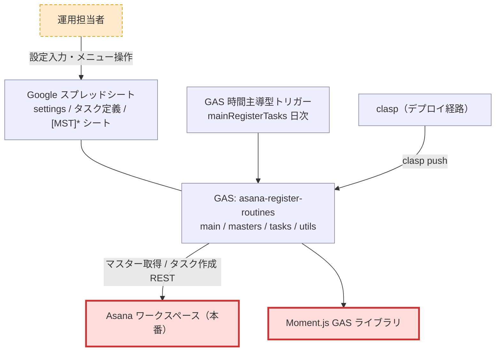
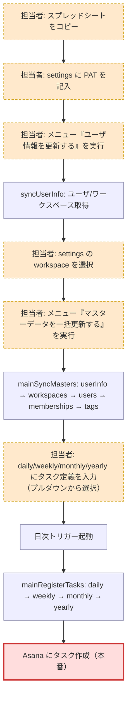
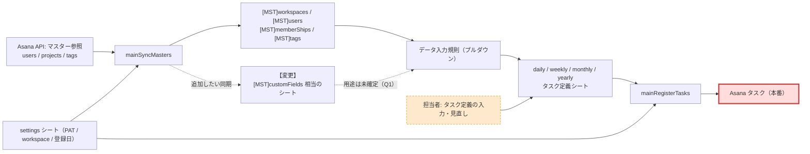

# preflight: asana-register-routines への変更影響調査

- 対象パス: `/Users/suwa_sh/src/github.com/suwa-sh/asana-register-routines`
- event_id: `20260813_095418_preflight`
- 調査範囲: 外側から読める資料のみ（README.md / CLAUDE.md / テキスト設定ファイル / ログ / コミット履歴）。`src/*.gs` の本文は開いていない。

## 結論

- 影響判定: **YES**
- 根拠: マスターデータ一括同期の反映先であるスプレッドシートのマスターシート群にカスタムフィールド用のシートが増え、タスク定義シートのプルダウン候補（利用者が観測する内容）と Asana API への読み取り呼び出しの種類が変わるため。
- 調べた変更内容: 「マスターデータ一括同期に、タグ一覧に加えてカスタムフィールド一覧の同期を追加したい」

補足: 最終境界である **Asana 上に作成されるタスクの内容**が変わるかは未確定（Q1）。同期したカスタムフィールドをタスク登録時に設定するところまで含むなら、そちらも YES になる。

## 整理 view

### システムコンテキスト



### 業務フロー



### 成果物チェーン



## ノード一覧

| ノード | 区分 | 説明 | 確度 | 根拠 |
|---|---|---|---|---|
| 運用担当者 | manual | スプレッドシートを自分のドライブにコピーして設定・運用する利用者。役割名の定義は資料に無い | medium | 推測: インストール手順が個人のマイドライブへのコピー前提（README.md:87-97）。組織的な役割分担の記載は無い |
| Google スプレッドシート | machine | settings / タスク定義 / マスターの各シートを保持する。view1 の `sheet` と view3 の `a3` `a5` `a9` `new` を集約したノード | high | 事実: README.md:16-82, CLAUDE.md:41-46 |
| GAS: asana-register-routines | machine | main.gs / masters.gs / tasks.gs / utils.gs の 4 ファイル構成。view1 の `gas` と view2/3 の `b4` `b7` `b10` `a2` `a7` を集約したノード | high | 事実: CLAUDE.md:27-34 |
| GAS 時間主導型トリガー | machine | `mainRegisterTasks` を日タイマーで実行する。手順書上は午前1時〜2時などを推奨 | medium | 事実: README.md:99-107。現行の設定値は利用者ごとに異なるため実態は未確認 |
| clasp（デプロイ経路） | machine | `clasp push` のみでデプロイ完了。トリガーは HEAD を実行する | high | 事実: CLAUDE.md:14-21, .clasp.json:2-3 |
| Asana ワークスペース（本番） | boundary | タスクの最終反映先。マスター参照元も兼ねる。API ベース URL は `https://app.asana.com/api/1.0/` | high | 事実: CLAUDE.md:55-63, README.md:4 |
| Moment.js GAS ライブラリ | boundary | GAS ライブラリ機能で追加した外部依存。npm ではない | high | 事実: src/appsscript.json:4-11, CLAUDE.md:67 |
| settings シート | machine | PAT / workspace / 週次・月次・年次の登録日を保持 | high | 事実: README.md:17-26 |
| [MST]workspaces / [MST]users / [MST]memberShips / [MST]tags | machine | マスター同期の反映先シート群。グローバルキャッシュの読み込み元 | high | 事実: CLAUDE.md:41-46。シート実体は未確認（構成説明テキスト由来） |
| 【変更】[MST]customFields 相当のシート | machine | 今回追加したいカスタムフィールド一覧の反映先。シート名・列構成はいずれも未定 | low | 推測: 既存 `[MST]tags` と同じ命名・構造に倣うと想定。資料に記載は無い |
| データ入力規則（プルダウン） | machine | マスター同期がタスク定義シートのプルダウンリストを作成する | high | 事実: README.md:36-39 |
| daily / weekly / monthly / yearly シート | machine | 日次/週次/月次/年次のタスク定義。共通項目として題名・説明・メンバーシップ1〜4・タグ1〜4・開始時刻・担当者を持つ | high | 事実: README.md:29-82 |
| 担当者: スプレッドシートをコピー | manual | 配布テンプレートをマイドライブにコピーする初期作業 | high | 事実: README.md:87 |
| 担当者: settings に PAT を記入 | manual | Asana のパーソナルアクセストークンを手入力する | high | 事実: README.md:22, README.md:91 |
| 担当者: メニュー『ユーザ情報を更新する』を実行 | manual | workspace プルダウンを作るための先行実行 | high | 事実: README.md:93, README.md:23 |
| 担当者: settings の workspace を選択 | manual | 複数ワークスペース所属に備えて対象を 1 つ選ぶ | high | 事実: README.md:95, CLAUDE.md:57 |
| 担当者: メニュー『マスターデータを一括更新する』を実行 | manual | 今回の変更対象となる機能の起動点 | high | 事実: README.md:97, README.md:12 |
| 担当者: タスク定義を入力 | manual | プルダウンを使って各シートにタスク定義を記入する | high | 事実: README.md:29-39 |
| Asana タスク（本番） | boundary | 日次トリガーで作成される最終成果物 | high | 事実: README.md:13-14, CLAUDE.md:53 |

注記: README.md:12 のマスターデータ一括同期の説明は「ユーザ情報、ユーザ一覧、メンバーシップ一覧、タグ一覧」だが、CLAUDE.md:52 の実行フローには `syncWorkspaces` が含まれる。README 側の記載漏れとみられる（今回の変更で README を更新する際に併せて確認したい）。

## 影響範囲の絞り込み

### 読まなくてよい範囲

- `logs/combined.log` / `logs/error.log`: 本システムの実出力ではない。中身は Storybook MCP Server のログで無関係（事実: logs/combined.log:1）。かつ `.claspignore` で GAS 配布対象外（事実: .claspignore:1）
- `LICENSE`: MIT ライセンス本文（事実: README.md:120-121）
- `.clasp.json` / `.claspignore` / `.gitignore`: デプロイ設定。`rootDir` は `./src` 固定で、既存 `.gs` の編集だけなら設定変更は不要（事実: .clasp.json:3, CLAUDE.md:21）
- `src/appsscript.json`: ランタイム設定と Moment.js 依存のみを定義し、`oauthScopes` を明示していない（事実: src/appsscript.json:1-15）。追加する Asana API は同一ホスト `app.asana.com`（事実: CLAUDE.md:63）で、外部接続先は増えない

### 読む必要がある範囲

- `src/masters.gs`: 変更の主対象。既存 `syncTags` と同型の同期関数を追加する（事実: CLAUDE.md:32, CLAUDE.md:52）
- `src/main.gs`: グローバルキャッシュ定義（`tagsCache` と同型のキャッシュ追加）、`parseCache` の対象シート登録、スプレッドシートメニュー定義（事実: CLAUDE.md:31, CLAUDE.md:36-48）
- `src/utils.gs`: Asana API の認証・共通呼び出し・キャッシュパーサー。新エンドポイント呼び出しで再利用する（事実: CLAUDE.md:33, CLAUDE.md:62-63）
- `README.md`: 機能一覧のマスターデータ一括同期の説明、タスク定義（共通）の項目表を更新する（事実: README.md:12, README.md:29-39）
- Google スプレッドシートのテンプレート実体（コードリポジトリ外の資産）: マスターシートの追加とデータ入力規則の設定が必要。配布用テンプレートは Google ドライブ上にある（事実: README.md:87）

### 未確定

- `src/tasks.gs` とタスク定義シートの列構成: 同期したカスタムフィールドをタスク登録時に設定するところまで含むかが未確定（→ Q1）。既存のタグ1〜4 は「同期結果をタスク定義列で使う」構造（事実: README.md:37）のため、同じ扱いに広がる可能性がある
- Asana API のエンドポイントと取得範囲: ワークスペース単位かプロジェクト単位かで同期処理と行構造が変わる（→ Q2）
- 追加シートの行構造: enum 型の選択肢（enum_options）を同期対象に含めるかで 1 カスタムフィールド = 1 行か複数行かが変わる（→ Q3）
- 既に配布済みのスプレッドシートへの反映方法: 同期処理がシートを自動作成するか、利用者にテンプレート再コピーを求めるかが未確定（→ Q4）
- マスターデータ一括同期の実行契機と頻度: 手順書上のトリガー登録は `mainRegisterTasks` のみ（事実: README.md:105）だが、現行運用で `mainSyncMasters` を定期実行している利用者がいるかは未確認。Asana API 呼び出しが 1 種類増えることの副作用（実行時間・レート制限）の評価に影響する（→ Q5）

## 手運用ノード

| 手運用 | なぜ残っていると考えられるか（推測） | 確度 | 根拠 |
|---|---|---|---|
| settings に PAT を手入力 | 個人のパーソナルアクセストークンを使う設計のため、利用者本人しか入力できない。シート内に平文保持する運用 | medium | 事実: README.md:22, README.md:91。保管ポリシーの記載は無い |
| workspace の手動選択 | 複数ワークスペース所属時に対象を機械的に決められない。API 側も workspace 指定を必須とする | high | 事実: CLAUDE.md:57-60, README.md:23 |
| マスターデータ一括更新の手動実行 | マスターの変更頻度が低く、Asana API 呼び出しを必要なときだけに絞るため。トリガー登録の手順は `mainRegisterTasks` にしか無い | medium | 事実: README.md:97, README.md:105。無効化の意図そのものは資料に記載無し |
| ユーザ情報更新 → workspace 選択 → 一括更新の 3 手順の順序遵守 | 一括更新が workspace 設定に依存するため、順序を守らないと同期対象が決まらない。グローバルキャッシュの更新順序依存も同じ理由 | high | 事実: README.md:93-97, CLAUDE.md:48, CLAUDE.md:52 |
| タスク定義のプルダウン入力 | 定義内容は人の意図そのもので自動化対象ではない。プルダウンは ID 直書きによる登録失敗を防ぐ安全装置 | medium | 推測: マスター同期がプルダウンを作る構造（README.md:36-39）から、手入力ミス防止が目的とみられる |

## 残質問リスト（担当者へ）

- Q1: 同期したカスタムフィールド一覧の用途は「プルダウン候補の提供」までか、それともタスク定義シートに「カスタムフィールド1〜4」のような列を追加して、タスク登録時に Asana のタスクへ設定するところまで含むか。（なぜ聞くか: 後者なら `src/tasks.gs` とタスク定義シートの列構成が変更範囲に入り、最終境界である Asana タスクの内容も変わるため）
- Q2: 同期対象のカスタムフィールドは、ワークスペース全体のカスタムフィールドか、プロジェクトに紐付いたカスタムフィールド設定か。（なぜ聞くか: 呼ぶ API と、シートに持つべきキー（プロジェクトとの対応）が変わるため）
- Q3: enum 型カスタムフィールドの選択肢も同期対象に含めるか。（なぜ聞くか: 含めると 1 カスタムフィールドが複数行になり、シートの行構造と既存 `[MST]tags` の構造の踏襲可否が変わるため）
- Q4: 既にスプレッドシートをコピーして使っている利用者への反映方法はどうするか。同期処理側でシートを自動作成するか、テンプレートの再コピーを案内するか。（なぜ聞くか: 既存利用者の運用手順が変わるかどうかが決まり、README の更新範囲にも影響するため）
- Q5: マスターデータ一括同期は現在、手動メニュー操作のみで実行しているか。定期トリガーに登録している運用はあるか。（なぜ聞くか: Asana API 呼び出しが 1 種類増えることの副作用（実行時間・レート制限）を評価する基準が変わるため）

## 次の一手

- `src/masters.gs` / `src/main.gs` / `src/utils.gs`（コードリポジトリ内）: `/distillery:dist-harvest /Users/suwa_sh/src/github.com/suwa-sh/asana-register-routines` で全量解析に進める
- `README.md`（コードリポジトリ内）: 上記の全量解析に含まれる。機能一覧の記載漏れ（`syncWorkspaces`）も併せて確認する
- Google スプレッドシートのテンプレート実体（非コード資産）: シート構成とデータ入力規則の設定を担当者に確認し、回答メモにする
- Q1〜Q5（非コード資産・運用実態）: 担当者にヒアリングし、回答メモを対象パスに置いて preflight を再実行する

回答メモの書き方（対象パス直下に `回答メモ.md` などの名前で置く）:

```markdown
# 回答メモ(YYYY-MM-DD ヒアリング)
- Q1(カスタムフィールド一覧の用途は?): {回答}
  回答者: {氏名} / 日付: {YYYY-MM-DD}
```

再実行コマンド:

```
/distillery:dist-harvest --preflight /Users/suwa_sh/src/github.com/suwa-sh/asana-register-routines --change "マスターデータ一括同期に、タグ一覧に加えてカスタムフィールド一覧の同期を追加したい"
```
