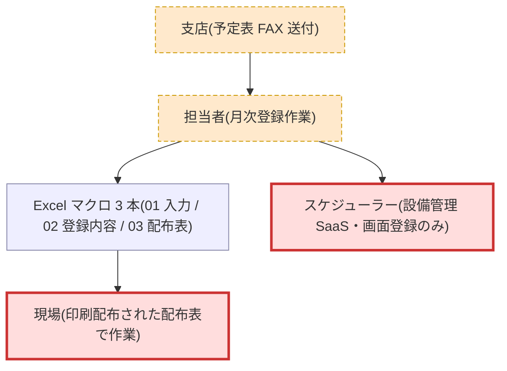
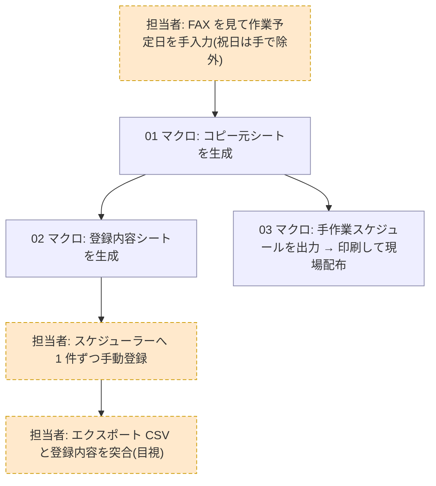
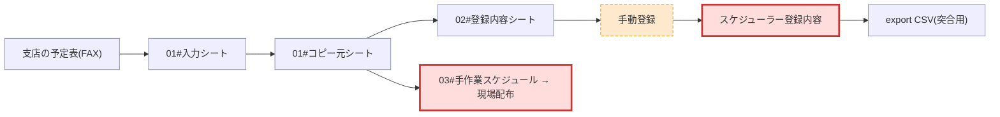

# preflight: 月次スケジュール登録マクロ への変更影響調査

## 結論

- 影響判定: **YES**
- 根拠: 変更内容が担当区分の値の変更(A 系設備の一部を電気→機械)を含み、割当は 02 のマクロ内
  ロジックで行われ(事実: 回答メモ.md:5-7)、登録時に担当区分を手で直す運用は無い(事実:
  回答メモ.md:11-13)。したがって外部影響境界 **スケジューラー登録内容**(export CSV の「担当区分」列で
  観測できる値)が、手運用込みの現行実態と比べて変わる
- 調べた変更内容: `02_登録内容作成.xlsm` のマクロを変更し、登録内容の担当区分の割当ルールを
  見直したい(A 系設備の一部を電気から機械に変更)

## 整理 view

### システムコンテキスト



### 業務フロー



### 成果物チェーン



## ノード一覧

3 view の全ノードを列挙する。システムコンテキストの「担当者」「Excel マクロ 3 本」と業務フローの
手順 s1〜s6 は、下表のチェーン粒度のノードを集約したものとして説明列に対応を示す。

| ノード | 区分 | 説明(view 間の対応) | 確度 | 根拠 |
|---|---|---|---|---|
| 支店の予定表(FAX) | machine | 入力の起点。コンテキスト view の「支店」 | medium | 事実: 操作手順書.md:9(手順 1) |
| 担当者 | manual | 業務フロー s1/s4/s5 の実行者。コンテキスト view の「担当者」 | high | 事実: 操作手順書.md:8-15 |
| 01#入力シート | machine | 作業予定日の手入力先(業務フロー s1) | medium | 事実: ファイル構成.md:7(シート一覧は構成メモ作成者の確認) |
| 01#コピー元シート | machine | 01 マクロが生成する中間生成物(業務フロー s2)。「Excel マクロ 3 本」の 01 | medium | 事実: 操作手順書.md:10 + ファイル構成.md:7 |
| 02#登録内容シート | machine | 02 マクロが 01 を読んで生成(業務フロー s3)。**変更対象**。担当区分の割当はマクロ内ロジック。「Excel マクロ 3 本」の 02 | high | 事実: 操作手順書.md:11-12 + 回答メモ.md:5-7(2 資料の突合) |
| 手動登録 | manual | 担当者がスケジューラー画面へ 1 件ずつ登録(業務フロー s4)。担当区分の手補正は無し | high | 事実: 操作手順書.md:13 + ファイル構成.md:12 + 回答メモ.md:11-13(3 資料の突合) |
| スケジューラー登録内容 | boundary | 外部 SaaS に残る**最終反映先**。コンテキスト view の「スケジューラー」 | high | 事実: 操作手順書.md:13 + ファイル構成.md:12 |
| export CSV | machine | スケジューラーからの実出力。突合用(業務フロー s5)。**担当区分列を含む** | high | 事実: ファイル構成.md:10 + 実データ例 :15-18 |
| 03#手作業スケジュール → 現場配布 | boundary | 印刷物として現場作業に影響する**もう 1 つの反映先**(業務フロー s6)。「Excel マクロ 3 本」の 03。コンテキスト view の「現場」への出力 | medium | 事実: 操作手順書.md:16-18 |

## 影響範囲の絞り込み

- 読まなくてよい範囲:
  - `01_作業予定入力.xlsm` のマクロ本文 — 変更対象(02)より上流で、02 の変更は上流に波及しない
    (チェーン構造から確定。事実: 操作手順書.md:10-12 の読み取り方向)
  - 参照表シートの探索 — 割当ルールは 02 のマクロ内ロジックで、参照表シートは無いと確定済み
    (事実: 回答メモ.md:5-7)
- 読む必要がある範囲:
  - `02_登録内容作成.xlsm` のマクロ本文のうち担当区分の割当ロジック(変更対象そのもの。
    マクロ内に定義と確定済み — 事実: 回答メモ.md:5-7)
- 未確定:
  - `03_現場配布表.xlsm` — 構成メモは「01 を参照している模様」(ファイル構成.md:9)としており、
    それが正しければ 02 の変更は 03 に届かない。ただし「模様」は推定情報のみで、
    03 が 02 の出力を参照していないことは未確定 → 対応する残質問: Q1

## 手運用ノード

| 手運用 | なぜ残っていると考えられるか(推測) | 確度 | 根拠 |
|---|---|---|---|
| FAX を見て手入力 | 支店がシステム未接続で FAX 運用のまま | low | 推測: 手順 1 の記述のみで理由は未記載 |
| 祝日を手で除外 | マクロが祝日を判定しないため人が安全装置になっている | medium | 事実: 操作手順書.md:23(手順書単独の記載。現行実態は未突合) |
| スケジューラーへ手動登録 | SaaS の API が契約外で画面登録しかできない | high | 事実: 操作手順書.md:13 + ファイル構成.md:12 + 回答メモ.md:11-13(3 資料の突合) |
| CSV 突合の目視確認 | 過去の二重登録トラブル由来の安全装置 | medium | 事実: 操作手順書.md:22(手順書単独の記載。現行実態は未突合) |

## 残質問リスト(担当者へ)

- Q1: `03_現場配布表.xlsm` が読み込むのは 01 のコピー元シートだけですか? 02 の登録内容シートを
  参照していませんか?(なぜ聞くか: 「読まなくてよい」判定の前提が構成メモの「模様」という
  推定情報のみのため。02 を参照していれば現場配布物にも影響が出る。前回ヒアリングでは
  担当者不在で未回答 — 回答メモ.md:15)

※ 初回の Q2(割当ルールの定義先)・Q3(スケジューラー側の値制約 — 無し・自由入力)と、
追加確認 Q4(登録時の手補正 — 無し)は回答済み(input/回答メモ.md)。Q3 の回答により、
手動登録の手順が変わる可能性は消えている。

## 次の一手

- `02_登録内容作成.xlsm` は非コード資産(共有フォルダの xlsm)のため、全量解析
  (`/distillery:dist-harvest <ディレクトリ>`)には接続できません。Q1 を担当者へヒアリングし、
  回答を `input/回答メモ.md` に追記して再実行してください:

  ```
  /distillery:dist-harvest --preflight samples/distillery/preflight/excel-macro/input --change "02_登録内容作成.xlsm のマクロを変更し、登録内容の担当区分の割当ルールを見直したい(A 系設備の一部を電気から機械に変更)"
  ```

- 未確定(03 の参照先)が確定した後に、02 の担当区分割当ロジックだけを VBA で読み、
  実装方針を決めてください
