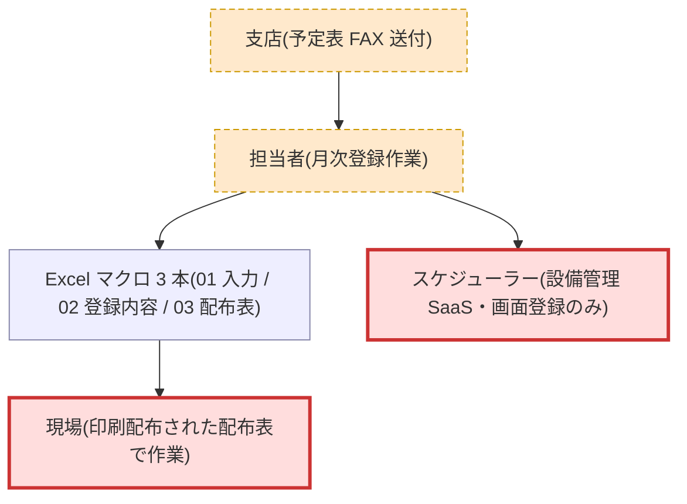
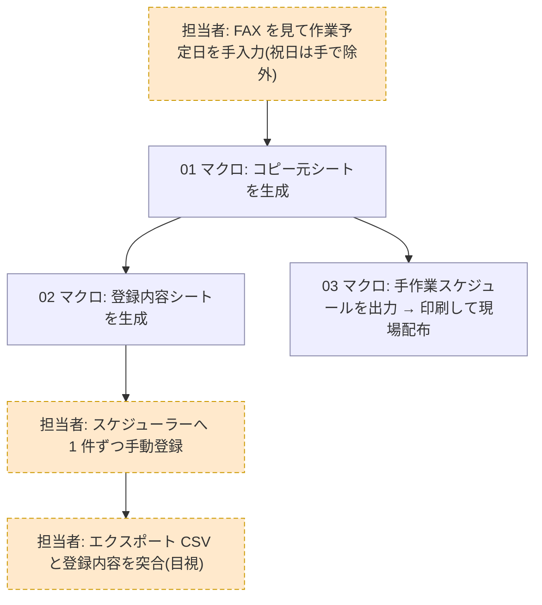
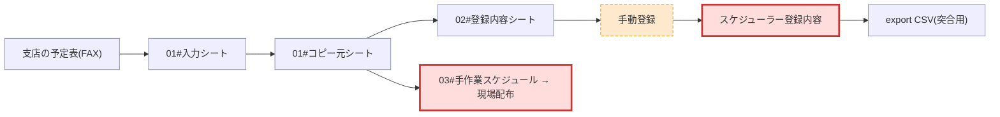

# preflight: 月次スケジュール登録マクロ への変更影響調査

## 結論

- 影響判定: **YES**
- 根拠: 祝日の自動除外により「登録内容」シートの日付集合が変わり、外部影響境界である
  **スケジューラー登録内容**(および現場配布の手作業スケジュール表)で観測される内容が変わる
- 調べた変更内容: `01_作業予定入力.xlsm` のマクロを変更し、祝日を作業予定日から自動で除外したい

## 整理 view

### システムコンテキスト

### 業務フロー

### 成果物チェーン

## ノード一覧

| ノード | 区分 | 説明 | 確度 | 根拠 |
|---|---|---|---|---|
| 支店の予定表(FAX) | machine | 入力の起点。支店から届く | medium | 事実: 操作手順書.md:9(手順 1) |
| 01#入力シート | machine | 作業予定日の手入力先 | medium | 事実: ファイル構成.md:7(シート一覧は構成メモ作成者の確認) |
| 01#コピー元シート | machine | 01 マクロが生成する中間生成物 | medium | 事実: 操作手順書.md:10 + ファイル構成.md:7 |
| 02#登録内容シート | machine | 02 マクロが 01 を読んで生成 | medium | 事実: 操作手順書.md:11-12 |
| 手動登録 | manual | 担当者がスケジューラー画面へ 1 件ずつ登録 | high | 事実: 操作手順書.md:13 + ファイル構成.md:12(API 契約外と突合) |
| スケジューラー登録内容 | boundary | 外部 SaaS に残る本番データ。**最終反映先** | high | 事実: 操作手順書.md:13 + ファイル構成.md:12 |
| export CSV | machine | スケジューラーからの実出力。突合用 | high | 事実: ファイル構成.md:10 + 実データ例 :15-18 |
| 03#手作業スケジュール → 現場配布 | boundary | 印刷物として現場作業に影響する**もう 1 つの反映先** | medium | 事実: 操作手順書.md:16-18 |

## 影響範囲の絞り込み

- 読まなくてよい範囲:
  - `02_登録内容作成.xlsm` / `03_現場配布表.xlsm` のマクロ本文 — 変更対象は 01 で、02/03 は
    コピー元シートを読むだけ。**前提: コピー元の形式が不変で祝日行が減るのみ**(この前提は未確認 → Q1)
  - スケジューラー側の設定 — 画面登録のみで変更は発生しない(事実: ファイル構成.md:12)
- 読む必要がある範囲:
  - `01_作業予定入力.xlsm` のマクロ本文のうち「整形実行」の処理(祝日除外を組み込む箇所)

## 手運用ノード

| 手運用 | なぜ残っていると考えられるか(推測) | 確度 | 根拠 |
|---|---|---|---|
| FAX を見て手入力 | 支店がシステム未接続で FAX 運用のまま | low | 推測: 手順 1 の記述のみで理由は未記載 |
| 祝日を手で除外 | マクロが祝日を判定しないため人が安全装置になっている | high | 事実: 操作手順書.md:23(注意事項に明記)。**今回の変更でこの手運用が自動化される** |
| スケジューラーへ手動登録 | SaaS の API が契約外で画面登録しかできない | high | 事実: ファイル構成.md:12 |
| CSV 突合の目視確認 | 過去の二重登録トラブル由来の安全装置 | high | 事実: 操作手順書.md:22(注意事項に明記) |

## 残質問リスト(担当者へ)

- Q1: 02/03 のマクロは、コピー元シートの行数や日付に依存する処理(日数集計・行位置参照など)を
  持ちますか?(なぜ聞くか: 祝日行が減ることで 02/03 の出力が壊れないかを、マクロ本文を読まずに
  確定できないため。「読まなくてよい」の前提確認)
- Q2: 祝日の判定元(祝日マスタ・カレンダー)は何を使う想定ですか?(なぜ聞くか: 変更の実装方式と、
  年次更新の運用が新たに発生するかを確定するため)
- Q3: 現場配布表では祝日をどう表示すべきですか — 行ごと消す / 「祝日」と明示して残す?
  (なぜ聞くか: もう 1 つの反映先である現場配布物の仕様が変わるため)
