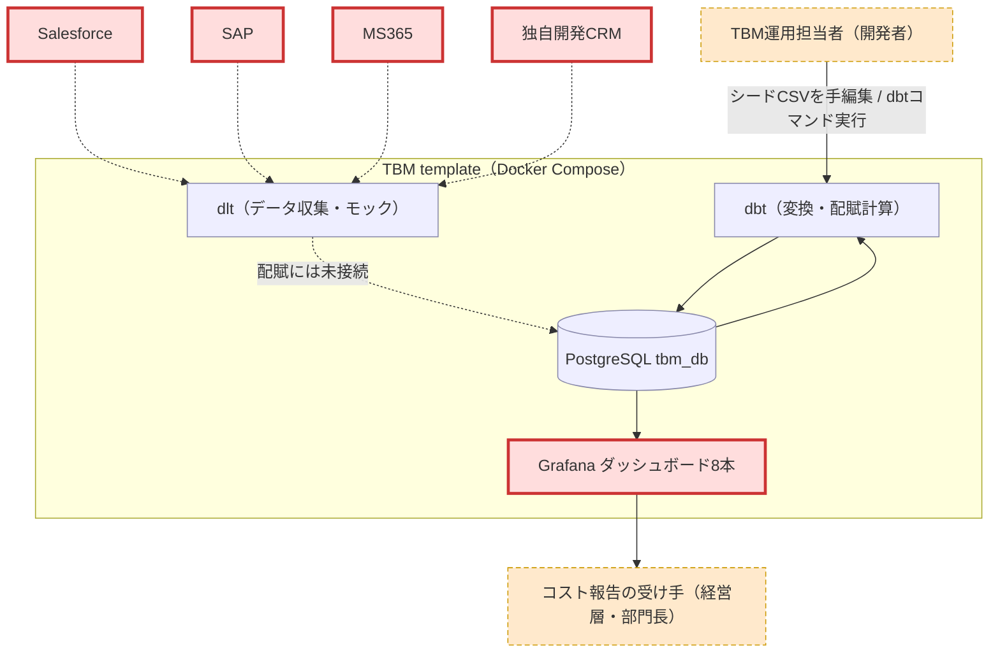
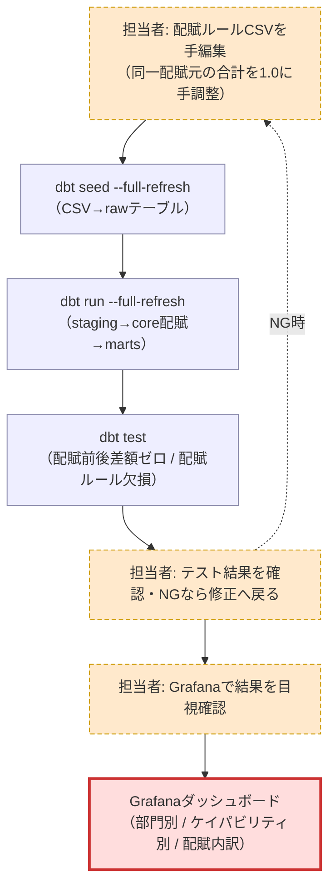
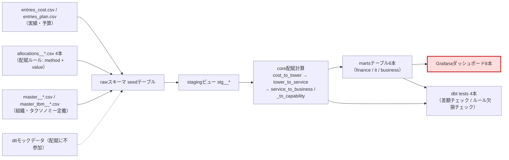

# preflight: tbm-template（TBM コスト配賦・可視化テンプレート）への変更影響調査

- 対象パス: `/Users/suwa_sh/src/github.com/suwa-sh/tbm-template`
- event_id: `20260813_095401_preflight`
- 規範: 実装内部（dbt モデル SQL 本文 / dlt Python 本文 / バイナリ）は未読。README・memory-bank・Agent Skills ドキュメント・シード CSV（実データ）・設定ファイル名のみを証拠にした。

## 結論

- 影響判定: **YES**
- 根拠: 配賦比率 `allocation_value` は CSV に静的値として保持され、配賦額は `amount × allocation_value` で決まる（事実: `.claude/skills/tbm-core/references/data-model.md:43,63`）。人数比（`user_count`）からコスト比へ変えると、この値と、最終反映先である Grafana ダッシュボード（部門別コスト・配賦内訳）で観測される金額・比率が変わる。
- 調べた変更内容: 「共通費の配賦ルールを人数比からコスト比に変更したい」
  - 補足: `--change` の指定値はファイルパス形式ではないため、テキストそのものを変更内容として解釈した。
  - **ただし「共通費」に対応するモデル要素が現行データに一意に定まらない**（下記 Q1）。影響の**有無**は YES で確定するが、影響の**範囲**は一部未確定。

## 整理 view

### システムコンテキスト



破線は「配賦計算に参加しない経路」を示す（事実: `README.md:87`「現在はモックデータを使用して、DBに保存しているだけです。配賦には利用されません。」）。

### 業務フロー



### 成果物チェーン



## ノード一覧

| ノード | 区分 | 説明 | 確度 | 根拠 |
|---|---|---|---|---|
| TBM運用担当者（開発者） | manual | シードCSVを編集し dbt コマンドを実行する人。View1 の `ops` と View2 の `s1/s5/s6` は同一人物 | high | 事実: `README.md:133-136`, `.claude/skills/tbm-customize/SKILL.md:25-69` |
| コスト報告の受け手（経営層・部門長） | manual | ダッシュボードでIT支出を見る側 | low | 推測: `memory-bank/productContext.md:5` の「経営層との溝」。役割名・運用は資料に無い |
| Salesforce / SAP / MS365 / 独自開発CRM | boundary | dlt の収集元。現状モックのみ | high | 事実: `README.md:86-88` |
| dlt（データ収集） | machine | View3 の `dltモックデータ` と同一。DB に保存するのみで配賦に参加しない | high | 事実: `README.md:87` |
| PostgreSQL tbm_db | machine | raw / staging / core / marts の格納先。View3 の raw〜marts を内包 | high | 事実: `.claude/skills/tbm-core/references/project-structure.md:43-47,49-57` |
| dbt（変換・配賦計算） | machine | View3 の stg / core / marts を実行する処理系 | high | 事実: `README.md:90-97` |
| Grafanaダッシュボード8本 | boundary | View1 `gf` / View2 `s7` / View3 `gf` は同一。最終反映先 | high | 事実: `.claude/skills/tbm-core/references/data-model.md:76-89` |
| 配賦ルールCSVの手編集 | manual | 4本の `allocations__*.csv` を直接編集。合計1.0は人が担保 | high | 事実: `README.md:226-237`, `.claude/skills/tbm-customize/SKILL.md:42` |
| dbt seed --full-refresh | machine | CSV を raw テーブルへロード | high | 事実: `README.md:170-171` |
| dbt run --full-refresh | machine | staging→core→marts を再構築 | high | 事実: `README.md:172` |
| dbt test | machine | View3 の `tests` と同一。差額チェック1本＋ルール欠損チェック3本 | high | 事実: ファイル実体 `dbt/src/tests/配賦結果チェック_配賦前後で差額がないこと.sql` ほか3本 |
| テスト結果の確認 | manual | NG なら CSV 編集に戻る | medium | 事実: `.claude/skills/tbm-customize/SKILL.md:64`（手順書単独。実運用でのループは未確認） |
| Grafanaでの目視確認 | manual | 変更後の確認を推奨 | medium | 事実: `.claude/skills/tbm-customize/SKILL.md:69`（手順書単独） |
| entries_cost.csv / entries_plan.csv | machine | コスト実績220行・予算32行。配賦の元本 | high | 事実: seed 実体の行数と `.claude/skills/tbm-core/references/data-model.md:45-52` |
| allocations__*.csv 4本 | machine | `allocation_method` + `allocation_value`(0.0〜1.0) + `description` を持つ配賦ルール | high | 事実: 各CSVヘッダ行、`.claude/skills/tbm-core/references/data-model.md:33-43` |
| master__*.csv / master_tbm__*.csv | machine | 組織固有マスター3本 + TBMタクソノミー4本 | high | 事実: seed 実体、`.claude/skills/tbm-core/references/data-model.md:14-29` |
| rawスキーマ seedテーブル | machine | seeds のロード先（materialization: table） | high | 事実: `.claude/skills/tbm-core/references/project-structure.md:53` |
| stagingビュー stg__* | machine | 14本。生データ整形 | high | 事実: `dbt/src/models/staging/` の実体14ファイル |
| core配賦計算 4本 | machine | `amount × allocation_value` で4段配賦 | high | 事実: `.claude/skills/tbm-core/references/data-model.md:62-66` |
| martsテーブル6本 | machine | finance/it/business の集計。company は予実・従業員あたりコストを含む | high | 事実: `.claude/skills/tbm-core/references/data-model.md:68-74` |

## 影響範囲の絞り込み

### 読まなくてよい範囲（前提が証拠で確定）

| 範囲 | 理由 | 確度 |
|---|---|---|
| `dlt/`（main.py・4コネクタ・モックデータ） | 収集データは DB 保存のみで配賦に利用されない | high（事実: `README.md:87`） |
| `dbt/src/target/`, `dbt/src/logs/`, `container_data/postgres/` | dbt ビルド生成物・ログ・DB 実体。`dbt seed`/`dbt run` で再生成される | high（事実: `README.md:170-172`） |
| `grafana/provisioning/dashboards/json/` 8本 | 全 JSON で `allocation_method` を参照していない（grep 0 件）。列構成が変わらない限りダッシュボード定義の改修は不要。表示される**金額・比率の値**は変わるが、それは影響の結果であって改修対象ではない | high（事実: grep 結果 0 件、`allocation_business.json` は `service_to_business` と `allocation_value` のみ参照） |
| `master_tbm__cost_pools.csv` | 列は `cost_pool_id,cost_pool_name,description` のみで配賦比率を持たない | high（事実: CSV ヘッダ実体） |
| `master_tbm__cost_sub_pools.csv` / `it_towers.csv` / `it_sub_towers.csv` | 同系統の定義マスターで「基本的に変更不要」と明記 | medium（事実: `README.md:228`, `.claude/skills/tbm-customize/SKILL.md:73`。ヘッダ実体は未確認） |
| `docs/TBM_Taxonomy_V4.0_ja.pdf` ほか参考資料 | 参照用のタクソノミー資料。処理経路に無い | high（事実: `README.md:229-231`） |

### 読む必要がある範囲

| 範囲 | 理由 | 確度 |
|---|---|---|
| `dbt/src/seeds/allocations__service_to_business.csv`（359行） | `user_count`（人数比）で配賦している行が 187 行あり、対象サービスは erp / crm / email / collaboration / remote_access / security_service の6本。「共通費の人数比配賦」の実体はここに最も濃い | high（事実: CSV 集計） |
| `dbt/src/models/core/cost_allocation/service_to_business.sql` | 配賦計算の本体。現行が「CSV の静的比率をそのまま掛けるだけ」かを確認しないと、コスト比の実装方式（下記 Q3）を決められない | high（事実: `.claude/skills/tbm-core/references/data-model.md:63-66`） |
| `dbt/src/tests/` 4本 | 「配賦前後で差額がないこと」「配賦ルール欠損チェック（3経路分）」が変更後も通る必要がある。比率合計 1.0 の制約はここで守られる | high（事実: ファイル実体、`.claude/skills/tbm-customize/SKILL.md:42`） |
| `dbt/src/seeds/master__business_units.csv`（98行） | `employee_count` 列が人数比の根拠データ。コスト比化後にこの列が配賦から外れるか、`company_cost_history` の「従業員あたりコスト」用途だけ残るかを確認する | high（事実: CSV ヘッダ、`.claude/skills/tbm-core/references/data-model.md:73`） |

### 未確定（証拠で確定できず、確定に質問が必要）

| 範囲 | 理由 | 対応する残質問 |
|---|---|---|
| `allocations__service_to_capability.csv`（`user_count` 66行）と `allocations__tower_to_service.csv`（同 44行） | 「共通費」がサービス→部門だけを指すのか、人数比を使う全経路を指すのか未確定 | Q1 |
| `allocations__cost_to_tower.csv` | TBM タクソノミー上の共通費に相当する `internal_services`（内部共有サービス費用）コストプールは、**実績（`entries_cost.csv`）にも配賦ルールにも 1 行も存在しない**。「共通費」がこのプールを新設する話なら、この経路に新規行が要る | Q1 |
| `dbt/src/models/core/cost_allocation/` の他3モデル | 実装方式が「CSV の値を再計算して差し替え（モデル無改修）」か「モデル側でコスト比を動的算出」かで、読む範囲が 1 本か 4 本かが変わる。動的算出なら配賦順序（共通費を後段に回す等）の変更で 4 本すべてが対象になりうる | Q3, Q4 |
| 書き換え対象の期間（`fiscal_year, fiscal_month` の範囲） | 配賦ルールは年度×月キーで全行が展開されている（`allocations__service_to_business.csv` は 359 行）。遡及適用なら全期間、新規適用なら対象月の行のみが変更範囲になる | Q6 |
| `dbt/src/models/marts/business/company_cost_history.sql` | 「従業員あたりコスト」が `employee_count` に依存する。人数を配賦から外した場合にこのマートの意味づけを変えるかどうかが未定 | Q2 |
| `allocation_method` 列に入れる新しい値（例 `cost_based`） | `dbt/src/` に `schema.yml` が無く（`dbt_project.yml` のみ）、`accepted_values` テストによる語彙制約は見当たらない。とはいえ値の統制方針は運用側の決めごと | Q5 |

## 手運用ノード

| 手運用 | なぜ残っていると考えられるか（推測） | 確度 | 根拠 |
|---|---|---|---|
| 配賦ルールCSVの手編集 | 配賦比率は組織の合意事項であり、自動導出できない政治的・会計的判断を含む。テンプレートとして「カスタマイズポイントを明確にする」設計意図でも CSV 直編集が選ばれている | medium | 事実: `memory-bank/activeContext.md`「カスタマイズポイントの明確化」/ `README.md:222-237` |
| 同一配賦元の比率合計を 1.0 に手調整 | 合計が 1.0 でないと未配賦コストが発生するが、CSV には制約機構が無いため人が担保している。事後に `dbt test`（差額チェック）で検知する二段構え | high | 事実: `.claude/skills/tbm-customize/SKILL.md:42,74` + テスト実体 |
| dbt test 結果の目視確認 | 配賦は金額の再分配であり、誤りが部門別コスト報告にそのまま出る。過去の配賦漏れ・二重計上への安全装置と考えられる | medium | 推測: テスト名「配賦前後で差額がないこと」「配賦ルール欠損チェック」が示す検知対象 |
| Grafana での結果目視確認 | 数値の妥当性（極端な偏り・ゼロ計上）はテストでは検知できず、人が見て気づく前提 | medium | 事実: `.claude/skills/tbm-customize/SKILL.md:69`（手順書単独） |
| 年度追加時の全マスター・配賦ルールの手作業展開 | 配賦ルールが年度×月キーで持たれており、期をまたぐたびに全行を複製・調整する必要がある | high | 事実: `.claude/skills/tbm-customize/SKILL.md:43,75`、CSV の `fiscal_year, fiscal_month` キー |

## 残質問リスト（担当者へ）

- **Q1: 「共通費」はこのモデルのどの要素を指しますか？**（なぜ聞くか: 現行データに「共通費」という名称の要素が無い。候補が3つあり、どれを選ぶかで変更対象ファイルが 1 本〜4 本に変わる）
  - 候補 A: サービス→部門配賦で `user_count` を使っている 6 サービス（erp, crm, email, collaboration, remote_access, security_service）
  - 候補 B: 特定利用者に紐づかない共通基盤サービス（email, collaboration, remote_access, security_service, file_sharing など workplace/platform/infrastructure 系）
  - 候補 C: TBM タクソノミーの `internal_services`（内部共有サービス費用）コストプール ※現行データでは実績も配賦ルールも 0 行
- **Q2: 「コスト比」の分母は何ですか？**（なぜ聞くか: 比率の計算式が決まらない。「部門に既に直課されている IT コストの構成比」「部門の総費用（IT 以外含む）の構成比」「部門の売上・予算比」で結果が全く変わる。IT 以外の費用は現行データに存在しないため、外部データの追加取り込みが必要になる可能性がある）
- **Q3: 比率の算出方法は「CSV の `allocation_value` を計算済みの値で更新する」運用ですか、「dbt モデル側で毎回動的に算出する」実装ですか？**（なぜ聞くか: 前者ならシード CSV の更新だけで済み core モデルは無改修。後者は core モデルの改修が必要で、読む範囲と工数が大きく変わる）
- **Q4: Q3 が「動的算出」の場合、循環参照をどう解くかの方針はありますか？**（なぜ聞くか: 「他コストの構成比で共通費を配賦する」と、配賦先の部門コストを求めるのに配賦結果が要る構造になりうる。共通費以外を先に配賦する二段構え等の設計判断が要る。※未読の SQL 本文に既存の解法がある可能性は排除していない、確度 low の推測）
- **Q5: `allocation_method` 列に入れる新しい値の名称は何にしますか？**（なぜ聞くか: 現行値は direct / usage_based / user_count / storage_used / ticket_count / consumption_based の 6 種。`schema.yml` が無く語彙制約は効いていないため、命名は運用の決めごとになる。ダッシュボードは `allocation_method` を参照していないため表示影響は無い）
- **Q6: 適用開始はどの年度・月からですか？既存期間（現行データは 2015年3月〜、年度×月キーで保持）を遡って作り直しますか？**（なぜ聞くか: 遡及すると過去の部門別コスト報告値が変わる。過去分を据え置くなら、配賦ルールは年度×月キーなので新期間の行だけ追加すればよい）

## 次の一手

### 読む必要がある範囲ごとの後続

| 対象 | 後続アクション |
|---|---|
| `dbt/src/seeds/`, `dbt/src/models/`, `dbt/src/tests/`（コードリポジトリ内） | `/distillery:dist-harvest /Users/suwa_sh/src/github.com/suwa-sh/tbm-template/dbt` で全量解析に進む（配賦ロジック・シード・テストを RDRA 4 レイヤーで as-is 化する） |
| 配賦ルールの決め方・共通費の定義・コスト比の分母（非コード資産） | 上記 Q1〜Q6 を配賦ルールの決裁者・経理/IT 財務担当にヒアリングし、回答メモを作成して preflight を再実行する |

### 回答メモの置き場所と再実行コマンド

`/Users/suwa_sh/src/github.com/suwa-sh/tbm-template` 配下（例: `docs/回答メモ_共通費配賦.md`）に次の形式で置き、preflight を再実行する。

```markdown
# 回答メモ（YYYY-MM-DD ヒアリング）
- Q1（「共通費」はどの要素？）: {回答}
  回答者: {氏名 / 役割} / 日付: YYYY-MM-DD
```

```bash
/distillery:dist-harvest --preflight /Users/suwa_sh/src/github.com/suwa-sh/tbm-template --change "共通費の配賦ルールを人数比からコスト比に変更したい"
```
