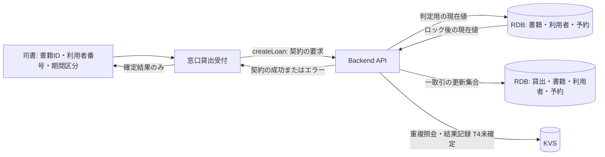
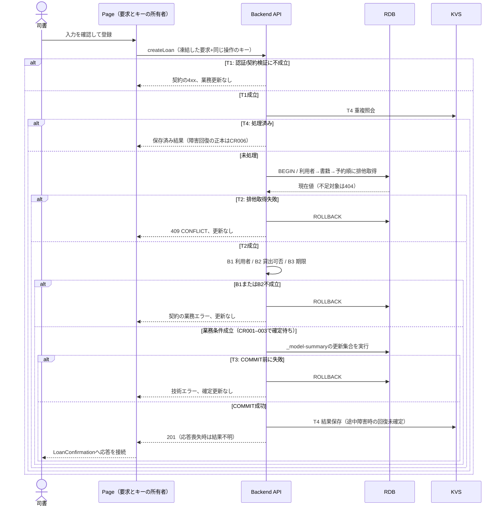

# 貸出を登録する

## 概要

司書が窓口で書籍と利用者を指定し、貸出を確定する。UC ID: `60d99956`。
生成結果は **needs-spec-change / draft**。業務分岐 B1–B3 と障害回復 T4 が未確定のため実装着手の完了仕様ではない。
参照先は常に前段の latest。本文内の `docs/...` はこのサンプルのプロジェクトルート相対。過去イベントは生成記録であり、現在の業務定義の正本にしない。

## データフロー



型・必須項目・HTTPコードは [API対応表](_api-summary.yaml) の `createLoan` と [分割OpenAPI入口](../../../_cross-cutting/api/openapi.yaml) を参照する。
上図の更新集合は [_model-summary.yaml](_model-summary.yaml)。業務データと冪等結果の二重書込については T4 を参照する。

## シーケンス



これは生成時の設計ドラフトであり、未確定の分岐を実行時に「仕様不足エラー」に変える指示ではない。還流で解決するまで昇格しない。

## 分岐の接続表

| ID | 条件の正本・要素 | 成立／不成立の接続 | 生成時判定 |
|---|---|---|---|
| B1 | [RDRA 条件](../../../../../../rdra/latest/条件.tsv)：貸出管理／貸出可否条件、[RDRA 状態](../../../../../../rdra/latest/状態.tsv)：利用者状態 | 許可ならB2、拒否なら更新なしで業務エラー | CR003: 「利用可能」と業務状態の対応未定義 |
| B2 | [RDRA 条件](../../../../../../rdra/latest/条件.tsv)：貸出可否条件・取置き中書籍貸出条件 | 許可ならB3、拒否なら更新なしで業務エラー | CR002: 予約待ちの拒否と取置き優先の優先順位が不明 |
| B3 | [RDRA 条件](../../../../../../rdra/latest/条件.tsv)：返却期限設定条件、[RDRA バリエーション](../../../../../../rdra/latest/バリエーション.tsv)：利用者区分・貸出期間区分 | 適用可能なら期限を得て更新集合へ、不適合は期間エラー | CR001: 日数と区分対応が未定義 |
| T1 | [Backend T1](tier-backend-api.md#t1-入口) | 認証・契約検証後T4、失敗は4xx | 定義済み |
| T2 | [Backend T2](tier-backend-api.md#t2-競合) | 取得後B1、失敗はrollback | 定義済み |
| T3 | [Backend T3](tier-backend-api.md#t3-更新境界) | commit後T4、不成立は全rollback | 定義済み |
| T4 | [Arch](../../../../../../arch/latest/arch-design.md)：SR-013 / SR-025 / CTP-006、[Backend T4](tier-backend-api.md#t4-再送と障害回復) | 同じ要求への前回結果再送、異なる要求は拒否 | CR006: DBcommit後のKVS書込失敗からの回復未確定 |

## 状態遷移参照・関連 RDRA モデル

[RDRA 状態](../../../../../../rdra/latest/状態.tsv) の `遷移UC=貸出を登録する` にある書籍状態・貸出状態・利用者状態・予約状態を適用する。状態表をここへ転記しない。
同時永続化する操作はモデル操作一覧が正本。B1/B2の未確定箇所を、表の遷移だけから推測して補完しない。
[RDRA BUC](../../../../../../rdra/latest/BUC.tsv) の業務=蔵書利用業務／BUC=書籍を貸し出すフロー／UC=貸出を登録するが範囲の正本。

## E2E 完了条件

以下は受入仕様。`@blocked` は今回実行できない期待値であり合格扱いにしない。

```gherkin
Feature: 貸出を登録する
  Scenario: 認証されていない登録要求は更新しない
    Given 認証ヘッダのない契約に適合する貸出要求
    When createLoanを呼び出す
    Then 401を返す
    And 貸出・書籍・利用者・予約に変更はない

  @blocked @CR001 @CR003
  Scenario: RDRAで許可された利用者と期間で貸出を確定する
    Given RDRA latestで貸出可能と確定した利用者と在庫書籍
    And RDRA latestで対応する期間区分と日数が確定している
    When 有効なUUIDの冪等キーで登録する
    Then RDRAの計算で得られる返却期限を201応答で返す
    And 遷移UCが貸出を登録する状態変更が一取引で確定する

  @blocked @CR002 @CR003
  Scenario: 取置き対象者への貸出の分岐を一意に選べる
    Given 予約待ちの書籍と予約順1位の取置き対象者
    When 貸出を登録する
    Then RDRA latestで確定した条件の優先順位により許可または拒否の一方に決まる

  @blocked @CR006
  Scenario: commit後に応答が失われても重複貸出しない
    Given 初回のDB更新はcommit済みでKVS結果保存前にプロセスが停止した
    When 保持期間内に同じキーと要求を再送する
    Then 初回と同じ貸出IDと応答を返し貸出件数を増やさない
```

## ティア別仕様

- [Backend API](tier-backend-api.md)：処理順序・排他・更新境界・再送。
- [Frontend staff](tier-frontend-staff.md)：Storybook接続・画面状態・API呼出。
- [レビュー結果](../../../_review/implementation-readiness.md) と [還流要求](../../../feedback-requests/20260906_120000_spec_feedback_60d99956.md)。
