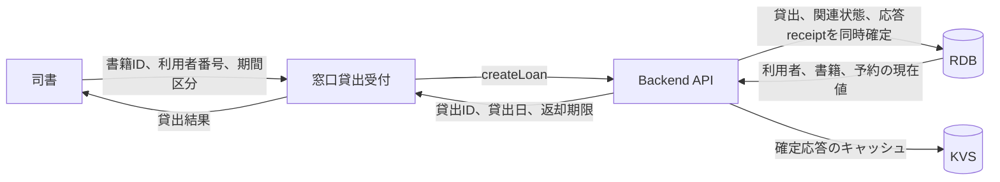
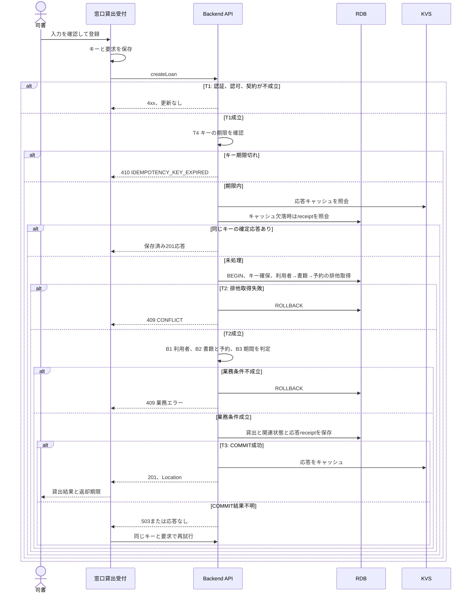

# 貸出を登録する

## 概要

司書が窓口で書籍と利用者を指定し、貸出を確定する。
システムは貸出可否と期間を確認し、貸出記録と関連状態を同時に更新して、返却期限を表示する。

| 項目 | 内容 |
|---|---|
| UC ID | `60d99956` |
| 契機 | 司書が窓口貸出受付画面で登録を押す |
| 入力 | 書籍ID、利用者番号、貸出期間区分 |
| 成功結果 | 貸出ID、貸出日、返却期限、貸出状態 |
| 範囲 | [RDRA BUC](../../../../../../rdra/latest/BUC.tsv)の「書籍を貸し出すフロー / 貸出を登録する」 |

## データフロー



| 接続 | 参照 |
|---|---|
| APIの入力と応答 | [API対応表](_api-summary.yaml)の`createLoan`、[OpenAPI](../../../_cross-cutting/api/openapi.yaml) |
| 永続化する値 | [モデル操作一覧](_model-summary.yaml)の`register-loan` |
| 再送結果の復元 | [Backendの再送処理](tier-backend-api.md#t4-再送と障害回復) |

## シーケンス



## 分岐の接続表

| ID | 条件の参照 | 成立時 | 不成立時 |
|---|---|---|---|
| B1 | [RDRA条件](../../../../../../rdra/latest/条件.tsv)の貸出可否条件、[状態](../../../../../../rdra/latest/状態.tsv)の利用者状態 | B2へ進む | 409 `USER_NOT_LOANABLE` |
| B2 | [RDRA条件](../../../../../../rdra/latest/条件.tsv)の貸出可否条件、取置き中書籍貸出条件、資料種別利用可否条件 | B3へ進む | 409 `BOOK_NOT_LOANABLE` |
| B3 | [RDRA条件](../../../../../../rdra/latest/条件.tsv)の返却期限設定条件、[バリエーション](../../../../../../rdra/latest/バリエーション.tsv)の利用者区分と貸出期間区分 | 返却期限を計算して更新へ進む | 409 `LOAN_PERIOD_NOT_ALLOWED` |
| T1 | [Backend入口](tier-backend-api.md#t1-入口) | T4へ進む | 400、401、403 |
| T2 | [Backend競合](tier-backend-api.md#t2-競合) | B1へ進む | 404、409、全rollback |
| T3 | [Backend更新境界](tier-backend-api.md#t3-更新境界) | 201を返す | 全rollback、または結果不明として照合 |
| T4 | [Backend再送](tier-backend-api.md#t4-再送と障害回復) | 確定結果を返す、または新規処理 | 本文不一致409、処理中409、期限切れ410 |

## 関連 RDRA モデル

[RDRA状態](../../../../../../rdra/latest/状態.tsv)の`遷移UC=貸出を登録する`を参照する。
対象は書籍状態、貸出状態、利用者状態、予約状態である。

## E2E 完了条件

```gherkin
Feature: 貸出を登録する
  Scenario: 一般利用者へ標準期間で貸し出す
    Given 登録済みの一般利用者と在庫ありの紙書籍
    And 貸出日は2026-09-06で貸出期間区分は標準
    When 司書が貸出を登録する
    Then 201と返却期限2026-09-20を返す
    And 貸出記録と関連状態が同時に確定する

  Scenario: 取置き対象者へ貸し出す
    Given 書籍は予約待ちで利用者は予約順1位の取置き対象者
    And 利用者状態は取引進行中で期間区分は標準
    When 司書が貸出を登録する
    Then 201を返し対象予約は貸出済みになる

  Scenario: 別の利用者への取置き書籍の貸出を拒否する
    Given 書籍は予約待ちで別の利用者の取置き中予約がある
    When 司書が貸出を登録する
    Then 409 BOOK_NOT_LOANABLEを返す
    And 業務データを更新しない

  Scenario: 一般利用者の長期指定を拒否する
    Given 一般利用者と在庫ありの紙書籍
    When 貸出期間区分に長期を指定して登録する
    Then 409 LOAN_PERIOD_NOT_ALLOWEDを返す
    And 業務データを更新しない

  Scenario: DB確定後の停止から成功応答を復元する
    Given 貸出と応答receiptがcommit済みでKVS保存前にプロセスが停止した
    When キー発行から24時間未満で同じキーと要求を再送する
    Then 初回の201と本文とLocationを返す
    And 貸出件数を増やさない

  Scenario: 期限切れキーを再実行しない
    Given キー発行から24時間以上が経過しreceiptが削除されている
    When 同じキーで登録要求を送る
    Then 410 IDEMPOTENCY_KEY_EXPIREDを返す
    And 貸出件数を増やさない
```

## ティア別仕様

- [Backend API](tier-backend-api.md)：処理順序、競合、永続化、再送。
- [Frontend staff](tier-frontend-staff.md)：入力、部品接続、通信、結果表示。
