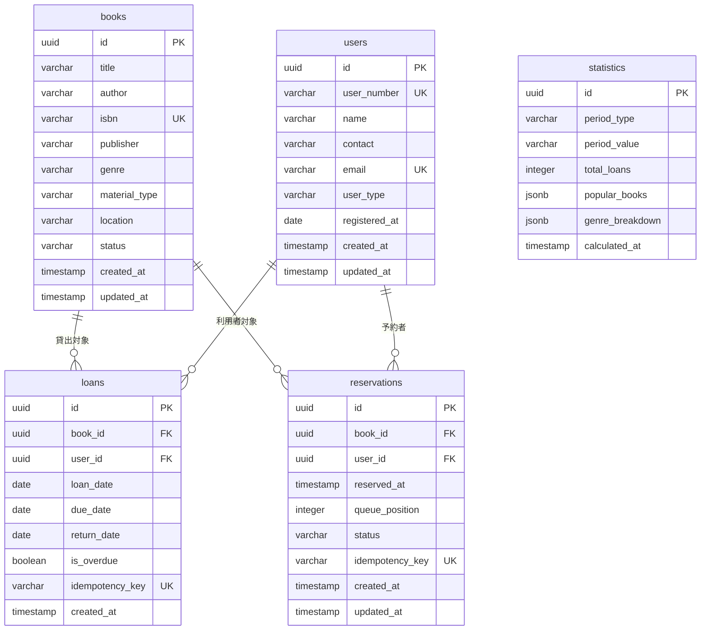

# データストアスキーマ

## サマリー

| データストア | 項目数 |
|------------|:------:|
| RDB テーブル | 5 |
| RDB インデックス | 11 |
| RDB 外部キー | 4 |
| KVS キーパターン | 2 |

## RDB

図書館蔵書管理システム RDB スキーマ定義

### ER 図


```

### テーブル一覧

| テーブル名 | RDRA 情報 | 説明 | カラム数 | インデックス数 | 利用 UC 数 |
|-----------|----------|------|:-------:|:----------:|:--------:|
| books | 書籍 | 図書館が所蔵する書籍の基本情報 | 11 | 3 | 0 |
| users | 利用者 | 図書館の利用者情報。個人情報（氏名・連絡先・メールアドレス）は保管時に暗号化する | 9 | 1 | 0 |
| loans | 貸出 | 書籍の貸出記録 | 9 | 4 | 0 |
| reservations | 予約 | 貸出中書籍への予約情報 | 9 | 2 | 0 |
| statistics | 統計情報 | 貸出データから集計した統計レポート用データ（非正規化テーブル） | 7 | 1 | 0 |

### books

**RDRA 情報**: 書籍
**説明**: 図書館が所蔵する書籍の基本情報

#### カラム

| カラム名 | 型 | NULL | 説明 |
|---------|---|:----:|------|
| **id** (PK) | uuid | NO | 書籍ID（主キー） |
| title | varchar(500) | NO | 書籍タイトル |
| author | varchar(200) | NO | 著者名 |
| isbn | varchar(17) | NO | ISBN-13形式 |
| publisher | varchar(200) | NO | 出版社名 |
| genre | varchar(50) | NO | 書籍ジャンル（文学/理工/児童書/社会科学/自然科学/芸術/その他） |
| material_type | varchar(20) | NO | 資料種別（紙書籍/電子書籍） |
| location | varchar(100) | YES | 配架場所（電子書籍の場合はNULL） |
| status | varchar(20) | NO | 貸出状態（available/on_loan/overdue） |
| created_at | timestamp | NO | 登録日時 |
| updated_at | timestamp | NO | 更新日時 |

#### インデックス

| 名前 | カラム | UNIQUE | 理由 | 利用 UC |
|------|-------|:------:|------|--------|
| idx_books_genre | genre | NO |  |  |
| idx_books_status | status | NO |  |  |
| idx_books_title_author | title, author | NO |  |  |

### users

**RDRA 情報**: 利用者
**説明**: 図書館の利用者情報。個人情報（氏名・連絡先・メールアドレス）は保管時に暗号化する

#### カラム

| カラム名 | 型 | NULL | 説明 |
|---------|---|:----:|------|
| **id** (PK) | uuid | NO | 利用者ID（主キー） |
| user_number | varchar(20) | NO | 利用者番号（表示用） |
| name | varchar(100) | NO | 氏名（暗号化保管） |
| contact | varchar(200) | YES | 連絡先（暗号化保管） |
| email | varchar(256) | NO | メールアドレス（暗号化保管） |
| user_type | varchar(20) | NO | 利用者種別（一般/学生/児童） |
| registered_at | date | NO | 登録日 |
| created_at | timestamp | NO | 作成日時 |
| updated_at | timestamp | NO | 更新日時 |

#### インデックス

| 名前 | カラム | UNIQUE | 理由 | 利用 UC |
|------|-------|:------:|------|--------|
| idx_users_name | name | NO |  |  |

### loans

**RDRA 情報**: 貸出
**説明**: 書籍の貸出記録

#### カラム

| カラム名 | 型 | NULL | 説明 |
|---------|---|:----:|------|
| **id** (PK) | uuid | NO | 貸出ID（主キー） |
| book_id | uuid | NO | 書籍ID（外部キー） |
| user_id | uuid | NO | 利用者ID（外部キー） |
| loan_date | date | NO | 貸出日 |
| due_date | date | NO | 返却期限 |
| return_date | date | YES | 返却日（NULL=未返却） |
| is_overdue | boolean | NO | 延滞フラグ |
| idempotency_key | varchar(36) | NO | 冪等キー |
| created_at | timestamp | NO | 作成日時 |

#### 外部キー

| カラム | 参照先テーブル | 参照先カラム | ON DELETE |
|-------|-------------|------------|----------|
| book_id |  |  |  |
| user_id |  |  |  |

#### インデックス

| 名前 | カラム | UNIQUE | 理由 | 利用 UC |
|------|-------|:------:|------|--------|
| idx_loans_book_id | book_id | NO |  |  |
| idx_loans_user_id | user_id | NO |  |  |
| idx_loans_due_date_return_date | due_date, return_date | NO |  |  |
| idx_loans_return_date_loan_date | return_date, loan_date | NO |  |  |

### reservations

**RDRA 情報**: 予約
**説明**: 貸出中書籍への予約情報

#### カラム

| カラム名 | 型 | NULL | 説明 |
|---------|---|:----:|------|
| **id** (PK) | uuid | NO | 予約ID（主キー） |
| book_id | uuid | NO | 書籍ID（外部キー） |
| user_id | uuid | NO | 利用者ID（外部キー） |
| reserved_at | timestamp | NO | 予約日時 |
| queue_position | integer | NO | 予約順位 |
| status | varchar(20) | NO | 予約状態（pending/reserved/cancelled） |
| idempotency_key | varchar(36) | NO | 冪等キー |
| created_at | timestamp | NO | 作成日時 |
| updated_at | timestamp | NO | 更新日時 |

#### 外部キー

| カラム | 参照先テーブル | 参照先カラム | ON DELETE |
|-------|-------------|------------|----------|
| book_id |  |  |  |
| user_id |  |  |  |

#### インデックス

| 名前 | カラム | UNIQUE | 理由 | 利用 UC |
|------|-------|:------:|------|--------|
| idx_reservations_book_id_status | book_id, status | NO |  |  |
| idx_reservations_user_id | user_id | NO |  |  |

### statistics

**RDRA 情報**: 統計情報
**説明**: 貸出データから集計した統計レポート用データ（非正規化テーブル）

#### カラム

| カラム名 | 型 | NULL | 説明 |
|---------|---|:----:|------|
| **id** (PK) | uuid | NO | 統計ID（主キー） |
| period_type | varchar(20) | NO | 集計期間種別（monthly/weekly） |
| period_value | varchar(10) | NO | 集計期間値（2026-04等） |
| total_loans | integer | NO | 期間内総貸出回数 |
| popular_books | jsonb | NO | 人気書籍ランキング（JSON配列） |
| genre_breakdown | jsonb | NO | ジャンル別貸出構成（JSON配列） |
| calculated_at | timestamp | NO | 集計実行日時 |

#### インデックス

| 名前 | カラム | UNIQUE | 理由 | 利用 UC |
|------|-------|:------:|------|--------|
| idx_statistics_period | period_type, period_value | NO |  |  |

## KVS

図書館蔵書管理システム KVS（Redis/ElastiCache）キーパターン定義

| キーパターン | 用途 | 値の型 | TTL | 利用 UC |
|------------|------|-------|-----|--------|
| `idempotency:{idempotency_key}` | 冪等キー重複チェック。貸出・返却・予約・キャンセル操作の二重実行を防止する | string | 86400 |  |
| `session:{session_id}` | ユーザーセッション管理。HttpOnly Cookie のセッションIDに対応するユーザー情報を保持 | hash | 3600 |  |

### `idempotency:{idempotency_key}`

- **用途**: 冪等キー重複チェック。貸出・返却・予約・キャンセル操作の二重実行を防止する
- **値の型**: string
- **TTL**: 86400
- **利用 UC**: 

### `session:{session_id}`

- **用途**: ユーザーセッション管理。HttpOnly Cookie のセッションIDに対応するユーザー情報を保持
- **値の型**: hash
- **TTL**: 3600
- **利用 UC**: 
