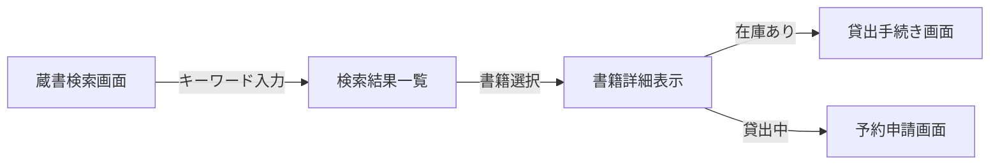
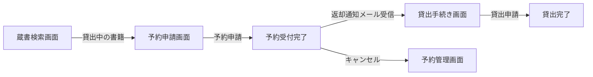
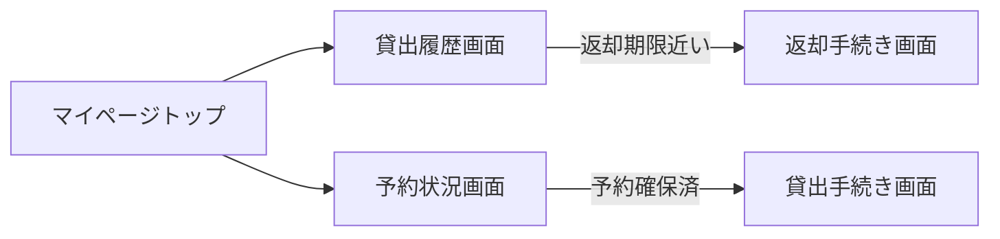
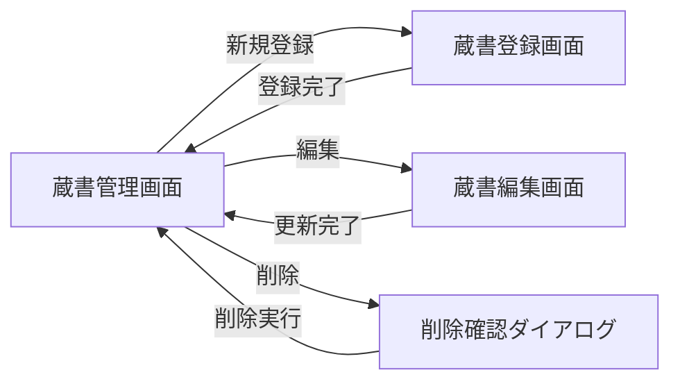
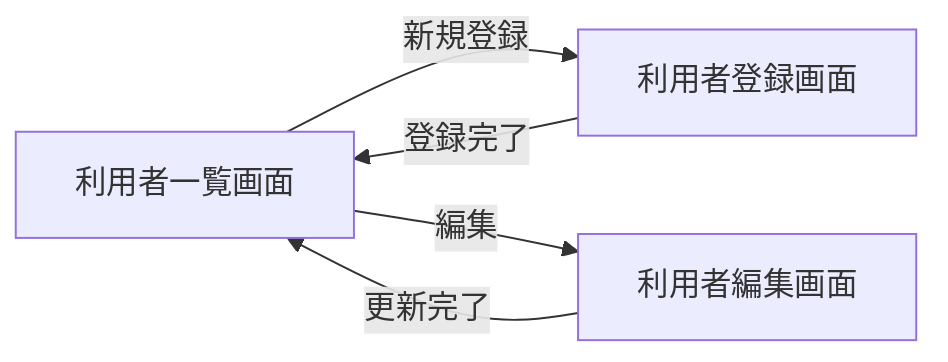
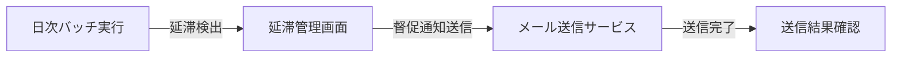
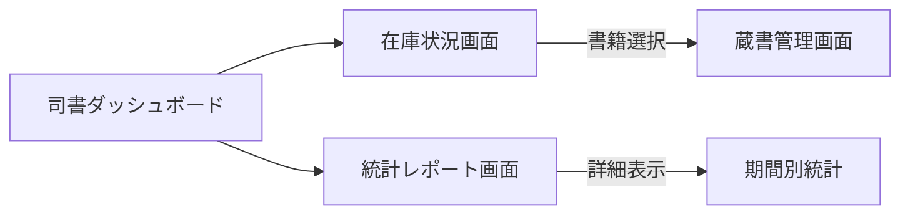
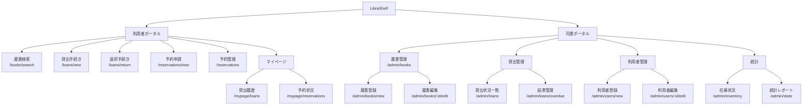

# UX デザイン仕様

## ユーザーフロー

### 閲覧業務: 蔵書検索フロー

**アクター**: 利用者
**ゴール**: キーワードやジャンル等の条件で書籍を検索し、貸出可能かどうかを確認する

**タッチポイント**:
| ステップ | 画面 | UC | 感情 | 改善機会 |
|---------|------|---|------|---------|
| 検索入力 | 蔵書検索画面 | 書籍を検索する | ニュートラル | サジェスト機能で入力補助 |
| 結果確認 | 蔵書検索画面 | 書籍を検索する | ポジティブ/ネガティブ | 在庫状態の即時表示で判断支援 |
| 貸出申請 | 貸出手続き画面 | 書籍を貸出する | ポジティブ | 返却期限の明示で安心感 |
| 予約申請 | 予約申請画面 | 書籍を予約する | ニュートラル | 予約順位の表示で期待値管理 |

### 貸出管理業務: 貸出・返却フロー

**アクター**: 利用者
**ゴール**: 書籍の貸出手続きを行い、期限内に返却する

**タッチポイント**:
| ステップ | 画面 | UC | 感情 | 改善機会 |
|---------|------|---|------|---------|
| 貸出申請 | 貸出手続き画面 | 書籍を貸出する | ポジティブ | 貸出可否の即時判定 |
| 貸出完了 | 貸出手続き画面 | 書籍を貸出する | ポジティブ | 返却期限のカレンダー登録リンク |
| 返却申請 | 返却手続き画面 | 書籍を返却する | ニュートラル | ワンタップ返却で手間削減 |

### 予約管理業務: 予約フロー

**アクター**: 利用者
**ゴール**: 貸出中の書籍を予約し、返却時に通知を受けて貸出手続きを行う

**タッチポイント**:
| ステップ | 画面 | UC | 感情 | 改善機会 |
|---------|------|---|------|---------|
| 予約申請 | 予約申請画面 | 書籍を予約する | ニュートラル | 予約順位の即時表示 |
| 通知受信 | メール | 予約通知を送信する | ポジティブ | メール内にワンクリック貸出リンク |
| キャンセル | 予約管理画面 | 予約をキャンセルする | ネガティブ | キャンセル理由の任意入力で改善フィードバック |

### 閲覧業務: 利用者マイページフロー

**アクター**: 利用者
**ゴール**: 自分の貸出履歴や予約状況を確認する

**タッチポイント**:
| ステップ | 画面 | UC | 感情 | 改善機会 |
|---------|------|---|------|---------|
| 履歴確認 | 貸出履歴画面 | 貸出履歴を確認する | ニュートラル | 返却期限のカウントダウン表示 |
| 予約確認 | 予約状況画面 | 予約状況を確認する | ニュートラル | 予約順位の進捗表示 |

### 蔵書管理業務: 蔵書管理フロー

**アクター**: 司書
**ゴール**: 書籍の登録・編集・削除を通じて蔵書を管理する

**タッチポイント**:
| ステップ | 画面 | UC | 感情 | 改善機会 |
|---------|------|---|------|---------|
| 書籍登録 | 蔵書登録画面 | 書籍を登録する | ニュートラル | ISBN 入力で書籍情報の自動補完 |
| 書籍編集 | 蔵書編集画面 | 書籍情報を編集する | ニュートラル | 変更箇所のハイライト表示 |
| 書籍削除 | 蔵書管理画面 | 書籍を削除する | ネガティブ | 削除前の確認ダイアログで誤操作防止 |

### 利用者管理業務: 利用者管理フロー

**アクター**: 司書
**ゴール**: 利用者の登録・編集を行い、利用者情報を管理する

**タッチポイント**:
| ステップ | 画面 | UC | 感情 | 改善機会 |
|---------|------|---|------|---------|
| 利用者登録 | 利用者登録画面 | 利用者を登録する | ニュートラル | 必須項目の明確な表示 |
| 利用者編集 | 利用者編集画面 | 利用者情報を編集する | ニュートラル | PII マスク表示/解除切替 |

### 貸出管理業務: 延滞管理フロー

**アクター**: 司書（+ システム自動処理）
**ゴール**: 延滞書籍を検出し、利用者に督促通知を送信する

**タッチポイント**:
| ステップ | 画面 | UC | 感情 | 改善機会 |
|---------|------|---|------|---------|
| 延滞確認 | 延滞管理画面 | 延滞を検出する | ネガティブ | 延滞日数でのソート・フィルター |
| 督促送信 | 延滞管理画面 | 督促通知を送信する | ニュートラル | 送信結果のリアルタイム表示 |

### 統計業務: 統計・レポートフロー

**アクター**: 司書
**ゴール**: 蔵書の在庫状況や貸出統計を確認し、運営判断に活用する

**タッチポイント**:
| ステップ | 画面 | UC | 感情 | 改善機会 |
|---------|------|---|------|---------|
| 在庫確認 | 在庫状況画面 | 在庫状況を確認する | ニュートラル | 在庫状態別の円グラフで全体把握 |
| 統計確認 | 統計レポート画面 | 統計レポートを閲覧する | ポジティブ | 期間指定フィルターでドリルダウン |

## 情報アーキテクチャ（IA）

### サイトマップ

### ナビゲーション構造

| ポータル | プライマリナビ | セカンダリナビ |
|---------|-------------|-------------|
| 利用者ポータル | 蔵書検索, 貸出手続き, 返却手続き, 予約, マイページ | マイページ配下: 貸出履歴, 予約状況 |
| 司書ポータル | 蔵書管理, 貸出管理, 利用者管理, 統計 | 貸出管理配下: 貸出状況一覧, 延滞管理 / 統計配下: 在庫状況, 統計レポート |

### ページ間の遷移ルール

- 蔵書検索結果から在庫あり書籍をクリック → 貸出手続き画面に遷移
- 蔵書検索結果から貸出中書籍をクリック → 予約申請画面に遷移
- マイページの貸出履歴から未返却書籍をクリック → 返却手続き画面に遷移
- マイページの予約状況から予約確保済書籍をクリック → 貸出手続き画面に遷移
- 司書ポータルの蔵書管理から書籍行をクリック → 蔵書編集画面に遷移
- 司書ポータルの在庫状況から書籍をクリック → 蔵書管理画面に遷移
- 全画面にパンくずリストを配置し、階層構造を明示する

## UX 心理学に基づくインタラクション設計原則

### 適用する原則

| 原則 | 適用場面 | 具体的な設計 |
|------|---------|-----------|
| 認知負荷 (Cognitive Load) | 全画面共通 | 一画面の情報量を4-5項目に制限。検索フィルターは折りたたみで初期表示を簡潔に |
| 視覚的階層 (Visual Hierarchy) | 蔵書検索画面、貸出状況一覧画面 | 書籍タイトル > 著者 > ISBN の階層。在庫状態バッジで即座に状態把握 |
| デフォルト効果 (Default Bias) | 蔵書登録画面、貸出手続き画面 | 資料種別「紙書籍」をデフォルト選択。貸出期間のデフォルト値を設定 |
| 意図的な壁 (Intentional Friction) | 書籍削除、予約キャンセル | 削除・キャンセル操作前に確認ダイアログを表示。不可逆操作の誤操作防止 |
| 段階的開示 (Progressive Disclosure) | 蔵書検索画面、統計レポート画面 | 検索フィルター（ジャンル、資料種別）は「絞り込み」ボタンで展開。統計はサマリー → ドリルダウン |
| ピーク・エンドの法則 (Peak-End Rule) | 貸出完了、返却完了 | 完了画面に「返却期限: YYYY/MM/DD」を大きく表示。返却完了時に「ありがとうございました」メッセージ |
| ドハティの閾値 (Doherty Threshold) | 蔵書検索、一覧画面全般 | 検索レスポンス 400ms 以内を目標。超過時は Skeleton UI で知覚待ち時間を短縮 |
| 目標勾配効果 (Goal Gradient Effect) | 蔵書登録画面（入力フォーム） | フォーム入力の進捗をステップインジケーターで表示 |

## アクセシビリティ方針

- **WCAG 準拠レベル**: AA（公共図書館システムとして標準的なアクセシビリティを確保）
- **キーボード操作**: 全操作をキーボードのみで完結可能にする。Tab 順序の論理的な設定。フォーカスインジケーターの明示
- **スクリーンリーダー**: 全画面要素に適切な ARIA ラベルを付与。動的コンテンツの変更を aria-live で通知
- **色覚多様性**: 在庫状態（在庫あり/貸出中/延滞中）の識別をアイコン + テキストで補完（色のみに依存しない）。コントラスト比 4.5:1 以上を確保
