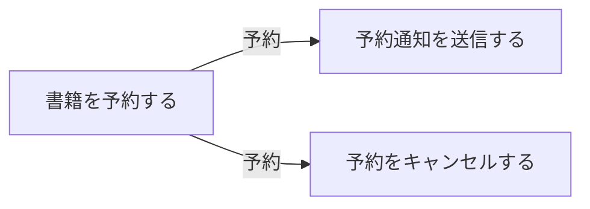
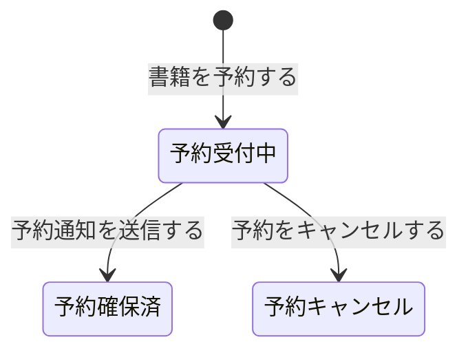

# 予約管理フロー

## 概要

予約管理業務における予約管理フローの俯瞰仕様。所属 UC 間のデータフロー、状態遷移の全体像を示す。

## 所属 UC 一覧

| UC名 | アクター | 主な操作 | 関連情報 |
|------|---------|---------|---------|
| [書籍を予約する](書籍を予約する/spec.md) | 利用者 | 貸出中書籍への予約 | 書籍, 予約 |
| [予約通知を送信する](予約通知を送信する/spec.md) | システム | 予約確保通知メール送信 | 予約, 利用者 |
| [予約をキャンセルする](予約をキャンセルする/spec.md) | 利用者 | 予約の取消 | 予約 |

## UC 横断データフロー

### データフロー図

### 情報 CRUD マトリクス

| 情報名 | 書籍を予約する | 予約通知を送信する | 予約をキャンセルする |
|--------|:---:|:---:|:---:|
| 書籍 | R | - | - |
| 予約 | C | RU | RU |
| 利用者 | - | R | - |

## 状態遷移全体図

### 状態遷移 UC マッピング

| 状態モデル | 遷移元 | 遷移先 | 担当 UC |
|-----------|--------|--------|---------|
| 予約状態 | (初期) | 予約受付中 | 書籍を予約する |
| 予約状態 | 予約受付中 | 予約確保済 | 予約通知を送信する |
| 予約状態 | 予約受付中 | 予約キャンセル | 予約をキャンセルする |

## BUC 内共有条件一覧

| 条件名 | 説明 | 適用 UC |
|--------|------|--------|
| 予約優先ルール | 同一書籍への予約は申込日時順に優先 | 書籍を予約する |

## BUC 内共有バリエーション一覧

この BUC に関連する RDRA 定義バリエーションはない。
