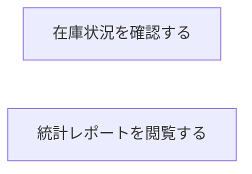

# 統計・レポートフロー

## 概要

統計業務における統計・レポートフローの俯瞰仕様。所属 UC 間のデータフロー、状態遷移の全体像を示す。

## 所属 UC 一覧

| UC名 | アクター | 主な操作 | 関連情報 |
|------|---------|---------|---------|
| [在庫状況を確認する](在庫状況を確認する/spec.md) | 司書 | 全書籍の在庫状態確認 | 書籍, 統計情報 |
| [統計レポートを閲覧する](統計レポートを閲覧する/spec.md) | 司書 | 貸出統計の閲覧 | 統計情報 |

## UC 横断データフロー

### データフロー図

### 情報 CRUD マトリクス

| 情報名 | 在庫状況を確認する | 統計レポートを閲覧する |
|--------|:---:|:---:|
| 書籍 | R | - |
| 統計情報 | R | R |

## 状態遷移全体図

この BUC に関連する状態遷移はない。

## BUC 内共有条件一覧

この BUC に関連する RDRA 定義条件はない。

## BUC 内共有バリエーション一覧

この BUC に関連する RDRA 定義バリエーションはない。
