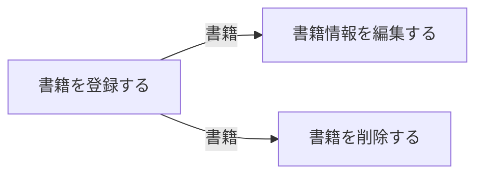
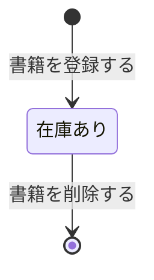

# 蔵書管理フロー

## 概要

蔵書管理業務における蔵書管理フローの俯瞰仕様。所属 UC 間のデータフロー、状態遷移の全体像を示す。

## 所属 UC 一覧

| UC名 | アクター | 主な操作 | 関連情報 |
|------|---------|---------|---------|
| [書籍を登録する](書籍を登録する/spec.md) | 司書 | 書籍の新規登録 | 書籍 |
| [書籍情報を編集する](書籍情報を編集する/spec.md) | 司書 | 書籍情報の修正 | 書籍 |
| [書籍を削除する](書籍を削除する/spec.md) | 司書 | 書籍の除籍 | 書籍 |

## UC 横断データフロー

### データフロー図

### 情報 CRUD マトリクス

| 情報名 | 書籍を登録する | 書籍情報を編集する | 書籍を削除する |
|--------|:---:|:---:|:---:|
| 書籍 | C | RU | RD |

## 状態遷移全体図

### 状態遷移 UC マッピング

| 状態モデル | 遷移元 | 遷移先 | 担当 UC |
|-----------|--------|--------|---------|
| 書籍貸出状態 | (初期) | 在庫あり | 書籍を登録する |
| 書籍貸出状態 | 在庫あり | (終了) | 書籍を削除する |

## BUC 内共有条件一覧

この BUC に関連する RDRA 定義条件はない。

## BUC 内共有バリエーション一覧

| バリエーション名 | 値 | 適用 UC |
|----------------|---|--------|
| 資料種別 | 紙書籍, 電子書籍 | 書籍を登録する, 書籍情報を編集する |
| 書籍ジャンル | 文学, 理工, 児童書, 社会科学, 自然科学, 芸術, その他 | 書籍を登録する, 書籍情報を編集する |
