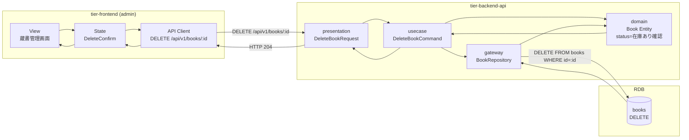
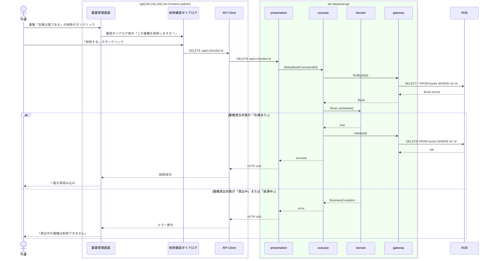

# 書籍を削除する

## 概要

司書が不要な書籍を蔵書から除外する。在庫あり状態の書籍のみ削除可能。貸出中・延滞中の書籍は削除できない。

## データフロー



| レイヤー | データモデル | 変換内容 |
|---------|------------|---------|
| FE View | 削除確認ダイアログ（書籍タイトル表示） | 確認ボタンクリック → API呼出し |
| BE presentation | DeleteBookRequest(id) | パスパラメータから取得 |
| BE domain | Book Entity status チェック | 在庫あり以外は BusinessException |
| BE gateway | DELETE FROM books WHERE id=:id | 論理削除 or 物理削除 |
| Response | 204 No Content | なし |

## 処理フロー



## バリエーション一覧

該当なし

## 分岐条件一覧

| 条件名 | 判定ルール | 適用 tier | 適用箇所 | BDD Scenario |
|--------|----------|----------|---------|-------------|
| 貸出可否判定ルール（削除用） | 書籍貸出状態が「在庫あり」の場合のみ削除可能 | tier-backend-api | DeleteBookCommand | 貸出中書籍の削除拒否 |

## 計算ルール一覧

該当なし

## 状態遷移一覧

| 状態モデル | 遷移元 | 遷移先 | トリガー | 事前条件 | 事後処理 | 適用 tier |
|-----------|--------|--------|---------|---------|---------|----------|
| 書籍貸出状態 | 在庫あり | (終了) | 書籍を削除する | 在庫あり状態であること | 関連予約があれば予約キャンセル | tier-backend-api |

## 関連 RDRA モデル

| モデル種別 | 要素名 | 関連 |
|-----------|--------|------|
| 業務 | 蔵書管理業務 | このUCが属する業務 |
| BUC | 蔵書管理フロー | このUCを含むBUC |
| アクター | 司書 | 操作するアクター |
| 情報 | 書籍 | 削除する情報 |
| 状態 | 書籍貸出状態 | 在庫あり → 終了 |

## E2E 完了条件（BDD）

### 正常系

```gherkin
Feature: 書籍を削除する

  Scenario: 在庫あり書籍の削除
    Given 司書「山田花子」がログイン済み
    And 「在庫あり」状態の書籍「吾輩は猫である」が登録済み
    When 蔵書管理画面で「吾輩は猫である」の削除ボタンをクリックする
    And 確認ダイアログで「削除する」をクリックする
    Then 蔵書管理画面から「吾輩は猫である」が消える
```

### 異常系

```gherkin
  Scenario: 貸出中書籍の削除拒否
    Given 司書「山田花子」がログイン済み
    And 「貸出中」状態の書籍「こころ」が存在する
    When 蔵書管理画面で「こころ」の削除ボタンをクリックする
    And 確認ダイアログで「削除する」をクリックする
    Then 「貸出中の書籍は削除できません」エラーが表示される
```

## ティア別仕様

- [フロントエンド](tier-frontend.md)
- [バックエンドAPI](tier-backend-api.md)
