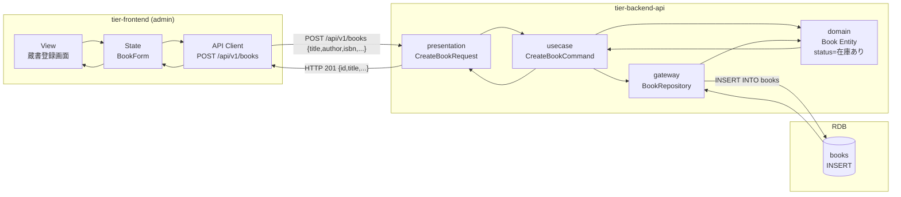
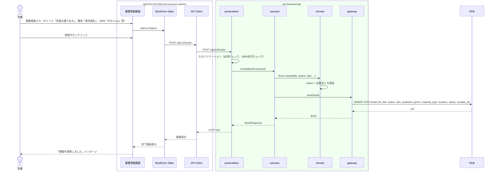

# 書籍を登録する

## 概要

司書が新規書籍の情報を入力し、蔵書として登録する。登録された書籍は「在庫あり」状態で蔵書管理画面に表示される。

## データフロー



| レイヤー | データモデル | 変換内容 |
|---------|------------|---------|
| FE View | 蔵書登録フォーム（タイトル、著者、ISBN、出版社、ジャンル、資料種別、配架場所） | ユーザー入力 → BookForm state |
| BE presentation | CreateBookRequest(title, author, isbn, publisher, genre, material_type, location) | バリデーション + CreateBookCommand 変換 |
| BE gateway | INSERT INTO books | Book Entity → books レコード作成 |
| Response | BookResponse(id, title, author, isbn, publisher, genre, material_type, location, status) | 登録完了表示用 |

## 処理フロー



## バリエーション一覧

| バリエーション名 | 値 | 処理内容 | 適用 tier | 適用箇所 |
|----------------|---|---------|----------|---------|
| 資料種別 | 紙書籍 | デフォルト選択 | tier-frontend | 蔵書登録画面の資料種別プルダウン |
| 資料種別 | 電子書籍 | 配架場所を非表示に切替 | tier-frontend | 蔵書登録画面の条件表示 |
| 書籍ジャンル | 文学、理工、児童書、社会科学、自然科学、芸術、その他 | プルダウン選択肢 | tier-frontend | 蔵書登録画面のジャンルプルダウン |

## 分岐条件一覧

該当なし（登録処理に RDRA 定義の条件適用なし）

## 計算ルール一覧

該当なし

## 状態遷移一覧

| 状態モデル | 遷移元 | 遷移先 | トリガー | 事前条件 | 事後処理 | 適用 tier |
|-----------|--------|--------|---------|---------|---------|----------|
| 書籍貸出状態 | (初期) | 在庫あり | 書籍を登録する | なし | なし | tier-backend-api |

## 関連 RDRA モデル

| モデル種別 | 要素名 | 関連 |
|-----------|--------|------|
| 業務 | 蔵書管理業務 | このUCが属する業務 |
| BUC | 蔵書管理フロー | このUCを含むBUC |
| アクター | 司書 | 操作するアクター |
| 情報 | 書籍 | 登録する情報 |
| 状態 | 書籍貸出状態 | 初期状態「在庫あり」を設定 |

## E2E 完了条件（BDD）

### 正常系

```gherkin
Feature: 書籍を登録する

  Scenario: 紙書籍の新規登録
    Given 司書「山田花子」がログイン済み
    When 蔵書登録画面で以下の情報を入力して登録する
      | タイトル | 吾輩は猫である |
      | 著者 | 夏目漱石 |
      | ISBN | 978-4-10-101001-2 |
      | 出版社 | 新潮社 |
      | ジャンル | 文学 |
      | 資料種別 | 紙書籍 |
      | 配架場所 | A棟2階 |
    Then 「書籍を登録しました」メッセージが表示される
    And 蔵書管理画面に「吾輩は猫である」が「在庫あり」状態で表示される

  Scenario: 電子書籍の新規登録
    Given 司書「山田花子」がログイン済み
    When 蔵書登録画面で資料種別「電子書籍」を選択する
    And 以下の情報を入力して登録する
      | タイトル | プログラミング入門 |
      | 著者 | 田中一郎 |
      | ISBN | 978-4-87311-001-0 |
      | 出版社 | 技術書出版社 |
      | ジャンル | 理工 |
    Then 配架場所の入力欄が非表示になっている
    And 「書籍を登録しました」メッセージが表示される
```

### 異常系

```gherkin
  Scenario: 必須項目未入力で登録失敗
    Given 司書「山田花子」がログイン済み
    When 蔵書登録画面でタイトルを空にして登録ボタンをクリックする
    Then 「タイトルは必須です」バリデーションエラーが表示される

  Scenario: ISBN形式不正で登録失敗
    Given 司書「山田花子」がログイン済み
    When 蔵書登録画面でISBN「invalid-isbn」を入力して登録する
    Then 「ISBNの形式が正しくありません」バリデーションエラーが表示される
```

## ティア別仕様

- [フロントエンド](tier-frontend.md)
- [バックエンドAPI](tier-backend-api.md)

### 統合 API Spec

- [OpenAPI Spec](../../../_cross-cutting/api/openapi.yaml)
- [AsyncAPI Spec](../../../_cross-cutting/api/asyncapi.yaml)
