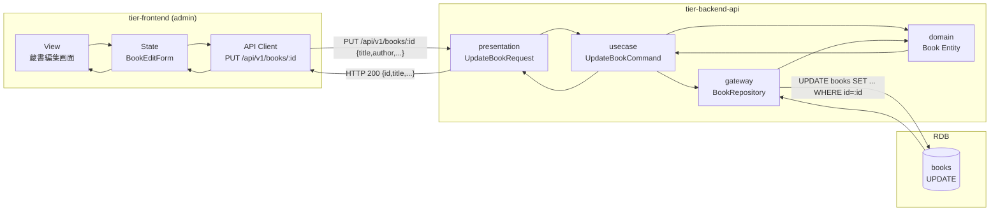
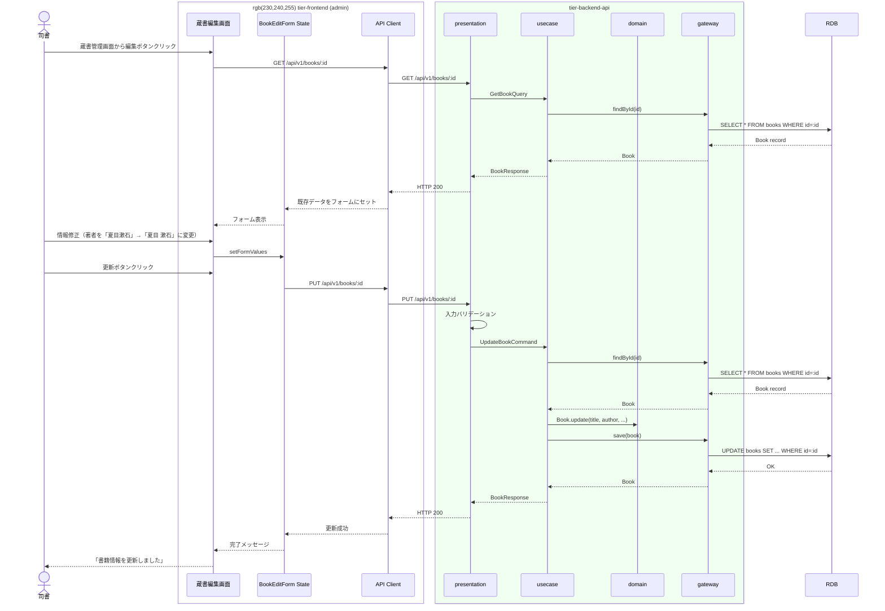

# 書籍情報を編集する

## 概要

司書が既存書籍の情報を修正・更新する。タイトル、著者、ISBN、出版社、ジャンル、資料種別、配架場所を編集できる。

## データフロー



| レイヤー | データモデル | 変換内容 |
|---------|------------|---------|
| FE View | 蔵書編集フォーム（既存値をプリフィル） | ユーザー編集 → BookEditForm state |
| BE presentation | UpdateBookRequest(title, author, isbn, publisher, genre, material_type, location) | バリデーション + UpdateBookCommand 変換 |
| BE gateway | UPDATE books SET ... WHERE id=:id | Book Entity → books レコード更新 |
| Response | BookResponse(id, title, author, ..., updated_at) | 更新完了表示用 |

## 処理フロー



## バリエーション一覧

| バリエーション名 | 値 | 処理内容 | 適用 tier | 適用箇所 |
|----------------|---|---------|----------|---------|
| 資料種別 | 紙書籍 | 配架場所を表示 | tier-frontend | 蔵書編集画面 |
| 資料種別 | 電子書籍 | 配架場所を非表示 | tier-frontend | 蔵書編集画面 |
| 書籍ジャンル | 文学、理工、児童書、社会科学、自然科学、芸術、その他 | プルダウン選択肢 | tier-frontend | 蔵書編集画面 |

## 分岐条件一覧

該当なし

## 計算ルール一覧

該当なし

## 状態遷移一覧

該当なし（編集操作は書籍貸出状態を変更しない）

## 関連 RDRA モデル

| モデル種別 | 要素名 | 関連 |
|-----------|--------|------|
| 業務 | 蔵書管理業務 | このUCが属する業務 |
| BUC | 蔵書管理フロー | このUCを含むBUC |
| アクター | 司書 | 操作するアクター |
| 情報 | 書籍 | 編集する情報 |

## E2E 完了条件（BDD）

### 正常系

```gherkin
Feature: 書籍情報を編集する

  Scenario: 書籍情報の更新
    Given 司書「山田花子」がログイン済み
    And ISBN「978-4-10-101001-2」の書籍「吾輩は猫である」が登録済み
    When 蔵書編集画面で著者を「夏目 漱石」に変更して更新する
    Then 「書籍情報を更新しました」メッセージが表示される
    And 蔵書管理画面で著者が「夏目 漱石」に更新されている
```

### 異常系

```gherkin
  Scenario: 存在しない書籍の編集
    Given 司書「山田花子」がログイン済み
    When 存在しない書籍ID「00000000-0000-0000-0000-000000000000」の編集画面にアクセスする
    Then 「書籍が見つかりません」エラーが表示される

  Scenario: ISBN重複での更新失敗
    Given ISBN「978-4-10-101001-2」の書籍Aと ISBN「978-4-87311-001-0」の書籍Bが登録済み
    When 書籍Bの ISBN を「978-4-10-101001-2」に変更して更新する
    Then 「このISBNは既に登録されています」エラーが表示される
```

## ティア別仕様

- [フロントエンド](tier-frontend.md)
- [バックエンドAPI](tier-backend-api.md)

### 統合 API Spec

- [OpenAPI Spec](../../../_cross-cutting/api/openapi.yaml)
