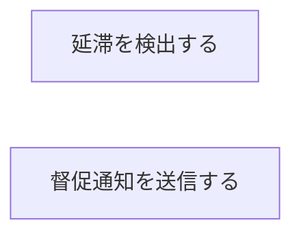
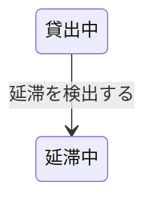

# 延滞管理フロー

## 概要

貸出管理業務における延滞管理フローの俯瞰仕様。所属 UC 間のデータフロー、状態遷移の全体像を示す。

## 所属 UC 一覧

| UC名 | アクター | 主な操作 | 関連情報 |
|------|---------|---------|---------|
| [延滞を検出する](延滞を検出する/spec.md) | 司書/システム | 返却期限超過の検出 | 貸出 |
| [督促通知を送信する](督促通知を送信する/spec.md) | システム | 延滞者への督促メール送信 | 貸出, 利用者 |

## UC 横断データフロー

### データフロー図

### 情報 CRUD マトリクス

| 情報名 | 延滞を検出する | 督促通知を送信する |
|--------|:---:|:---:|
| 貸出 | RU | R |
| 利用者 | R | R |

## 状態遷移全体図

### 状態遷移 UC マッピング

| 状態モデル | 遷移元 | 遷移先 | 担当 UC |
|-----------|--------|--------|---------|
| 書籍貸出状態 | 貸出中 | 延滞中 | 延滞を検出する |

## BUC 内共有条件一覧

| 条件名 | 説明 | 適用 UC |
|--------|------|--------|
| 延滞判定ルール | 返却期限を超過した貸出を延滞として判定 | 延滞を検出する |

## BUC 内共有バリエーション一覧

この BUC に関連する RDRA 定義バリエーションはない。
