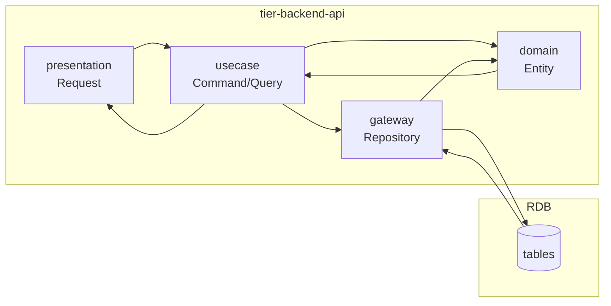
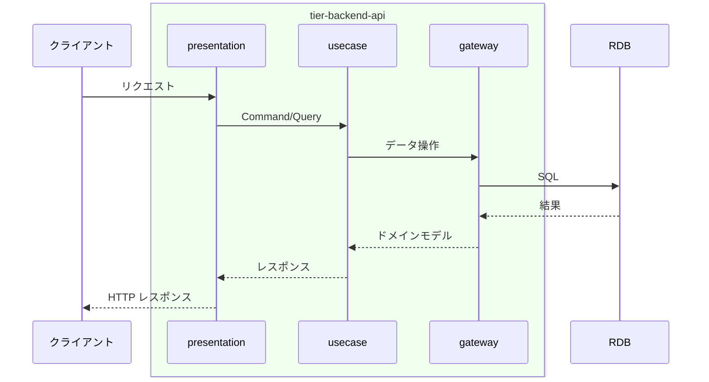

# 延滞を検出する

## 概要

延滞を検出するの処理を実行する。

## データフロー



| レイヤー | データモデル | 変換内容 |
|---------|------------|---------|
| BE presentation | Request/Response DTO | バリデーション + Command/Query 変換 |
| BE domain | Entity | ビジネスルール適用 |
| BE gateway | Repository | データ永続化 |

## 処理フロー



## バリエーション一覧

該当なし

## 分岐条件一覧

| 条件名 | 判定ルール | 適用 tier | 適用箇所 | BDD Scenario |
|--------|----------|----------|---------|-------------|
| 延滞判定ルール | RDRA条件定義参照 | tier-backend-api | ビジネスロジック | 正常系/異常系 |

## 計算ルール一覧

該当なし

## 状態遷移一覧

| 状態モデル | 遷移元 | 遷移先 | トリガー | 事前条件 | 事後処理 | 適用 tier |
|-----------|--------|--------|---------|---------|---------|----------|
| 書籍貸出状態 | 貸出中 | 延滞中 | 延滞を検出する | - | - | tier-backend-api |

## 関連 RDRA モデル

| モデル種別 | 要素名 | 関連 |
|-----------|--------|------|
| 業務 | 貸出管理業務 | このUCが属する業務 |
| BUC | 延滞管理フロー | このUCを含むBUC |
| アクター | 司書 | 操作するアクター |
| 情報 | 貸出 | 参照・更新する情報 |
| 条件 | 延滞判定ルール | 適用される条件 |
| 状態 | 書籍貸出状態 | 貸出中 -> 延滞中 |


## E2E 完了条件（BDD）

### 正常系

```gherkin
Feature: 延滞を検出する

  Scenario: 延滞を検出するの正常実行
    Given 司書「山田花子」がログイン済み
    When 延滞管理画面で操作を実行する
    Then 処理が正常に完了する
```

### 異常系

```gherkin
  Scenario: 未認証アクセスの拒否
    Given ユーザーが未ログイン状態
    When 延滞管理画面にアクセスする
    Then ログイン画面にリダイレクトされる
```

## ティア別仕様

- [tier-frontend](tier-frontend.md)
- [tier-backend-api](tier-backend-api.md)
- [tier-worker](tier-worker.md)
