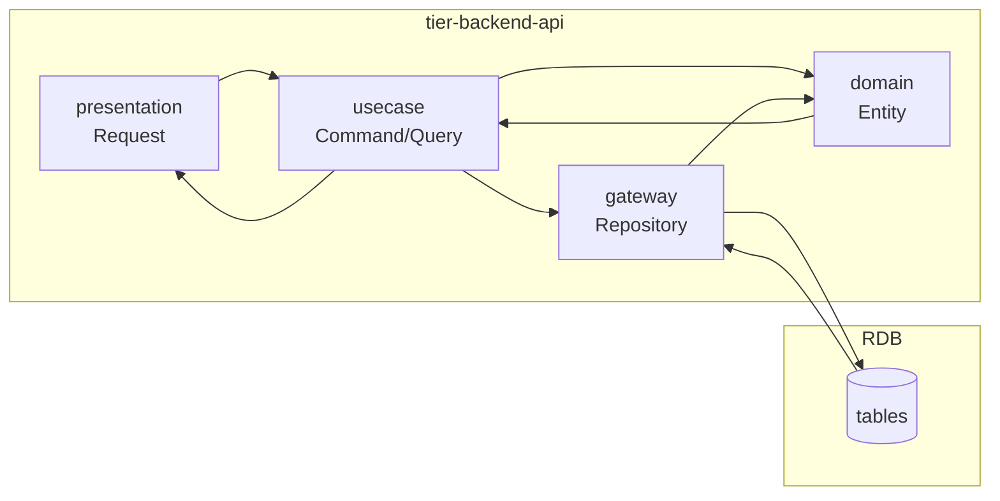
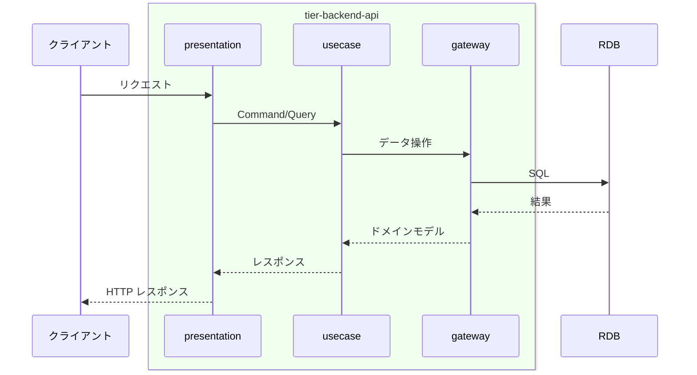

# 督促通知を送信する

## 概要

督促通知を送信するの処理を実行する。

## データフロー



| レイヤー | データモデル | 変換内容 |
|---------|------------|---------|
| BE presentation | Request/Response DTO | バリデーション + Command/Query 変換 |
| BE domain | Entity | ビジネスルール適用 |
| BE gateway | Repository | データ永続化 |

## 処理フロー



## バリエーション一覧

該当なし

## 分岐条件一覧

該当なし

## 計算ルール一覧

該当なし

## 状態遷移一覧

該当なし

## 関連 RDRA モデル

| モデル種別 | 要素名 | 関連 |
|-----------|--------|------|
| 業務 | 貸出管理業務 | このUCが属する業務 |
| BUC | 延滞管理フロー | このUCを含むBUC |

| 情報 | 貸出 | 参照・更新する情報 |
| 情報 | 利用者 | 参照・更新する情報 |


| 外部システム | メール送信サービス | 連携する外部システム |

## E2E 完了条件（BDD）

### 正常系

```gherkin
Feature: 督促通知を送信する

  Scenario: 督促通知を送信するの正常実行
    Given システムが正常稼働中
    When 督促通知を送信するがトリガーされる
    Then 処理が正常に完了する
```

### 異常系

```gherkin
  Scenario: 対象データなしの場合
    Given 処理対象のデータが0件
    When 督促通知を送信するがトリガーされる
    Then 処理がスキップされログに記録される
```

## ティア別仕様

- [tier-backend-api](tier-backend-api.md)
- [tier-worker](tier-worker.md)
