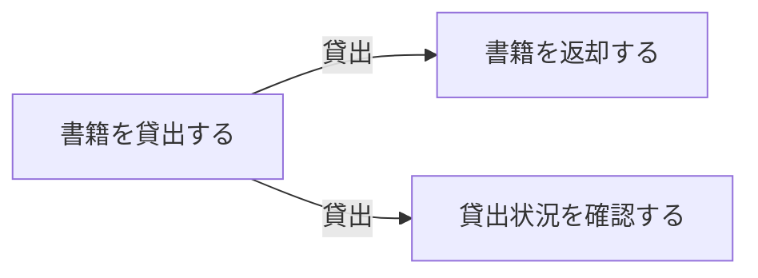
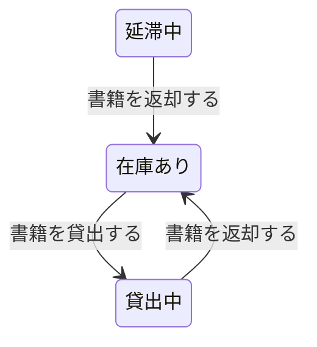

# 貸出管理フロー

## 概要

貸出管理業務における貸出管理フローの俯瞰仕様。所属 UC 間のデータフロー、状態遷移の全体像を示す。

## 所属 UC 一覧

| UC名 | アクター | 主な操作 | 関連情報 |
|------|---------|---------|---------|
| [書籍を貸出する](書籍を貸出する/spec.md) | 利用者 | 書籍の貸出手続き | 書籍, 貸出 |
| [書籍を返却する](書籍を返却する/spec.md) | 利用者 | 書籍の返却手続き | 書籍, 貸出 |
| [貸出状況を確認する](貸出状況を確認する/spec.md) | 司書 | 貸出中書籍の一覧確認 | 貸出 |

## UC 横断データフロー

### データフロー図

### 情報 CRUD マトリクス

| 情報名 | 書籍を貸出する | 書籍を返却する | 貸出状況を確認する |
|--------|:---:|:---:|:---:|
| 書籍 | RU | RU | R |
| 貸出 | C | U | R |

## 状態遷移全体図

### 状態遷移 UC マッピング

| 状態モデル | 遷移元 | 遷移先 | 担当 UC |
|-----------|--------|--------|---------|
| 書籍貸出状態 | 在庫あり | 貸出中 | 書籍を貸出する |
| 書籍貸出状態 | 貸出中 | 在庫あり | 書籍を返却する |
| 書籍貸出状態 | 延滞中 | 在庫あり | 書籍を返却する |

## BUC 内共有条件一覧

| 条件名 | 説明 | 適用 UC |
|--------|------|--------|
| 貸出期限ルール | 貸出日から14日間を返却期限として設定 | 書籍を貸出する |
| 貸出可否判定ルール | 書籍が在庫ありかつ予約がない場合に貸出可能 | 書籍を貸出する |

## BUC 内共有バリエーション一覧

この BUC に関連する RDRA 定義バリエーションはない。
