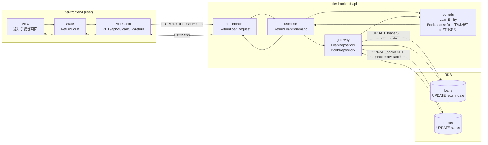
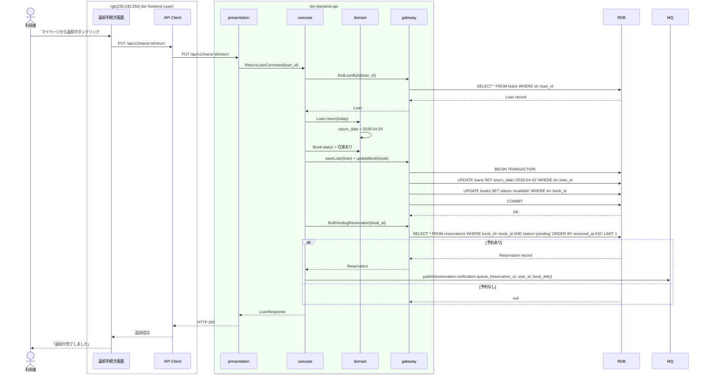

# 書籍を返却する

## 概要

利用者が書籍の返却手続きを行う。返却完了時に書籍の状態が「貸出中」または「延滞中」から「在庫あり」に遷移する。予約がある場合は予約通知をトリガーする。

## データフロー



| レイヤー | データモデル | 変換内容 |
|---------|------------|---------|
| FE View | LoanRecord で未返却貸出表示 + 返却ボタン | ボタンクリック to API呼出し |
| BE presentation | ReturnLoanRequest(loan_id) | パスパラメータから取得 |
| BE domain | Loan.return + Book.status 遷移 | 返却日設定 + 在庫あり遷移 + 予約チェック |
| BE gateway | UPDATE loans + UPDATE books | トランザクション内 |
| Response | LoanResponse(return_date) | 返却完了表示 |

## 処理フロー



## バリエーション一覧

該当なし

## 分岐条件一覧

該当なし（返却処理にRDRA定義の条件適用なし。ただし予約有無で通知の分岐あり）

## 計算ルール一覧

該当なし

## 状態遷移一覧

| 状態モデル | 遷移元 | 遷移先 | トリガー | 事前条件 | 事後処理 | 適用 tier |
|-----------|--------|--------|---------|---------|---------|----------|
| 書籍貸出状態 | 貸出中 | 在庫あり | 書籍を返却する | 該当貸出が存在 | 予約ありの場合は予約通知キューにメッセージ送信 | tier-backend-api |
| 書籍貸出状態 | 延滞中 | 在庫あり | 書籍を返却する | 該当貸出が存在 | 延滞フラグ解除 + 予約通知チェック | tier-backend-api |

## 関連 RDRA モデル

| モデル種別 | 要素名 | 関連 |
|-----------|--------|------|
| 業務 | 貸出管理業務 | このUCが属する業務 |
| BUC | 貸出管理フロー | このUCを含むBUC |
| アクター | 利用者 | 操作するアクター |
| 情報 | 書籍 | 返却対象の書籍 |
| 情報 | 貸出 | 更新する貸出記録 |
| 状態 | 書籍貸出状態 | 貸出中/延滞中 to 在庫あり |

## E2E 完了条件（BDD）

### 正常系

```gherkin
Feature: 書籍を返却する

  Scenario: 通常の返却
    Given 利用者「田中太郎」がログイン済み
    And 利用者「田中太郎」が書籍「吾輩は猫である」を貸出中（返却期限: 2026-04-26）
    When 返却手続き画面で「吾輩は猫である」の「返却する」ボタンをクリックする
    Then 「返却が完了しました」メッセージが表示される
    And 書籍「吾輩は猫である」の状態が「在庫あり」に変わる

  Scenario: 延滞書籍の返却
    Given 利用者「田中太郎」がログイン済み
    And 利用者「田中太郎」が書籍「こころ」を延滞中（返却期限: 2026-04-01、延滞10日）
    When 返却手続き画面で「こころ」の「返却する」ボタンをクリックする
    Then 「返却が完了しました」メッセージが表示される
    And 書籍「こころ」の状態が「在庫あり」に変わる

  Scenario: 予約あり書籍の返却で通知トリガー
    Given 利用者「田中太郎」が書籍「三四郎」を貸出中
    And 利用者「佐藤次郎」が書籍「三四郎」を予約受付中
    When 利用者「田中太郎」が書籍「三四郎」を返却する
    Then 書籍「三四郎」の状態が「在庫あり」に変わる
    And 予約通知キューにメッセージが送信される
```

### 異常系

```gherkin
  Scenario: 存在しない貸出の返却
    Given 利用者「田中太郎」がログイン済み
    When 存在しない貸出ID「00000000-0000-0000-0000-000000000000」の返却を試みる
    Then 「貸出が見つかりません」エラーが表示される
```

## ティア別仕様

- [フロントエンド](tier-frontend.md)
- [バックエンドAPI](tier-backend-api.md)
