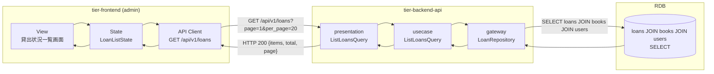
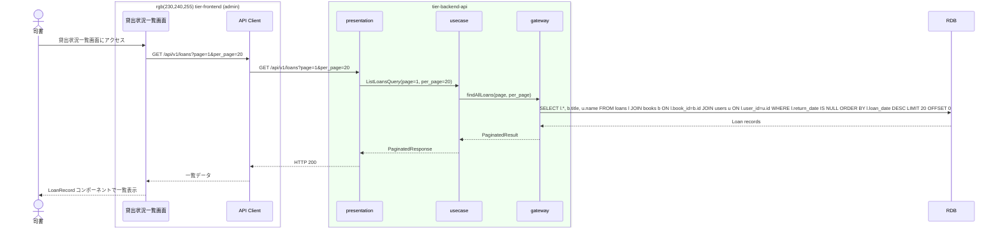

# 貸出状況を確認する

## 概要

司書が貸出中の書籍一覧を確認する。貸出状況一覧画面で、全利用者の貸出中・延滞中の貸出レコードを一覧表示する。

## データフロー



| レイヤー | データモデル | 変換内容 |
|---------|------------|---------|
| FE View | LoanRecord コンポーネント一覧 | ページネーション付き一覧表示 |
| BE presentation | ListLoansQuery(page, per_page, status) | クエリパラメータからQuery変換 |
| BE gateway | SELECT loans JOIN books JOIN users | 貸出+書籍+利用者情報の結合取得 |
| Response | PaginatedResponse(items: LoanListItem[], total, page) | ページネーション付き一覧 |

## 処理フロー



## バリエーション一覧

該当なし

## 分岐条件一覧

該当なし

## 計算ルール一覧

該当なし

## 状態遷移一覧

該当なし（参照のみ）

## 関連 RDRA モデル

| モデル種別 | 要素名 | 関連 |
|-----------|--------|------|
| 業務 | 貸出管理業務 | このUCが属する業務 |
| BUC | 貸出管理フロー | このUCを含むBUC |
| アクター | 司書 | 操作するアクター |
| 情報 | 貸出 | 参照する情報 |

## E2E 完了条件（BDD）

### 正常系

```gherkin
Feature: 貸出状況を確認する

  Scenario: 貸出中書籍の一覧表示
    Given 司書「山田花子」がログイン済み
    And 利用者「田中太郎」が書籍「吾輩は猫である」を貸出中（返却期限: 2026-04-26）
    And 利用者「佐藤次郎」が書籍「こころ」を延滞中（返却期限: 2026-04-01）
    When 貸出状況一覧画面にアクセスする
    Then 2件の貸出レコードが表示される
    And 「こころ」のレコードが延滞ハイライトで表示される
```

### 異常系

```gherkin
  Scenario: 貸出なしの場合
    Given 司書「山田花子」がログイン済み
    And 貸出中の書籍が0件
    When 貸出状況一覧画面にアクセスする
    Then 「現在貸出中の書籍はありません」メッセージが表示される
```

## ティア別仕様

- [フロントエンド](tier-frontend.md)
- [バックエンドAPI](tier-backend-api.md)
