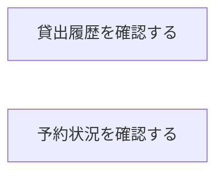

# 利用者マイページフロー

## 概要

閲覧業務における利用者マイページフローの俯瞰仕様。所属 UC 間のデータフロー、状態遷移の全体像を示す。

## 所属 UC 一覧

| UC名 | アクター | 主な操作 | 関連情報 |
|------|---------|---------|---------|
| [貸出履歴を確認する](貸出履歴を確認する/spec.md) | 利用者 | 過去・現在の貸出一覧確認 | 貸出 |
| [予約状況を確認する](予約状況を確認する/spec.md) | 利用者 | 現在の予約一覧確認 | 予約 |

## UC 横断データフロー

### データフロー図

### 情報 CRUD マトリクス

| 情報名 | 貸出履歴を確認する | 予約状況を確認する |
|--------|:---:|:---:|
| 貸出 | R | - |
| 予約 | - | R |

## 状態遷移全体図

この BUC に関連する状態遷移はない。

## BUC 内共有条件一覧

この BUC に関連する RDRA 定義条件はない。

## BUC 内共有バリエーション一覧

この BUC に関連する RDRA 定義バリエーションはない。
