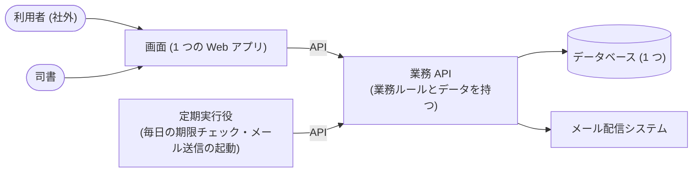

# 決定のレビュー要約 (図書館蔵書管理システム)

非機能要求の水準と、設計の大きな決定 8 件をまとめた。
すべて推奨案を自動で採用している。「確認してほしいこと」の項目だけ見れば判断できる。

## 全体像

## 非機能要求のハイライト

前提: 1 館での運用で、停止しても社会的影響は小さい規模 (IPA のモデルシステム 1) とした。
ただし、市民が使う Web 画面と個人情報があるため、一部を引き上げた。

| 観点 | 決めた水準 | 理由 |
|---|---|---|
| 使える時間 | 朝 9 時〜翌朝 8 時 (夜間 1 時間程度の停止あり) | 利用者が閉館後も検索・予約・照会をする |
| データの復旧 | 障害の直前まで戻す | 誰が何を借りているか、予約の順番を失えない |
| 画面の応答 | 5 秒以内 | 市民が操作する画面がある |
| 同時利用 | 100 人以下 | 1 館・2 種類の利用者 |
| 個人情報 | 保管時は暗号化、通信は TLS、個人情報保護法に準拠 | 利用者の氏名とメールアドレスを持つ |
| 権限 | 司書と利用者の役割で分け、利用者は自分のデータだけ見られる | 他人の貸出は表示しない要求がある |
| 監視 | アプリの動きまで監視し、メール送信の失敗を検知する | 督促やリマインドの送り漏れが利用者から見えない |
| 移行 | 紙台帳と表計算ファイルから一括で取り込む | 既存データは小さい |

## 決定と却下した案

| # | 決定 | 却下した案 (理由) |
|---|---|---|
| 1 | 画面・業務 API・定期実行役の 3 つに分ける。業務 API は 1 つにまとめ、中を業務ごとに区切る | 画面を利用者用と司書用で 2 つに分ける (実装が 2 倍になる) / 業務ごとに API を分ける (1 館規模には過剰) |
| 2 | すべて TypeScript で書く。サーバー側の具体的なフレームワークは次の段階で決める | サーバーを別言語にする (型とテストを共有できない) |
| 3 | 業務 API は 5 層に分け、業務ルールを中心の層に集める。画面は 3 層、定期実行役は 2 層 | 3 層以下にする (状態と条件が多く、ルールが散らばる) / 読み書きを分ける (規模に対して複雑すぎる) |
| 4 | データベースは 1 つ。書籍・貸出・予約の変化は上書きせず追記で残す。利用者と書籍は消さずに「削除済み」の印を付ける。レポートは都度集計する | すべてを完全な履歴方式にする (規制要件が無く過剰) / 検索専用の仕組みを足す (1 館の蔵書なら不要) |
| 5 | メッセージ配信の仕組みは使わない。メール送信の依頼を業務の更新と同時にデータベースへ記録し、定期実行役が送信を起動する。二重送信・二重登録は防ぐ | メッセージキューを置く (受け手が 1 つで過剰) / 返却登録の中で直接メールを送る (メール側の障害で返却が失敗する) |
| 6 | ログインは外部の認証サービス (標準規格 OIDC) に任せる。権限は「司書か利用者か」と「本人のデータか」で判定する | アプリでパスワードを管理する (漏えいの責任を負う) / 役割だけで判定する (利用者同士のデータを分けられない) |
| 7 | テストは受入・ユースケース・契約・単体の 4 段。受入は API 経由で実行し、ブラウザ操作での受入はしない | ブラウザで受入を実行する (今回は API で受入まで通す方針) |
| 8 | 画面は 1 つの React アプリ (ブラウザ側で描画)。共通部品を 1 か所に集める | 部品を共通化しない (20 画面超で見た目がそろわない) / サーバー側描画 (スマホや検索エンジン向けの要件が無い) |

補足: 業務の区切りは 蔵書・利用者・貸出・予約・通知・蔵書分析 の 6 つ。区切りの関係図は [architecture.md](architecture.md) にある。

## ブランド方針の由来

- ブランド資料がプロジェクトに無かったため、要求 (公共図書館・1 館・市民と司書) から推論して仮置きした。
- 由来: 推論 (確信度は低い)。

| 項目 | 仮置きの値 |
|---|---|
| 主色 | 落ち着いた青 #1F5F8B |
| 副色 | 緑 #2E7D6B |
| 強調色 | 琥珀 #C8812A |
| 中間色 | 灰青 #5F6B76 |
| 書体 | 見出し・本文とも Noto Sans JP |
| トーン | 落ち着いた・親しみやすい・信頼できる |

## 確認してほしいこと

### 設計の決定 (確信度が低いもの)

1. **ブランドの色と書体** (決定 8): 上の表の値でよいか。図書館や自治体に既存の配色・ロゴがあれば差し替える。
2. **ログインの方式** (決定 6): 司書と利用者が同じ認証サービスを使ってよいか。
   - 利用者のアカウントは、司書が利用者を登録するときに作る想定にした。要求に記述が無いため確認したい。
   - 代替案: 利用者だけ自分でアカウント登録する / 司書は館内の既存アカウントでログインする。

### 非機能要求 (重要かつ仮置きのもの)

| 観点 | 仮置きの水準 | 確認したい点 |
|---|---|---|
| 停止時の切替 | 手動切替で 2 時間未満 | 窓口が止まってよい時間 |
| 復旧までの時間 | 半日以内 | 同上 |
| サーバーの冗長化 | 電源・ディスクの冗長化のみ | 自動切替まで要るか |
| 災害対策・業務継続 | 対策なし (紙で窓口を続ける) | 自治体の方針として要るか |
| 同時利用・1 日の件数 | 100 人以下・1,000 件以下 | 蔵書数と利用者数の実数 |
| パッチ適用 | 四半期ごと | 運用体制 |
| テスト環境 | 本番を縮小した環境を 1 つ | 予算 |
| ログの保管 | 3 か月 | 自治体の保存規程 |
| 移行 | 一括移行・リハーサル 1 回 | 移行する件数と時期 |
| セキュリティ診断・WAF | ツールによる自動診断・基本ルール | 公開前の診断方針 |
| パスワードの規則 | 複雑さと有効期限の規則あり | 認証サービス側で設定できるか |
| 対応ブラウザ | 主要ブラウザ 2〜3 種 | スマートフォン対応が要るか |

### 未決のまま残した事項

- サーバー側の具体的なフレームワーク (次の段階で契約の生成方式と合わせて決める)。
- 認証サービスを自前で運用するか、外部サービスを使うか (インフラ選定で決める)。
- 要求の段階で「仕様なし」となった 4 つのユースケース (予約の取消、予約一覧、取り置き一覧、延滞一覧) は、今回の決定の前提に含めていない。
