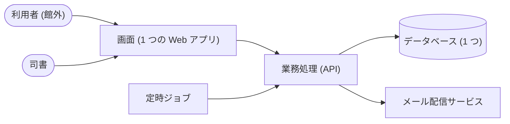

# 決定のレビュー要約 (図書館蔵書管理システム)

この要約は、非機能要求のグレード表と 9 本の設計決定を平易な言葉でまとめたものです。
推奨案を自動で採用して作りました。人の確認が要る点は、最後の「確認してほしいこと」に集めています。

## 全体像

- 画面は 1 つの Web アプリで、利用者と司書で見せる機能を変えます。
- 業務ルールとデータは「業務処理 (API)」の 1 か所に集めます。
- 返却期限のお知らせと延滞の督促は「定時ジョブ」が毎日起動します。

## 非機能要求のハイライト

システムの社会的影響は「極めて限定的」と判断しました (1 館運用、利用者と司書の 2 種、金銭のやり取りなし)。
ただし館外の利用者と個人情報を扱うため、セキュリティは個別に引き上げています。

| 観点 | 決めた水準 | 根拠 |
|---|---|---|
| 運用時間 | 1 時間程度の停止を許容 (9 時〜翌 8 時) | 利用者が閉館後も検索・予約する |
| データ損失の許容 | 数時間前まで復旧できる | 貸出・予約の記録は失うと再現できない |
| 復旧時間 | 1 営業日以内 | 窓口は紙の控えで一時しのげる |
| 画面の応答 | 5 秒以内 | 館外の利用者が使う画面がある |
| 同時アクセス | 100 以下 (推定) | 1 館・2 種類の利用者 |
| 監視 | アプリケーションまで監視し、ツールで検知 | 自動メールが止まっても利用者は気付けない |
| アクセス制御 | 役割 (司書/利用者) + 本人のデータだけ | 権限と本人参照の条件がある |
| 暗号化 | 通信は TLS、氏名・メールは保管時も暗号化 | 個人情報を持つ |
| 移行 | 表計算ファイルから一括移行 (リハーサル 1 回) | 旧システムが無い |

## 決定と却下した案

| # | 決定 | 却下した案と理由 |
|---|---|---|
| 1 | 画面・業務処理 (API)・定時ジョブの 3 つに分け、業務処理は 1 つのまとまりにする | 画面を利用者用と司書用に分ける案は、作る手間が倍になるため却下。業務処理を業務ごとに別サービスにする案は、1 館には運用が重すぎるため却下 |
| 2 | 全体を TypeScript で書き、画面は React の単一ページアプリにする。業務処理の Web フレームワークは未定 | 業務処理だけ別の言語にする案は、画面と型を共有できないため却下。サーバ側で画面を組み立てる方式は、検索エンジン公開の要求が無いため却下 |
| 3 | 業務処理を 5 段の層に分け、業務ルールの層は何にも依存させない。メール送信と時刻は差し替え可能にする | 3 段にする案は、貸出可否などの判定をテストで切り出せないため却下。読み取りと書き込みを分ける方式は、負荷が小さく複雑になるだけなので却下 |
| 4 | データベースは 1 つ。蔵書・貸出・予約・通知は変更履歴を消さずに残す。在庫状況と統計は保存せず都度集計する | 全データを履歴方式にする案は、監査要件が無く過剰なため却下。全文検索の専用基盤は、1 館の蔵書数では不要なため却下 |
| 5 | メッセージキューは使わない。通知は「送信待ち」として記録し、定時ジョブが数分ごとに送る | 返却登録の中でメールを直接送る案は、メール側の障害で返却登録が失敗するため却下 |
| 6 | ログインは外部の認証基盤に任せ、アプリはパスワードを持たない。権限は役割と本人かどうかで判定する | アプリ内で ID・パスワードを管理する案は、漏えい時の影響が大きいため却下 |
| 7 | テストは受入・UC 単位・契約・単体の 4 段。受入は API 経由で実行し、ブラウザ実行は無効にする | ブラウザで受入を回す案は、この実走の方針 (API で受入まで通す) により却下 |
| 8 | 画面部品を共有ライブラリにまとめ、色や文字はデザイントークンで統一する | 画面ごとに部品を作る案は、21 画面で見た目がそろわないため却下 |
| 9 | 業務処理の中を「蔵書」「利用者」「貸出予約」「通知」「蔵書分析」の 5 つに分ける | 貸出と予約を分ける案は、返却時の取り置きなどで互いに頻繁に呼び合うため却下 |

## ブランド方針の由来

- 由来は「推論」です (RDRA から推論。確信度は低)。
- brand スキルは使えました。しかし、ブランドガイドライン (docs/brand-guidelines.md) が無いため値を取り出せませんでした。
- 色と書体は下の「確認してほしいこと」に含めています。

## 確認してほしいこと

### 設計の決定 (確信度が低いもの)

1. **ログインの方式 (決定 6)**
   - 採用: 外部の認証基盤 (OIDC) に任せ、利用者と司書で同じ基盤を使う。
   - 他の選択肢: アプリ内で ID・パスワードを管理する簡易方式。
   - 確認点: 司書が利用者を登録するとき、認証基盤にもアカウントを作る運用でよいか。多要素認証は要るか。
2. **ブランドの色と書体 (決定 8)**
   - 主色は紺 #1F4E79、副色は深緑 #2F6F5E、強調色は琥珀 #B45309、中立色は灰 #5B6470。
   - 書体は見出し・本文とも Noto Sans JP。
   - トーンは「落ち着いた・信頼できる・やさしい」。
   - 確認点: 図書館や自治体の既存のロゴ・色の指定があるか。
3. **業務処理の Web フレームワーク (決定 2)**
   - 未定のままです。段階③で契約生成の道具と合わせて選びます。

### 非機能要求 (重要かつ仮置きのもの)

| 項目 | 仮置きした水準 | 確認点 |
|---|---|---|
| サーバの冗長化 | 電源・ディスクの冗長化 | 設置先 (クラウド / 館内サーバ) が未定 |
| 災害対策 | 対策なし | 1 館の運用でよいか |
| 同時アクセス数 | 100 以下 | 利用者の登録人数の見込み |
| 1 日のリクエスト件数 | 1 万件以下 | 同上 |
| スループット | 毎秒 10 件以下 | 同上 |
| テスト環境 | 本番を縮小した環境を用意 | 運用体制 |
| ログの保管期間 | 3 か月 | 館の規程で延長が要るか |
| 移行リハーサル | 1 回 | 表計算ファイルの件数と品質 |
| 認証方式 | パスワードポリシー付き | 多要素認証の要否 |
| WAF | 基本ルールを適用 | 設置先が未定 |

### 非機能要求 (重要度は低いが仮置きのもの)

- 対応端末は PC のみと仮置きしました。利用者のスマートフォン対応が要るかを確認してください。
- アクセシビリティは WCAG 2.1 AA を目標にしました。自治体の規定があるかを確認してください。
- 司書画面を館内からの接続に限るかは未確認です。
