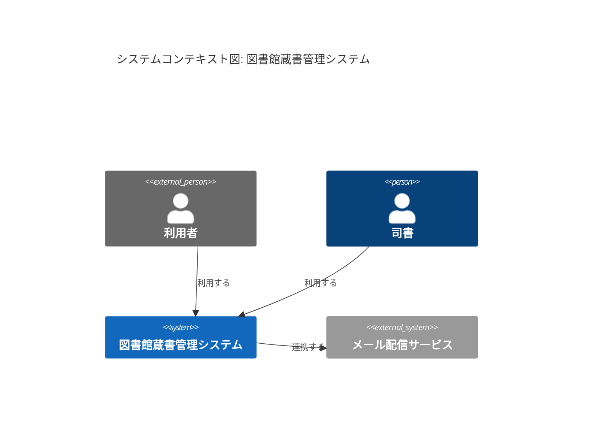
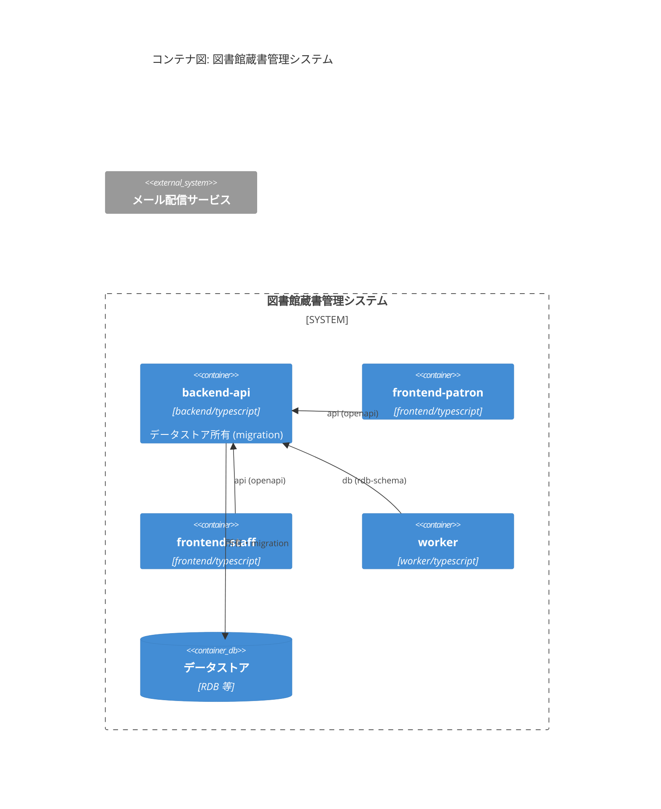

# アーキテクチャ (決めたもの)

accepted な ADR とティア構成・契約・RDRA から決定論的に描いた C4 図。実装の実態は `docs/as-built/_system/dependency-graph.md` を見る。

## システムコンテキスト図

```mermaid
C4Context
title システムコンテキスト図: 図書館蔵書管理システム
Person_Ext(actor_1, "利用者")
Person(actor_2, "司書")
System(sys, "図書館蔵書管理システム", "")
System_Ext(ext_1, "メール配信サービス", "")
Rel(actor_1, sys, "利用する")
Rel(actor_2, sys, "利用する")
Rel(sys, ext_1, "連携する")
```

## コンテナ図

```mermaid
C4Container
title コンテナ図: 図書館蔵書管理システム
System_Boundary(sys, "図書館蔵書管理システム") {
  Container(backend_api, "backend-api", "backend/typescript", "データストア所有 (migration)")
  Container(frontend_patron, "frontend-patron", "frontend/typescript", "")
  Container(frontend_staff, "frontend-staff", "frontend/typescript", "")
  Container(worker, "worker", "worker/typescript", "")
  ContainerDb(datastore, "データストア", "RDB 等", "")
}
System_Ext(ext_1, "メール配信サービス", "")
Rel(frontend_patron, backend_api, "api (openapi)")
Rel(frontend_staff, backend_api, "api (openapi)")
Rel(worker, backend_api, "db (rdb-schema)")
Rel(backend_api, datastore, "所有・migration")
```
