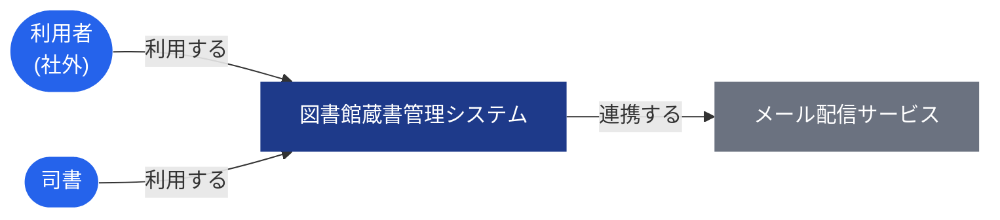
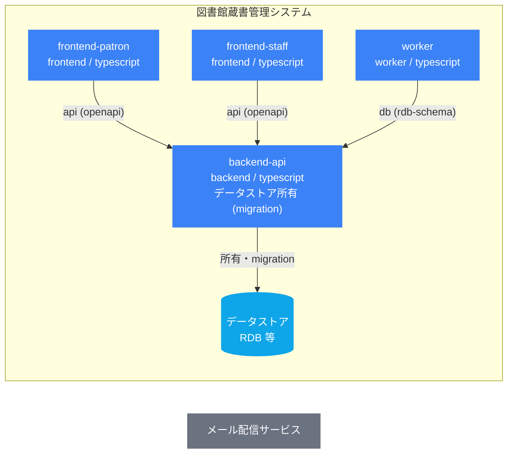

# アーキテクチャ (決めたもの)

accepted な ADR とティア構成・契約・RDRA から決定論的に描いた構成図 (C4 モデルのレベル 1 / 2)。実装の実態は `docs/as-built/_system/dependency-graph.md` を見る。

## システムコンテキスト図

```mermaid
graph LR
  actor_1(["利用者<br/>(社外)"]):::actor
  actor_2(["司書"]):::actor
  sys["図書館蔵書管理システム"]:::system
  ext_1["メール配信サービス"]:::external
  actor_1 -->|利用する| sys
  actor_2 -->|利用する| sys
  sys -->|連携する| ext_1
  classDef actor fill:#2563EB,color:#fff,stroke:none
  classDef system fill:#1E3A8A,color:#fff,stroke:none
  classDef tier fill:#3B82F6,color:#fff,stroke:none
  classDef store fill:#0EA5E9,color:#fff,stroke:none
  classDef external fill:#6B7280,color:#fff,stroke:none
```

## コンテナ図

```mermaid
graph LR
  subgraph sys["図書館蔵書管理システム"]
    backend_api["backend-api<br/>backend / typescript<br/>データストア所有 (migration)"]:::tier
    frontend_patron["frontend-patron<br/>frontend / typescript"]:::tier
    frontend_staff["frontend-staff<br/>frontend / typescript"]:::tier
    worker["worker<br/>worker / typescript"]:::tier
    datastore[("データストア<br/>RDB 等")]:::store
  end
  ext_1["メール配信サービス"]:::external
  frontend_patron -->|"api (openapi)"| backend_api
  frontend_staff -->|"api (openapi)"| backend_api
  worker -->|"db (rdb-schema)"| backend_api
  backend_api -->|所有・migration| datastore
  classDef actor fill:#2563EB,color:#fff,stroke:none
  classDef system fill:#1E3A8A,color:#fff,stroke:none
  classDef tier fill:#3B82F6,color:#fff,stroke:none
  classDef store fill:#0EA5E9,color:#fff,stroke:none
  classDef external fill:#6B7280,color:#fff,stroke:none
```
