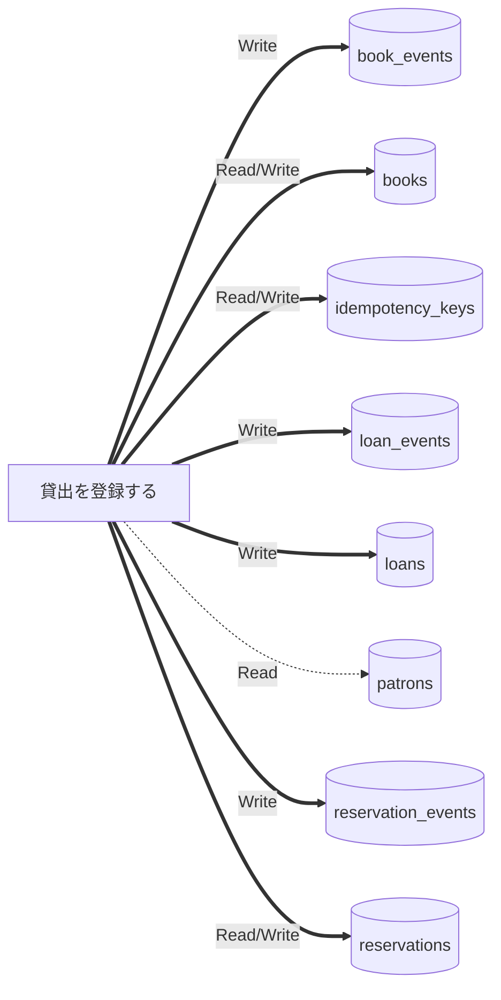

# データフロー (抽出)

UC がどのテーブルを読み書きするか。R = Read、W = Write、RW = 両方。UC ごとの詳しい流れは各 UC の実装の記録の「どう動くか」。

| テーブル | 貸出を登録する |
|---|---|
| book_events | W |
| books | RW |
| idempotency_keys | RW |
| loan_events | W |
| loans | W |
| patrons | R |
| reservation_events | W |
| reservations | RW |

