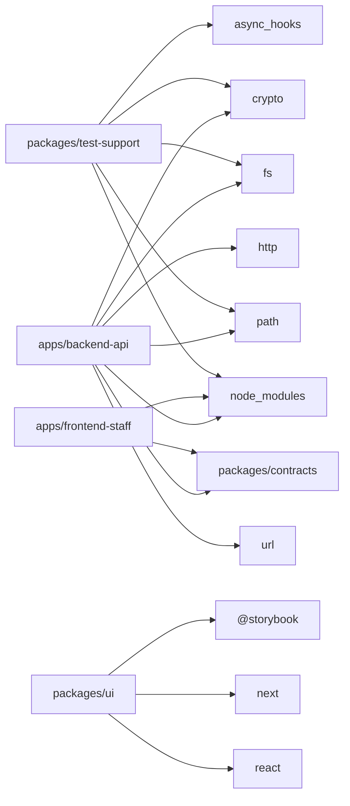

# 依存グラフ (抽出)

## 実態 (dependency-cruiser)

コードの import から抽出した実際の依存。

## 違反

| from | to | rule | severity |
|---|---|---|---|
| packages/ui/app/page.tsx | packages/ui/app/page.tsx | no-orphans | warn |
