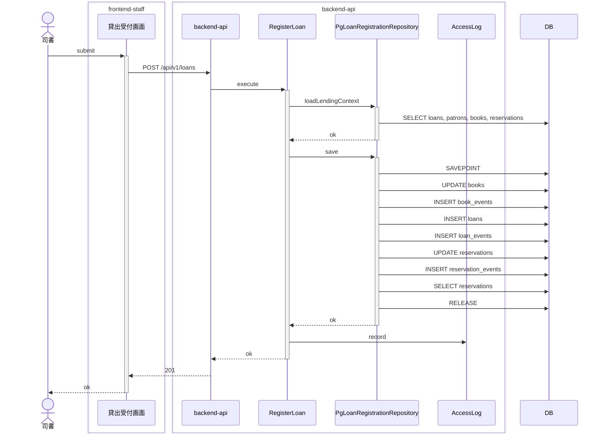
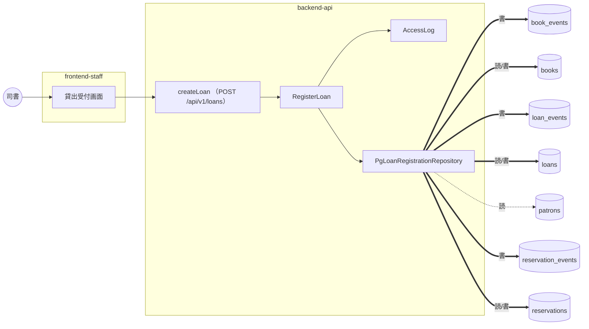

# 貸出業務 / 貸出を登録する

<!-- 要約: 表 1 つ (| 項目 | 内容 | 根拠 |)。行は 誰が / 何をする / 完了の条件。内容は 40 字以内、根拠はコード位置 path:line -->
<!-- 要約:begin 概要 -->
| 項目 | 内容 | 根拠 |
|---|---|---|
| 誰が | 司書が貸出受付画面で | apps/frontend-staff/src/screens/loan-checkout/submit-loan-checkout.ts:9 |
| 何をする | 利用者番号と書籍 ID を読み取り「貸出する」を押す 画面が createLoan を呼ぶ backend-api が利用者・書籍・予約の状態を検査して貸出を記録する | apps/backend-api/src/usecase/loan/register-loan.ts:48 |
| 完了の条件 | 書籍の貸出中化・貸出の登録・返却期限の算出が 1 トランザクションで終わる 画面に返却期限が出る | apps/backend-api/src/repository/loan/pg-loan-registration-repository.ts:71, apps/frontend-staff/src/screens/loan-checkout/loan-checkout-state.ts:124 |
<!-- 要約:end -->

## 結果 (抽出)

| 項目 | 結果 |
|---|---|
| ゲート | 5 段すべて pass |
| 受入基準 | 3 / 3 をシナリオが覆う |
| シナリオ | 10 本中 9 本 pass (受入 4、ブラウザ 1 (未実行)) |
| 実装者が決めた前提 | 20 件 (人が承認 5、自動承認 15) |
| 未決の課題 | 7 件 (契約 2、要求 2、ルール 3) |
| 計装の範囲 (backend-api) | gateway, presentation, repository, usecase |
| 計装の範囲 (frontend-staff) | api-client, screen |

## 入口 (抽出)

| 種類 | 名前 |
|---|---|
| API | createLoan (POST /loans) |
| 画面 | LoanCheckout |
| 発行イベント | なし |
| 購読イベント | なし |

主要な部品 (トレースに現れたもの):

- backend-api: AccessLog、PgLoanRegistrationRepository、RegisterLoan
- frontend-staff: 貸出受付画面

## どう動くか (抽出)

正常系: 取置中の予約を持つ予約順 1 位の利用者には取置の書籍を貸し出せる

分岐 (他のシナリオとの違い):

| シナリオ | 応答 | 書き込み | 発行 |
|---|---|---|---|
| 利用者は貸出を登録できない | 403 | なし | なし |
| 削除済みの利用者には貸し出せない | 404 | なし | なし |
| 削除済みの書籍は貸し出せない | 404 | なし | なし |
| 取置の書籍は取置中の予約を持たない利用者には貸し出せない | 409 | なし | なし |
| 在庫ありの書籍を登録済みの利用者に貸し出す | 201 | book_events, books, loan_events, loans | なし |
| 延滞中の貸出を持つ利用者には貸し出せない | 409 | なし | なし |
| 貸出を登録すると返却期限が自動で設定される | 201 | book_events, books, loan_events, loans | なし |
| 貸出中の書籍は同じ書籍として貸し出せない | 409 | なし | なし |

全シナリオの図は [sequence.md](sequence.md)。

### データの流れ

全シナリオを合算。点線は読み、太線は書き。

## 何を守るか (要約)

<!-- 要約: 表 1 つ (| 守ること | 手段 | 根拠 |)。守ること = 原子性 / 競合 / 冪等 / 障害と副作用。手段は 1 行 1 つ (  区切り、各 40 字以内)、根拠はコード位置 -->
<!-- 要約:begin 整合性 -->
| 守ること | 手段 | 根拠 |
|---|---|---|
| 原子性 | 書籍の貸出中化・貸出の登録・予約の受取済み化は 1 トランザクション トランザクションは SAVEPOINT で実装 各更新と対応するイベント追記も同じトランザクション 取置の受取では後続予約の繰り上げも同じトランザクション 失敗したらまとめて巻き戻す 貸出可否の判定に使う読み取りだけはトランザクションの外 | apps/backend-api/src/repository/loan/pg-loan-registration-repository.ts:28, :71, :89, :136, :171, :177 / apps/backend-api/src/gateway/db/sql-client.ts:19 |
| 競合 | 書籍は判定時に読んだ版番号が一致するときだけ更新 受取対象の予約は版番号と on_hold 状態が一致するときだけ更新 どれかが 0 行なら VersionConflict で全体を巻き戻す 409 version-conflict で返す 新しい貸出の版番号は 1 から | apps/backend-api/src/repository/loan/pg-loan-registration-repository.ts:83, :88, :165, :184 / apps/backend-api/src/presentation/http/loans/create-loan-handler.ts:72 / apps/backend-api/src/domain/loan/loan.ts:102 |
| 冪等 | 冪等キーは受け取らない 貸出 ID は要求ごとに採番 同じ書籍への再送: 1 回目で書籍が on_loan になる 2 回目は 409 book-on-loan で拒否 (二重登録にならない) | apps/backend-api/src/usecase/loan/register-loan.ts:8, :55 / apps/backend-api/src/domain/loan/loan.ts:129 |
| 障害と副作用 | 外部へのメッセージ発行は無い 書き込みは RDB のスナップショットとイベントテーブルだけ データアクセスログ: 成功は保存後、拒否は例外捕捉時、権限不足は判定時に記録 それ以外の例外ではログを記録しない 画面は通信例外を「通信に失敗しました。貸出は登録されていません。」と表示 サーバ側で登録済みかは確かめない | apps/backend-api/src/repository/loan/pg-loan-registration-repository.ts:19 / apps/backend-api/src/usecase/loan/register-loan.ts:49, :57, :63 / apps/frontend-staff/src/api-client/loan-api.ts:53 / apps/frontend-staff/src/screens/loan-checkout/loan-checkout-state.ts:64, :113 |
<!-- 要約:end -->

## 決めたこと (転記)

仕様に書かれておらず、実装者が決めた前提。検証は Verifier の判定、処遇は人のレビューの結果。

### 人が承認した前提 (5)

| ティア | 分類 | 何を決めたか | 検証 | 場所 |
|---|---|---|---|---|
| backend-api | セキュリティ | テスト用トークンの解釈 | **仕様に無い (major)** | test-authenticator.ts:10 |
| backend-api | セキュリティ | データアクセスログの項目 | **仕様に無い (major)** | register-loan.ts:25 |
| backend-api | エラー処理 | 入力検証 400 を認可 403 より先に | **仕様に無い (major)** | create-loan-handler.ts:43 |
| backend-api | 永続化 | イベント payload の項目と初期版番号 | **仕様に無い (major)** | pg-loan-registration-repository.ts:96 |
| backend-api | 永続化 | 読み取りはトランザクション外、予約も版照合 | **仕様に無い (major)** | pg-loan-registration-repository.ts:165 |

前提の全文

- **テスト用トークンの解釈** (backend-api): テスト用 composition root では Authorization ヘッダが無いリクエストを司書 (subject test-staff) とみなし、Bearer test-staff: / test-patron:<利用者番号> を検証済みトークンとして扱う
- **データアクセスログの項目** (backend-api): データアクセスログは action=loan.register、操作者の subject とロール、対象の書籍ID・利用者番号・貸出ID、結果 (succeeded / denied / rejected と理由 code) を 1 行 JSON で記録し、氏名・連絡先は載せない
- **入力検証 400 を認可 403 より先に** (backend-api): 入力検証 (400) を認可判定 (403) より先に行う。利用者ロールが不正な本文を送ると 400 になる
- **イベント payload の項目と初期版番号** (backend-api): イベント payload は JSON で、BookLoaned は status・loanId・patronNumber、LoanCreated は貸出の全項目と pickedUpReservationId、ReservationPickedUp は status・loanId、QueueAdvanced は繰り上げ前後の予約順を持つ。貸出の版番号は 1 から始める
- **読み取りはトランザクション外、予約も版照合** (backend-api): 貸出可否の判定に使う読み取りはトランザクションの外で行い、書き込みトランザクションで書籍の版番号に加えて受取済みにする予約の版番号と取置中の状態も照合し、どちらかが変わっていれば 409 version-conflict で全体を巻き戻す

### 自動承認した前提 (15)

| ティア | 分類 | 何を決めたか | 検証 | 場所 |
|---|---|---|---|---|
| backend-api | データ形式 | 貸出期間は全組み合わせ 14 日 | 仕様に無い (minor) | loan-period.ts:20 |
| backend-api | 入力検証 | 貸出上限冊数は判定しない | 仕様に無い (minor) | loan.ts:81 |
| backend-api | エラー処理 | 貸出可否の判定順序 | 仕様に無い (minor) | loan.ts:89 |
| backend-api | エラー処理 | 存在しない書籍・利用者も 404 | 仕様に無い (minor) | errors.ts:27 |
| backend-api | データ形式 | 業務日付は Asia/Tokyo の暦日 | 仕様に無い (minor) | clocks.ts:6 |
| backend-api | エラー処理 | 想定外の失敗は 500 Problem | 仕様に無い (minor) | problem.ts:58 |
| backend-api | 入力検証 | 本文は 64 KiB 上限 | 仕様に無い (minor) | http-io.ts:5 |
| frontend-staff | エラー処理 | 404 も notLendable 表示 | 仕様に無い (minor) | loan-checkout-state.ts:70 |
| frontend-staff | 入力検証 | 400 は項目エラーに表示 | 仕様に無い (minor) | loan-checkout-state.ts:101 |
| frontend-staff | エラー処理 | その他ステータスは error 表示 | 仕様に無い (minor) | loan-checkout-state.ts:144 |
| frontend-staff | エラー処理 | code で表示先の欄を決める | 仕様に無い (minor) | loan-checkout-state.ts:91 |
| frontend-staff | エラー処理 | Alert の文言はサーバの Problem | 仕様に無い (minor) | loan-checkout-state.ts:89 |
| frontend-staff | データ形式 | daysLeft は loanPeriodDays | 仕様に無い (minor) | loan-checkout-state.ts:133 |
| frontend-staff | データ形式 | 完了メッセージは利用者番号で | 仕様に無い (minor) | loan-checkout-state.ts:124 |
| frontend-staff | 入力検証 | 事前検証は trim のみ | 仕様に無い (minor) | submit-loan-checkout.ts:9 |

前提の全文

- **貸出期間は全組み合わせ 14 日** (backend-api): 貸出期間は利用者区分 (一般・児童・学生) と媒体種別 (紙・電子) のすべての組み合わせで 14 日とする
- **貸出上限冊数は判定しない** (backend-api): 利用者区分ごとの貸出上限冊数は判定せず、上限による貸出拒否を行わない
- **貸出可否の判定順序** (backend-api): 貸出可否の判定は 利用者の存在 → 書籍の存在 → 書籍状態 (貸出中・取置) → 利用者の延滞 の順に行い、最初に満たさない条件の code だけを返す
- **存在しない書籍・利用者も 404** (backend-api): 削除済みでなく存在しない書籍・利用者も 404 (code book-not-found / patron-not-found) とし、detail を「指定した書籍は見つかりません」「指定した利用者は見つかりません」とする
- **業務日付は Asia/Tokyo の暦日** (backend-api): 業務日付 (貸出日) は Asia/Tokyo の暦日で決める。テストの固定時計は発生日時を業務日付の 09:00+09:00 とする
- **想定外の失敗は 500 Problem** (backend-api): 想定外の失敗は 500 と Problem (type .../internal-error、title サーバでエラーが発生しました) で返し、例外の内容は応答に出さない
- **本文は 64 KiB 上限** (backend-api): リクエスト本文は 64 KiB を上限とし、超過や JSON として読めない本文は 400 ValidationProblem (field body) で返す
- **404 も notLendable 表示** (frontend-staff): createLoan が 404 (削除済みの書籍・利用者) を返したとき、貸出受付画面は 409 と同じ notLendable variant にする
- **400 は項目エラーに表示** (frontend-staff): createLoan が 400 を返したとき、画面は default variant のまま ValidationProblem.errors の patronNumber / bookId を CounterLookup の patronError / bookError に出し、対応する項目エラーが 1 件も無ければ error variant にする
- **その他ステータスは error 表示** (frontend-staff): createLoan が 400 / 404 / 409 / 201 以外 (401 / 403 / 5xx など) を返したとき、error variant にし、Alert の本文には Problem.detail (無ければ title) をそのまま出す
- **code で表示先の欄を決める** (frontend-staff): notLendable のとき、Problem.code が patron-not-found / patron-has-overdue-loan なら利用者番号欄 (patronError) に、それ以外 (book-* と version-conflict) なら書籍 ID 欄 (bookError) に Problem.detail を出す
- **Alert の文言はサーバの Problem** (frontend-staff): notLendable の Alert は story の固定文言ではなく、サーバの Problem.title を見出し、Problem.detail を本文にする
- **daysLeft は loanPeriodDays** (frontend-staff): 貸出完了時の DueDateDisplay の daysLeft は、登録直後なので loanPeriodDays と同じ値にする (端末の時計は使わない)
- **完了メッセージは利用者番号で** (frontend-staff): 貸出完了メッセージは利用者の氏名ではなく利用者番号で「利用者 P000123 に貸し出しました」と出し、貸出内容に利用者区分を出さない
- **事前検証は trim のみ** (frontend-staff): 読み取った利用者番号と書籍 ID は前後の空白だけを除いて送り、形式 (^P[0-9]{6}$ / uuid) の事前検証は画面でせずサーバの 400 に任せる

### Verifier の指摘 (前提以外、2)

- **major** 生成クライアントでなく手書き (frontend-staff, loan-api-types.ts, loan-api.ts)

minor 1 件

- A-010 の分類が Verifier と不一致 (backend-api, create-loan-handler.ts:43)

指摘の全文

- **A-010 の分類が Verifier と不一致** (backend-api, minor): A-010 の category (error_handling) と Verifier 独立判定の verified_category (security) が不一致
- **生成クライアントでなく手書き** (frontend-staff, major): docs/rules/tier-frontend.md の必須指示『API 呼び出しは packages/contracts の生成クライアント経由。fetch / axios の直書き禁止』『入力: 自ティアが consumer の契約 (OpenAPI) の生成物』に反し、契約の生成型・生成クライアントが存在しないため、contract-slice.json の schemas を手書きで写した型 (loan-api-types.ts) と手書きの API クライアント (loan-api.ts) を使っている。

## 課題 (抽出 + 要約)

| 種類 | 課題 |
|---|---|
| ルール | 基盤のテスト配線が抜けている |
| ルール | 計装が日本語シナリオ名と usecase に未対応 |
| 契約 | 20260924_090000_register-loan |
| 要求 | 20260924_120000_loan-period-mapping |
| 要求 | 20260924_120001_loan-limit-count |
| 契約 | 20260924_130000_frontend-api-client-missing |
| ルール | 20260924_130001_frontend-staff-toolchain |

<!-- 要約: 表 1 つ (| 課題 | 背景 | 今の実装 | 対処 | 根拠 |)。課題 1 つ 1 行、セルは 40 字以内、根拠はコード位置 -->
<!-- 要約:begin 課題 -->
| 課題 | 背景 | 今の実装 | 対処 | 根拠 |
|---|---|---|---|---|
| 貸出期間の対応表 (要求) | 要求は貸出期間 (7・14・21 日) だけを定め、対応表の値が無い | 全組み合わせを 14 日で仮置き | 対応表が決まったら `LOAN_PERIOD_TABLE` の 1 箇所を直す | apps/backend-api/src/domain/loan/loan-period.ts:15, :18, :20 |
| 貸出上限冊数 (要求) | 利用者区分ごとの上限冊数の値が未決 | 上限冊数を判定しない | 値が決まったら `registerLoan` に条件を加える | apps/backend-api/src/domain/loan/loan.ts:79, :81 |
| 生成 API クライアントが無い (契約) | 0.1.0 の基盤に genApiClient が無かった | contract-slice を写した手書きの型とクライアント 通信は注入した ApiTransport に任せる | 生成クライアントが用意されたら ApiTransport を差し替える | apps/frontend-staff/src/api-client/loan-api.ts:4, :6, :7 |
| 本番用の認証が無い (ルール) | 契約に認証方式の具体が無い | テスト専用の TestAuthenticator Authorization 無しを司書とみなす | Authenticator は注入で受けるので OIDC 検証の実装を差し込む | apps/backend-api/src/testing/test-authenticator.ts:4, :10 / apps/backend-api/src/presentation/http/app.ts:15 |
<!-- 要約:end -->

## 証跡 (抽出)

ゲート: static pass / unit pass / contract pass / uc-bdd pass / acceptance pass

| ティア | 単体 (pass/total) | 契約 (pass/total) |
|---|---|---|
| frontend-staff | 22/22 | 0/0 |
| backend-api | 45/45 | 20/22 |

受入基準の対応:

| 基準 | 内容 | シナリオ (結果) |
|---|---|---|
| SPEC-002-01-1 | Given 在庫ありの書籍と登録済みの利用者がいる When 司書が利用者番号と書籍を指定して貸出を登録する Then 貸出が記録され書籍の状態が貸出中になる | 在庫ありの書籍を登録済みの利用者に貸し出す (passed) |
| SPEC-002-01-2 | Given 貸出中の書籍がある When 司書が同じ書籍の貸出を登録しようとする Then 貸出できない旨が表示され貸出は記録されない | 貸出中の書籍は同じ書籍として貸し出せない (passed) 貸出受付画面で貸出中の書籍を貸し出そうとすると貸出できない旨が表示される (skipped) |
| SPEC-003-01-1 | Given 司書が貸出を登録する When 貸出が記録される Then 貸出日と貸出期間から算出した返却期限が自動で設定される | 貸出を登録すると返却期限が自動で設定される (passed) |

## 付録 (抽出)

変更ファイル (93)

- backend-api (35)
  - apps/backend-api/migrations/0001_schema.sql
  - apps/backend-api/package.json
  - apps/backend-api/src/domain/loan/due-date.test.ts
  - apps/backend-api/src/domain/loan/due-date.ts
  - apps/backend-api/src/domain/loan/errors.ts
  - apps/backend-api/src/domain/loan/loan-period.test.ts
  - apps/backend-api/src/domain/loan/loan-period.ts
  - apps/backend-api/src/domain/loan/loan-registration-repository.ts
  - apps/backend-api/src/domain/loan/loan.test.ts
  - apps/backend-api/src/domain/loan/loan.ts
  - apps/backend-api/src/domain/shared/business-date.ts
  - apps/backend-api/src/gateway/clock/clocks.ts
  - apps/backend-api/src/gateway/db/sql-client.ts
  - apps/backend-api/src/gateway/log/access-log-writers.ts
  - apps/backend-api/src/presentation/http/app.test.ts
  - apps/backend-api/src/presentation/http/app.ts
  - apps/backend-api/src/presentation/http/authenticator.ts
  - apps/backend-api/src/presentation/http/http-io.ts
  - apps/backend-api/src/presentation/http/loans/create-loan-handler.ts
  - apps/backend-api/src/presentation/http/loans/create-loan-request.test.ts
  - apps/backend-api/src/presentation/http/loans/create-loan-request.ts
  - apps/backend-api/src/presentation/http/problem.ts
  - apps/backend-api/src/repository/loan/pg-loan-registration-repository.test.ts
  - apps/backend-api/src/repository/loan/pg-loan-registration-repository.ts
  - apps/backend-api/src/test-app.test.ts
  - apps/backend-api/src/test-app.ts
  - apps/backend-api/src/testing/contract-fixture.ts
  - apps/backend-api/src/testing/test-authenticator.ts
  - apps/backend-api/src/usecase/auth/principal.ts
  - apps/backend-api/src/usecase/loan/register-loan.test.ts
  - apps/backend-api/src/usecase/loan/register-loan.ts
  - apps/backend-api/src/usecase/ports/access-log.ts
  - apps/backend-api/test/contract/createLoan.test.ts
  - apps/backend-api/test/contract/db-schema.test.ts
  - apps/backend-api/tsconfig.json
- frontend-staff (9)
  - apps/frontend-staff/package.json
  - apps/frontend-staff/src/api-client/loan-api-types.ts
  - apps/frontend-staff/src/api-client/loan-api.test.ts
  - apps/frontend-staff/src/api-client/loan-api.ts
  - apps/frontend-staff/src/screens/loan-checkout/loan-checkout-state.test.ts
  - apps/frontend-staff/src/screens/loan-checkout/loan-checkout-state.ts
  - apps/frontend-staff/src/screens/loan-checkout/submit-loan-checkout.test.ts
  - apps/frontend-staff/src/screens/loan-checkout/submit-loan-checkout.ts
  - apps/frontend-staff/tsconfig.json
- その他 (49)
  - "docs/as-built/\350\262\270\345\207\272\346\245\255\345\213\231/\350\262\270\345\207\272\343\202\222\347\231\273\351\214\262\343\201\231\343\202\213/index.md"
  - "docs/as-built/\350\262\270\345\207\272\346\245\255\345\213\231/\350\262\270\345\207\272\343\202\222\347\231\273\351\214\262\343\201\231\343\202\213/sequence.md"
  - "features/\350\262\270\345\207\272\346\245\255\345\213\231/register-loan.feature"
  - .distillery/runs/register-loan/events.jsonl
  - .distillery/runs/register-loan/issues/20260924_000100_foundation-test-wiring.md
  - .distillery/runs/register-loan/issues/20260924_000200_trace-and-driver-wiring.md
  - .distillery/runs/register-loan/issues/20260924_090000_register-loan.md
  - .distillery/runs/register-loan/issues/20260924_120000_loan-period-mapping.md
  - .distillery/runs/register-loan/issues/20260924_120001_loan-limit-count.md
  - .distillery/runs/register-loan/issues/20260924_130000_frontend-api-client-missing.md
  - .distillery/runs/register-loan/issues/20260924_130001_frontend-staff-toolchain.md
  - .distillery/runs/register-loan/stages/asbuilt.done.yaml
  - .distillery/runs/register-loan/stages/contract-gate.done.yaml
  - .distillery/runs/register-loan/stages/contract.done.yaml
  - .distillery/runs/register-loan/stages/feedback.done.yaml
  - .distillery/runs/register-loan/stages/integrate.done.yaml
  - .distillery/runs/register-loan/stages/review.done.yaml
  - .distillery/runs/register-loan/stages/scaffold.done.yaml
  - .distillery/runs/register-loan/stages/scenario.done.yaml
  - .distillery/runs/register-loan/stages/tier.done.yaml
  - .distillery/runs/register-loan/stages/verify.done.yaml
  - contracts/generated/openapi.bundle.yaml
  - contracts/generated/slices/register-loan/contract-slice.json
  - contracts/generated/slices/register-loan/rdb-slice.yaml
  - contracts/openapi/openapi.yaml
  - contracts/openapi/paths/loans.yaml
  - contracts/uc-index.yaml
  - cucumber.js
  - docs/as-built/_system/api-inventory.md
  - docs/as-built/_system/data-flow.md
  - docs/as-built/_system/dependency-graph.md
  - docs/as-built/_system/index.md
  - docs/as-built/_system/traceability-index.json
  - docs/requirements/use-cases.yaml
  - features/step_definitions/register-loan.steps.ts
  - features/support/drivers/api.ts
  - features/support/drivers/browser.ts
  - features/support/drivers/types.ts
  - features/support/hooks.ts
  - features/support/scenario-db.ts
  - features/support/world.ts
  - packages/contracts/api/stubs/.distillery2-generated.json
  - packages/contracts/api/stubs/createLoan.201.json
  - packages/contracts/api/stubs/createLoan.400.json
  - packages/contracts/api/stubs/createLoan.404.json
  - packages/contracts/api/stubs/createLoan.409.json
  - packages/contracts/db/tables.ts
  - packages/test-support/README.md
  - packages/test-support/src/tracer.ts

シナリオの実行結果 (10)

| シナリオ | 種別 | 結果 | 時間 (ms) |
|---|---|---|---|
| 利用者は貸出を登録できない | UC | passed | 8 |
| 削除済みの利用者には貸し出せない | UC | passed | 7 |
| 削除済みの書籍は貸し出せない | UC | passed | 8 |
| 取置の書籍は取置中の予約を持たない利用者には貸し出せない | UC | passed | 9 |
| 取置中の予約を持つ予約順 1 位の利用者には取置の書籍を貸し出せる | UC | passed | 17 |
| 在庫ありの書籍を登録済みの利用者に貸し出す | 受入 | passed | 1088 |
| 延滞中の貸出を持つ利用者には貸し出せない | UC | passed | 9 |
| 貸出を登録すると返却期限が自動で設定される | 受入 | passed | 9 |
| 貸出中の書籍は同じ書籍として貸し出せない | 受入 | passed | 8 |
| 貸出受付画面で貸出中の書籍を貸し出そうとすると貸出できない旨が表示される | 受入・ブラウザ | skipped | 0 |

生成情報

- 上流: requirements@10d88a0 adr@2f9d373 contracts@10d88a0
- コード: 3187219
- 生成日時: 2026-09-24T00:12:39.628Z / 実行試行: 1
- 凡例: (抽出) はスクリプトが生成、(要約) は LLM がコード位置を根拠に書く、(転記) は実行記録からの写し

