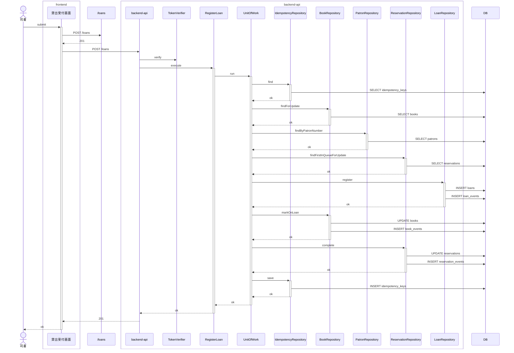
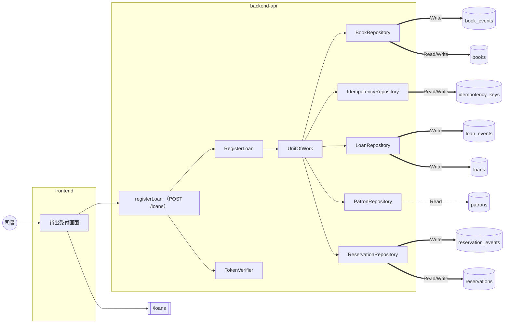

# 貸出業務 / 貸出を登録する

<!-- 要約: 表 1 つ (| 項目 | 内容 | 根拠 |)。行は 誰が / 何をする / 完了の条件。内容は 40 字以内、根拠はコード位置 path:line -->
<!-- 要約:begin 概要 -->
| 項目 | 内容 | 根拠 |
|---|---|---|
| 誰が | 司書 (librarian ロール) | apps/backend-api/src/usecase/register-loan.ts:157 |
| 何をする | 利用者番号と書籍IDを指定して貸出を登録する | apps/backend-api/src/usecase/register-loan.ts:110 apps/backend-api/src/usecase/register-loan.ts:114 |
| 完了の条件 | 貸出が記録される 書籍の状態が貸出中になる 返却期限は貸出日に貸出期間を加えた日になる 予約待ちの書籍なら予約順 1 位の予約が完了になる | apps/backend-api/src/usecase/register-loan.ts:145 apps/backend-api/src/usecase/register-loan.ts:146 apps/backend-api/src/domain/loan/lend-book.ts:55 apps/backend-api/src/usecase/register-loan.ts:148 |
<!-- 要約:end -->

## 結果 (抽出)

| 項目 | 結果 |
|---|---|
| ゲート | 5 段すべて pass |
| 受入基準 | 3 / 3 をシナリオが覆う |
| シナリオ | 6 本中 6 本 pass (受入 3) |
| 実装者が決めた前提 | 17 件 (人が承認 6、自動承認 11) |
| 未決の課題 | 5 件 (契約 3、要求 1、ルール 1) |
| 計装の範囲 (backend-api) | gateway, presentation, repository, usecase |
| 計装の範囲 (frontend) | api-client, screen |

## 入口 (抽出)

| 種類 | 名前 |
|---|---|
| API | registerLoan (POST /loans) |
| 画面 | LoanRegister |
| 発行イベント | なし |
| 購読イベント | なし |
| 要求 | SPEC-003-01, SPEC-005-01 ([要求仕様書](../../../requirements/requirements.md)) |
| シナリオ | [register-loan.feature](../../../../features/%E8%B2%B8%E5%87%BA%E6%A5%AD%E5%8B%99/register-loan.feature) |
| 契約 | [contract-slice.json](../../../../contracts/generated/slices/register-loan/contract-slice.json) |

主要な部品 (トレースに現れたもの):

- backend-api: BookRepository、IdempotencyRepository、LoanRepository、PatronRepository、RegisterLoan、ReservationRepository、TokenVerifier、UnitOfWork
- frontend: 貸出受付画面

## どう動くか (抽出)

正常系: 予約待ちの書籍を予約順 1 位の利用者に貸し出す

分岐 (他のシナリオとの違い):

| シナリオ | 応答 | 書き込み | 発行 |
|---|---|---|---|
| 予約待ちの書籍は予約順 1 位以外の利用者に貸し出せない | 409 | idempotency_keys | なし |
| 在庫ありの書籍を登録済みの利用者に貸し出す | 201 | book_events, books, idempotency_keys, loan_events, loans | なし |
| 登録されていない利用者には貸し出せない | 409 | idempotency_keys | なし |
| 貸出を登録すると返却期限が自動で設定される | 201 | book_events, books, idempotency_keys, loan_events, loans | なし |
| 貸出中の書籍は貸し出せない | 409 | idempotency_keys | なし |

全シナリオの図は [sequence.md](sequence.md)。

### データの流れ

全シナリオを合算。点線は Read、太線は Write。

## 何を守るか (要約)

<!-- 要約: 表 1 つ (| 守ること | 手段 | 根拠 |)。守ること = 原子性 / 競合 / 冪等 / 障害と副作用。手段は 1 行 1 つ (  区切り、各 40 字以内)、根拠はコード位置 -->
<!-- 要約:begin 整合性 -->
| 守ること | 手段 | 根拠 |
|---|---|---|
| 原子性 | 判定・書き込み・冪等キー保存を 1 トランザクションで行う スナップショット更新とイベント追記を同じトランザクションで行う | apps/backend-api/src/usecase/register-loan.ts:168 apps/backend-api/src/repository/db-context.ts:35 apps/backend-api/src/repository/pg-loan-repositories.ts:63 |
| 競合 | 書籍を `FOR UPDATE` で行ロックしてから判定する 予約順 1 位の予約を `FOR UPDATE` で行ロックする スナップショット更新は version 一致を条件にする 版が合わなければ例外で全体を巻き戻す | apps/backend-api/src/repository/pg-loan-repositories.ts:53 apps/backend-api/src/repository/pg-loan-repositories.ts:111 apps/backend-api/src/repository/pg-loan-repositories.ts:64 apps/backend-api/src/repository/pg-loan-repositories.ts:43 |
| 冪等 | キー・主体・operationId で保存済みの応答を引く 同じ本文の再送には初回の応答を返す 本文が違う再送は idempotency_key_conflict を返す 201・409・404 の応答を判定と同じ処理で保存する 画面は結果が不確かな失敗の後に同じキーで再送する | apps/backend-api/src/repository/pg-loan-repositories.ts:204 apps/backend-api/src/usecase/register-loan.ts:175 apps/backend-api/src/usecase/register-loan.ts:171 apps/backend-api/src/usecase/register-loan.ts:189 apps/frontend/src/screens/loan-checkout/submit-loan-checkout.ts:55 |
| 障害と副作用 | 例外はトランザクションごと巻き戻す 例外時は internal_error (500) を返す 500 の応答は Idempotency-Key に保存しない 同じキーの同時要求は後着側が 500 になる 発行するイベントは無い | apps/backend-api/src/repository/db-context.ts:35 apps/backend-api/src/presentation/http-app.ts:171 apps/backend-api/src/usecase/register-loan.ts:169 apps/backend-api/src/repository/pg-loan-repositories.ts:221 |
<!-- 要約:end -->

## 決めたこと (転記)

仕様に書かれておらず、実装者が決めた前提。検証は Verifier の判定、処遇は人のレビューの結果。

### 人が承認した前提 (6)

| ティア | 分類 | 何を決めたか | 検証 | 場所 |
|---|---|---|---|---|
| backend-api | 永続化 | 冪等キーに業務判定後の応答を全て保存 | **仕様に無い (major)** | register-loan.ts:188 |
| backend-api | セキュリティ | トークン無効は 401、司書以外は 403 | **仕様に無い (major)** | register-loan.ts:157 |
| backend-api | 永続化 | 予約完了時に後続の予約順位は詰めない | **仕様に無い (major)** | pg-loan-repositories.ts:136 |
| backend-api | セキュリティ | テスト入口は認証ヘッダを補う | **仕様に無い (major)** | test-app.ts:53 |
| backend-api | 永続化 | 書籍と予約を行ロックして判定する | **仕様に無い (major)** | pg-loan-repositories.ts:53 |
| frontend | 永続化 | 再送判定キーは結果が確定したら替える | **仕様に無い (major)** | submit-loan-checkout.ts:54 |

前提の全文

- **冪等キーに業務判定後の応答を全て保存** (backend-api): Idempotency-Key には、書籍を引いた後の業務判定の応答 (201 貸出・409 貸出可否条件の拒否・404 書籍不在) をステータスと本文 (JSON 文字列) のまま、判定と同じトランザクションで保存し、同じキー・同じ本文の再送には保存した応答をそのまま返す。401 (認証)・400 (入力検証)・403 (ロール)・409 idempotency_key_conflict は業務判定の前に返すため保存しない。同じキーで本文 (bookId と patronNumber の SHA-256) が違う再送は 409 idempotency_key_conflict を返す
- **トークン無効は 401、司書以外は 403** (backend-api): Authorization の Bearer トークンが無い・検証できないときは 401 (unauthorized)、librarian 以外のロールは usecase で 403 (forbidden) を返す
- **予約完了時に後続の予約順位は詰めない** (backend-api): 予約を完了にするとき、その予約の queue_position を null にするだけで、後続の予約 (予約中) の queue_position は変えない
- **テスト入口は認証ヘッダを補う** (backend-api): テスト用 composition root (createTestApp) は、Authorization と Idempotency-Key が無い要求に司書のテストトークンと新しい Idempotency-Key を補う (defaultHeaders false で無効化できる。本番の createApp は補わない)
- **書籍と予約を行ロックして判定する** (backend-api): 1 トランザクションの中で書籍と予約順 1 位の予約を SELECT ... FOR UPDATE でロックしてから判定し、スナップショット更新は version 一致を条件にする。版が合わなければ例外で全体を巻き戻し 500 を返す
- **再送判定キーは結果が確定したら替える** (frontend): Idempotency-Key は UUID v4 (crypto.randomUUID) とする。貸出受付画面では、結果が不確かな失敗 (通信できない・契約外の応答) の後は同じキーで再送し、結果が確定した応答 (201 登録済み、400 / 409 貸し出せない) の後は新しいキーに替える。入口関数 submitLoanCheckout はキー省略時に呼び出しごとに新しいキーを作る

### 自動承認した前提 (11)

| ティア | 分類 | 何を決めたか | 検証 | 場所 |
|---|---|---|---|---|
| backend-api | データ形式 | 貸出期間は一律 14 日 | 仕様に無い (minor) | loan-policy.ts:7 |
| backend-api | データ形式 | 貸出日の当日は Asia/Tokyo で決める | 仕様に無い (minor) | loan-policy.ts:10 |
| backend-api | エラー処理 | 拒否理由は利用者の登録を先に判定 | 仕様に無い (minor) | lend-book.ts:43 |
| backend-api | エラー処理 | 未登録・削除済みの書籍は 404 | 仕様に無い (minor) | register-loan.ts:112 |
| backend-api | データ形式 | 貸出時のイベント種別の値 | 仕様に無い (minor) | pg-loan-repositories.ts:27 |
| backend-api | エラー処理 | 401 を 400 より先に判定する | 仕様に無い (minor) | http-app.ts:100 |
| backend-api | エラー処理 | 未通知の予約順 1 位も順位外として拒否 | 仕様に無い (minor) | register-loan.ts:94 |
| frontend | エラー処理 | 契約外の応答は再試行を促す失敗表示 | 仕様に無い (minor) | submit-loan-checkout.ts:90 |
| frontend | エラー処理 | 通信失敗は登録できない旨を表示 | 仕様に無い (minor) | LoanRegisterScreen.tsx:179 |
| frontend | 入力検証 | 画面では入力検証せず API に委ねる | 仕様に無い (minor) | submit-loan-checkout.ts:68 |
| frontend | データ形式 | 登録前の貸出日と返却期限は空欄 | 仕様に無い (minor) | LoanRegisterScreen.tsx:120 |

前提の全文

- **貸出期間は一律 14 日** (backend-api): 貸出期間の日数を全利用者・全書籍 (媒体種別を問わず) で一律 14 日とし、返却期限を貸出日 + 14 日にする
- **貸出日の当日は Asia/Tokyo で決める** (backend-api): 貸出日 (サーバーの当日の日付) を Asia/Tokyo タイムゾーンの暦日で決める
- **拒否理由は利用者の登録を先に判定** (backend-api): 書籍が貸出中などで、かつ利用者も未登録のときは patron_not_registered を返す (判定順は 書籍の存在 → 利用者の登録 → 書籍状態 → 予約順位)
- **未登録・削除済みの書籍は 404** (backend-api): 書籍IDの書籍が無い、または論理削除済みのときは 404 (code not_found) を返し、貸出・書籍・予約には何も書き込まない
- **貸出時のイベント種別の値** (backend-api): 追記するイベント種別を 書籍=lent、貸出=registered、予約=completed とし、payload は JSON 文字列 (書籍・予約は loanId と状態の遷移、貸出は Loan 全体) にする
- **401 を 400 より先に判定する** (backend-api): 認証 (401) を、本文と Idempotency-Key の入力検証 (400) より先に判定する。トークンが無効なら本文が壊れていても 401 を返す
- **未通知の予約順 1 位も順位外として拒否** (backend-api): 予約待ちの書籍で、借り手が予約順 1 位でも予約状態が予約中 (未通知) のとき、または予約順位の管理対象の予約が 1 件も無いときも not_first_in_reservation_queue (409) で拒否する。1 位で未通知のときだけ detail を「利用者 X の予約はまだ通知済になっていません」にし、それ以外は契約 example と同じ「予約順 1 位ではありません」にする
- **契約外の応答は再試行を促す失敗表示** (frontend): registerLoan の応答が 201 以外で、本文が Problem 形式 (code と title を持つ) なら 400 / 409 と同じく貸出できない旨と title を表示し、Problem 形式でなければ status を保持した failed として固定の再試行を促す文言を表示する
- **通信失敗は登録できない旨を表示** (frontend): fetch 自体が例外を投げた (通信できない) 場合、画面は status 0 の failed として通信状態の確認と再試行を促す文言を表示し、同じ Idempotency-Key で再送できる状態に戻す
- **画面では入力検証せず API に委ねる** (frontend): 貸出受付画面は利用者番号・書籍IDを加工 (trim 等) も事前検証もせずにそのまま送り、形式違反の判定は backend の 400 (validation_error) に委ねる
- **登録前の貸出日と返却期限は空欄** (frontend): 貸出受付画面の「貸出の内容」は story どおり 利用者 / 書籍 / 貸出日 / 返却期限 の行を出す。登録前は貸出日と返却期限の値を空欄にし (返却期限の注記は出す)、登録後は応答の loan.loanedOn と loan.dueDate を表示する。端末の日付で貸出日を仮表示しない

### Verifier が見つけた未申告の判断 (1)

| ティア | 判断 | 場所 |
|---|---|---|
| backend-api | 500 (同時更新の競合・想定外の例外) はトランザクションごと巻き戻して Idempotency-Key に保存しない。同じキーの要求が同時に届くと、後着側は冪等キーの主キー重複で 500 になり初回の応答を返さない | register-loan.ts:169 |

### Verifier の指摘 (前提以外、3)

minor 3 件

- Problem 形式の 5xx でキーを替える (frontend, submit-loan-checkout.ts:90)
- 拒否の理由を step が確かめない (frontend, register-loan.steps.ts:170)
- checkout は要求の用語でない (frontend, submit-loan-checkout.ts:63)

指摘の全文

- **Problem 形式の 5xx でキーを替える** (frontend, minor): A-001 は契約外の応答の後は同じキーで再送すると記すが、実装は本文が Problem 形式なら契約外ステータス (例 500 internal_error) でも rejected にし、nextIdempotencyKey が新しいキーに替える。A-001 と A-002 の記述が食い違っており、人レビューで A-001 を判断する材料として記録を正すべき
- **拒否の理由を step が確かめない** (frontend, minor): 前 attempt F-008 が未対応。『貸出できない旨が表示され』の step は kind=rejected と文言が空でないことだけを確かめ、code (book_on_loan / not_first_in_reservation_queue / patron_not_registered) を見ないため、別理由での拒否でも pass する
- **checkout は要求の用語でない** (frontend, minor): 前 attempt F-009 が未対応。入口関数・ディレクトリ名に要求に無い別名 checkout を使っている。要求・story・UC slug の用語は 貸出登録 (register-loan / LoanRegister)

## 課題 (抽出 + 要約)

| 種類 | 課題 |
|---|---|
| 契約 | 契約テストが必須ヘッダを送らない |
| ルール | 生成契約テストが biome format で落ちる |
| 要求 | 登録前の貸出日と返却期限は画面で出せない |
| 契約 | 書籍不在の 404 が registerLoan に無い |
| 契約 | registerLoan に 401/403 の応答が無い |

<!-- 要約: 表 1 つ (| 課題 | 背景 | 今の実装 | 対処 | 根拠 |)。課題 1 つ 1 行、セルは 40 字以内、根拠はコード位置 -->
<!-- 要約:begin 課題 -->
| 課題 | 背景 | 今の実装 | 対処 | 根拠 |
|---|---|---|---|---|
| 契約テストが必須ヘッダを送らない | 生成テストが認証ヘッダと冪等キーを送らない | テスト入口だけがヘッダを補う | 生成器が必須ヘッダとテスト資格情報を付ける | apps/backend-api/src/test-app.ts:53 |
| 生成契約テストが biome format で落ちる | 生成テストが整形差分ありと判定される | backend-api の biome.json で生成テストを外す | ルート biome.json で生成テストを外す | apps/backend-api/biome.json:6 |
| 登録前の貸出日と返却期限は画面で出せない | 登録前に両日を得る operation が契約に無い | 登録前は空欄にする 登録後は応答の値を出す | story から登録前の値を外す または両日を得る手段を要求と契約に足す | apps/frontend/src/view/loan-register/LoanRegisterScreen.tsx:120 |
| 書籍不在の 404 が registerLoan に無い | 契約の応答は 201・400・409 だけ | 404 (not_found) を返す 貸出・書籍・予約には書き込まない | 契約に 404 を足す または 409 に寄せる | apps/backend-api/src/usecase/register-loan.ts:112 |
| registerLoan に 401/403 の応答が無い | 契約は bearerAuth と司書限定を定める 応答に 401・403 が無い | トークン無効は 401 を返す 司書以外は 403 を返す | 契約に 401・403 と example を足す | apps/backend-api/src/presentation/http-app.ts:101 apps/backend-api/src/usecase/register-loan.ts:157 |
<!-- 要約:end -->

## 証跡 (抽出)

ゲート: static pass / unit pass / contract pass / uc-bdd pass / acceptance pass

| ティア | 単体 (pass/total) | 契約 (pass/total) |
|---|---|---|
| frontend | 12/12 | - |
| backend-api | 55/55 | 17/17 |
| worker | 0/0 | - |

受入基準の対応:

| 基準 | 内容 | シナリオ (結果) |
|---|---|---|
| SPEC-003-01-1 | Given 在庫ありの書籍と登録済みの利用者がいる When 司書が貸出を登録する Then 貸出が記録され書籍の状態が貸出中になる | 在庫ありの書籍を登録済みの利用者に貸し出す (passed) |
| SPEC-003-01-2 | Given 貸出中の書籍がある When 司書が同じ書籍の貸出を登録しようとする Then 貸出できない旨が表示され貸出は記録されない | 貸出中の書籍は貸し出せない (passed) |
| SPEC-005-01-1 | Given 在庫ありの書籍と登録済みの利用者がいる When 司書が貸出を登録する Then 貸出日から貸出期間を加えた日が返却期限として設定される | 貸出を登録すると返却期限が自動で設定される (passed) |

## 付録 (抽出)

変更ファイル (82)

- backend-api (28)
  - apps/backend-api/biome.json
  - apps/backend-api/migrations/0001_schema.sql
  - apps/backend-api/src/app.ts
  - apps/backend-api/src/domain/loan/calendar-date.test.ts
  - apps/backend-api/src/domain/loan/calendar-date.ts
  - apps/backend-api/src/domain/loan/lend-book.test.ts
  - apps/backend-api/src/domain/loan/lend-book.ts
  - apps/backend-api/src/domain/loan/loan-policy.ts
  - apps/backend-api/src/gateway/in-memory-token-verifier.ts
  - apps/backend-api/src/gateway/system.ts
  - apps/backend-api/src/index.ts
  - apps/backend-api/src/presentation/http-app.test.ts
  - apps/backend-api/src/presentation/http-app.ts
  - apps/backend-api/src/presentation/problem.ts
  - apps/backend-api/src/presentation/register-loan-request.ts
  - apps/backend-api/src/presentation/register-loan-response.test.ts
  - apps/backend-api/src/presentation/register-loan-response.ts
  - apps/backend-api/src/repository/db-context.ts
  - apps/backend-api/src/repository/pg-loan-repositories.test.ts
  - apps/backend-api/src/repository/pg-loan-repositories.ts
  - apps/backend-api/src/test-app.test.ts
  - apps/backend-api/src/test-app.ts
  - apps/backend-api/src/test-fixtures/contract-examples.ts
  - apps/backend-api/src/usecase/ports.ts
  - apps/backend-api/src/usecase/register-loan.test.ts
  - apps/backend-api/src/usecase/register-loan.ts
  - apps/backend-api/test/contract/db-schema.test.ts
  - apps/backend-api/test/contract/registerLoan.test.ts
- frontend (7)
  - apps/frontend/src/api-client/register-loan.ts
  - apps/frontend/src/assets.d.ts
  - apps/frontend/src/index.ts
  - apps/frontend/src/screens/loan-checkout/submit-loan-checkout.test.ts
  - apps/frontend/src/screens/loan-checkout/submit-loan-checkout.ts
  - apps/frontend/src/view/loan-register/LoanRegisterScreen.test.tsx
  - apps/frontend/src/view/loan-register/LoanRegisterScreen.tsx
- その他 (47)
  - "features/\350\262\270\345\207\272\346\245\255\345\213\231/register-loan.feature"
  - .distillery/runs/register-loan/attempt-1/assumptions.backend-api.yaml
  - .distillery/runs/register-loan/attempt-1/assumptions.frontend.yaml
  - .distillery/runs/register-loan/attempt-1/findings.backend-api.yaml
  - .distillery/runs/register-loan/attempt-1/findings.frontend.yaml
  - .distillery/runs/register-loan/attempt-2/assumptions.backend-api.yaml
  - .distillery/runs/register-loan/attempt-2/assumptions.frontend.yaml
  - .distillery/runs/register-loan/attempt-2/findings.backend-api.yaml
  - .distillery/runs/register-loan/attempt-2/findings.frontend.yaml
  - .distillery/runs/register-loan/events.jsonl
  - .distillery/runs/register-loan/invalidated/20260926_015748_tier.done.yaml
  - .distillery/runs/register-loan/invalidated/20260926_015749_contract-gate.done.yaml
  - .distillery/runs/register-loan/invalidated/20260926_015750_integrate.done.yaml
  - .distillery/runs/register-loan/issues/20260926T1045_register-loan-contract-test-headers.md
  - .distillery/runs/register-loan/issues/20260926T1046_register-loan-generated-test-format.md
  - .distillery/runs/register-loan/issues/20260926T1100_register-loan-story-prefilled-dates.md
  - .distillery/runs/register-loan/issues/20260926T1200_register-loan-book-not-found-404.md
  - .distillery/runs/register-loan/issues/20260926T1201_register-loan-auth-responses.md
  - .distillery/runs/register-loan/stages/contract-gate.done.yaml
  - .distillery/runs/register-loan/stages/contract.done.yaml
  - .distillery/runs/register-loan/stages/integrate.done.yaml
  - .distillery/runs/register-loan/stages/review.done.yaml
  - .distillery/runs/register-loan/stages/scaffold.done.yaml
  - .distillery/runs/register-loan/stages/scenario.done.yaml
  - .distillery/runs/register-loan/stages/tier.done.yaml
  - .distillery/runs/register-loan/stages/verify.done.yaml
  - contracts/generated/openapi.bundle.yaml
  - contracts/generated/slices/register-loan/contract-slice.json
  - contracts/generated/slices/register-loan/rdb-slice.yaml
  - contracts/openapi/openapi.yaml
  - contracts/openapi/paths/loans.yaml
  - contracts/uc-index.yaml
  - docs/README.md
  - docs/requirements/use-cases.yaml
  - features/step_definitions/register-loan.steps.ts
  - features/support/composition.ts
  - features/support/drivers/api.ts
  - features/support/library-hooks.ts
  - features/support/library-scenario.ts
  - packages/contracts/library-api/client.ts
  - packages/contracts/library-api/server.ts
  - packages/contracts/library-api/stubs/.distillery2-generated.json
  - packages/contracts/library-api/stubs/registerLoan.201.json
  - packages/contracts/library-api/stubs/registerLoan.400.json
  - packages/contracts/library-api/stubs/registerLoan.409.json
  - packages/contracts/library-api/types.ts
  - packages/contracts/library-db/tables.ts

シナリオの実行結果 (6)

| シナリオ | 種別 | 結果 | 時間 (ms) |
|---|---|---|---|
| 予約待ちの書籍は予約順 1 位以外の利用者に貸し出せない | UC | passed | 685 |
| 予約待ちの書籍を予約順 1 位の利用者に貸し出す | UC | passed | 737 |
| 在庫ありの書籍を登録済みの利用者に貸し出す | 受入 | passed | 1286 |
| 登録されていない利用者には貸し出せない | UC | passed | 699 |
| 貸出を登録すると返却期限が自動で設定される | 受入 | passed | 889 |
| 貸出中の書籍は貸し出せない | 受入 | passed | 734 |

生成情報

- 上流: requirements@6293d33 adr@481506a contracts@6293d33
- コード: 51746a2
- 生成日時: 2026-09-26T02:13:22.592Z / 実行試行: 2
- モデル: 実装 claude-opus-5-5 / 検証 claude-opus-5-5 / オーケストレータ claude-opus-5-5
- 凡例: (抽出) はスクリプトが生成、(要約) は LLM がコード位置を根拠に書く、(転記) は実行記録からの写し

