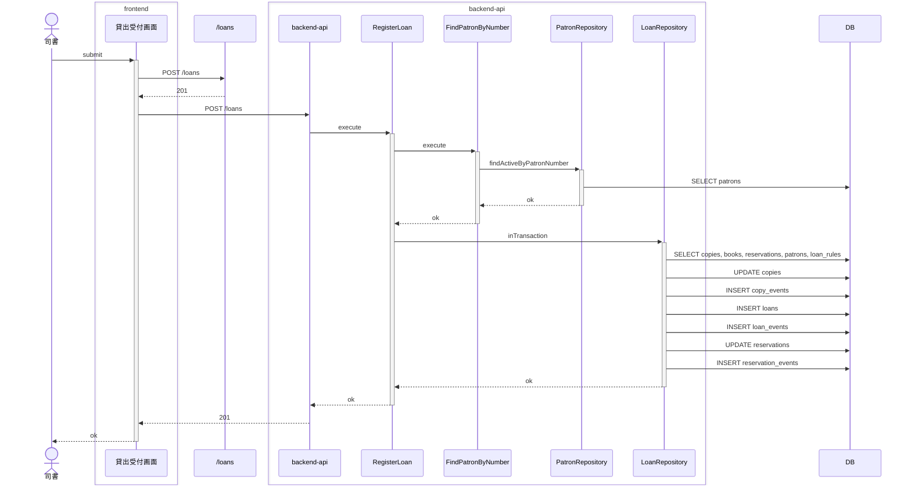
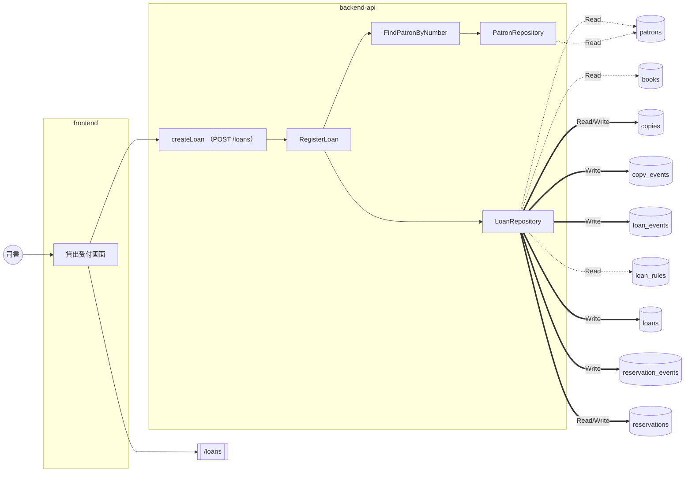

# 貸出業務 / 貸出を登録する

<!-- 要約: 表 1 つ (| 項目 | 内容 | 根拠 |)。行は 誰が / 何をする / 完了の条件。内容は 40 字以内、根拠はコード位置 path:line -->
<!-- 要約:begin 概要 -->
| 項目 | 内容 | 根拠 |
|---|---|---|
| 誰が | 司書 (利用者区分が司書でなければ 403) | apps/backend-api/src/usecase/shared/principal.ts:28 |
| 何をする | 利用者番号と蔵書 ID を指定して蔵書を貸し出す 蔵書を貸出中にし、返却期限つきの貸出を記録する 本人向け取り置きの予約は受取済みにする | apps/backend-api/src/usecase/circulation/registerLoan.ts:40 apps/backend-api/src/domain/circulation/loan.ts:65 apps/backend-api/src/domain/circulation/loan.ts:78 |
| 完了の条件 | 貸出・蔵書・予約の更新が 1 トランザクションで確定する 201 で契約 Loan を返す | apps/backend-api/src/usecase/circulation/registerLoan.ts:44 apps/backend-api/src/presentation/circulation/createLoanHandler.ts:117 |
<!-- 要約:end -->

## 結果 (抽出)

| 項目 | 結果 |
|---|---|
| ゲート | 5 段すべて pass |
| 受入基準 | 4 / 4 をシナリオが覆う |
| シナリオ | 6 本中 6 本 pass (受入 4) |
| 実装者が決めた前提 | 20 件 (人が承認 6、自動承認 14) |
| 未決の課題 | 3 件 (契約 2、未分類 1) |
| 計装の範囲 (backend-api) | gateway, presentation, repository, usecase |
| 計装の範囲 (frontend) | api-client, screen |

## 入口 (抽出)

| 種類 | 名前 |
|---|---|
| API | createLoan (POST /loans) |
| 画面 | LoanCheckout |
| 発行イベント | なし |
| 購読イベント | なし |
| 要求 | SPEC-004-01, SPEC-006-01 ([要求仕様書](../../../requirements/requirements.md)) |
| シナリオ | [register-loan.feature](../../../../features/%E8%B2%B8%E5%87%BA%E6%A5%AD%E5%8B%99/register-loan.feature) |
| 契約 | [contract-slice.json](../../../../contracts/generated/slices/register-loan/contract-slice.json) |

主要な部品 (トレースに現れたもの):

- backend-api: FindPatronByNumber、LoanRepository、PatronRepository、RegisterLoan
- frontend: 貸出受付画面

## どう動くか (抽出)

正常系: 本人向けに取り置き中の蔵書を貸し出すと予約が受取済みになる

分岐 (他のシナリオとの違い):

| シナリオ | 応答 | 書き込み | 発行 |
|---|---|---|---|
| 他の利用者向けに取り置き中の蔵書は貸し出せない | 409 | なし | なし |
| 在庫ありの蔵書を貸し出す | 201 | copies, copy_events, loan_events, loans | なし |
| 月をまたぐ返却期限も貸出日に貸出期間を加えて設定される | 201 | copies, copy_events, loan_events, loans | なし |
| 貸出中の蔵書は貸し出せない | 409 | なし | なし |
| 貸出登録時に貸出日に貸出期間を加えた返却期限が設定される | 201 | copies, copy_events, loan_events, loans | なし |

全シナリオの図は [sequence.md](sequence.md)。

### データの流れ

全シナリオを合算。点線は Read、太線は Write。

## 何を守るか (要約)

<!-- 要約: 表 1 つ (| 守ること | 手段 | 根拠 |)。守ること = 原子性 / 競合 / 冪等 / 障害と副作用。手段は 1 行 1 つ (  区切り、各 40 字以内)、根拠はコード位置 -->
<!-- 要約:begin 整合性 -->
| 守ること | 手段 | 根拠 |
|---|---|---|
| 原子性 | 蔵書の読み取りから更新までを 1 トランザクションで行う snapshots の更新と events の追記を同じトランザクションで行う 利用者の存在確認はトランザクションの外で行う | apps/backend-api/src/usecase/circulation/registerLoan.ts:44 apps/backend-api/src/repository/circulation/pgLoanRepository.ts:84 apps/backend-api/src/usecase/circulation/registerLoan.ts:40 |
| 競合 | copies を version 一致の条件で更新する reservations を version と on_hold の条件で更新する 更新 0 件なら ConcurrentUpdateError で全体を戻す 競合は 409 concurrent_update を返す (自動再試行なし) | apps/backend-api/src/repository/circulation/pgLoanRepository.ts:89 apps/backend-api/src/repository/circulation/pgLoanRepository.ts:137 apps/backend-api/src/repository/circulation/pgLoanRepository.ts:93 apps/backend-api/src/presentation/http/problem.ts:64 |
| 冪等 | 冪等キーは無く、要求ごとに新しい loan_id を採番する 再送すると蔵書が貸出中のため 409 on_loan になる | apps/backend-api/src/usecase/circulation/registerLoan.ts:52 apps/backend-api/src/domain/circulation/loanEligibility.ts:28 |
| 障害と副作用 | 有効な貸出ルールが無ければ記録せず 500 を返す 想定外の例外は 500 internal_error を返す イベントの発行は無い 監査ログは出力しない | apps/backend-api/src/usecase/circulation/registerLoan.ts:49 apps/backend-api/src/presentation/http/server.ts:93 apps/backend-api/src/repository/circulation/pgLoanRepository.ts:84 apps/backend-api/src/usecase/circulation/registerLoan.ts:37 |
<!-- 要約:end -->

## 決めたこと (転記)

仕様に書かれておらず、実装者が決めた前提。検証は Verifier の判定、処遇は人のレビューの結果。

### 人が承認した前提 (6)

| ティア | 分類 | 何を決めたか | 検証 | 場所 |
|---|---|---|---|---|
| backend-api | セキュリティ | テストでは認証ヘッダ無しを司書扱い | **仕様に無い (major)** | test-app.ts:27 |
| backend-api | セキュリティ | 401/403 の Problem の形を自前で決定 | **仕様に無い (major)** | problem.ts:46 |
| backend-api | 永続化 | 退会済み利用者は存在しない扱い | **仕様に無い (major)** | pgPatronRepository.ts:14 |
| backend-api | 永続化 | 貸出登録の events の payload は空 | **仕様に無い (major)** | pgLoanRepository.ts:127 |
| backend-api | セキュリティ | 貸出登録は監査ログに記録しない | **仕様に無い (major)** | registerLoan.ts:37 |
| frontend | セキュリティ | 認可トークンは上位から注入し保持しない | **仕様に無い (major)** | loan-api.ts:38 |

前提の全文

- **テストでは認証ヘッダ無しを司書扱い** (backend-api): createTestApp の偽の認証基盤は Authorization ヘッダが無い要求を司書 lib1 として通す (defaultPrincipal で変更でき、null なら 401)
- **401/403 の Problem の形を自前で決定** (backend-api): 認証なしは 401 (type .../problems/unauthorized, code unauthorized)、利用者区分が利用者なら 403 (type .../problems/forbidden, code forbidden) を Problem で返す
- **退会済み利用者は存在しない扱い** (backend-api): patrons.deleted_at が設定された (退会した) 利用者の利用者番号は patron_not_found の 404 にする
- **貸出登録の events の payload は空** (backend-api): 貸出登録で追記する loan_events / copy_events / reservation_events の payload は NULL とし、付帯情報は snapshots だけに持つ
- **貸出登録は監査ログに記録しない** (backend-api): 貸出登録は ADR 0006 の「司書の管理操作」に含めず、監査ログを出力しない
- **認可トークンは上位から注入し保持しない** (frontend): frontend の貸出受付はアクセストークンを自分で取得・保存せず、呼び出し側が ApiOptions.headers (Authorization: Bearer) で注入する。未注入なら認可ヘッダ無しで呼ぶ

### 自動承認した前提 (14)

| ティア | 分類 | 何を決めたか | 検証 | 場所 |
|---|---|---|---|---|
| backend-api | データ形式 | 業務日付は Asia/Tokyo で決める | 仕様に無い (minor) | clock.ts:7 |
| backend-api | 入力検証 | 空白だけの利用者番号は未入力扱い | 仕様に無い (minor) | createLoanHandler.ts:42 |
| backend-api | 入力検証 | 未知の項目は unknown_field で 400 | 仕様に無い (minor) | createLoanHandler.ts:80 |
| backend-api | 入力検証 | JSON でない本文は field=body で 400 | 仕様に無い (minor) | server.ts:46 |
| backend-api | エラー処理 | 利用者の存在確認を蔵書より先に行う | 仕様に無い (minor) | registerLoan.ts:41 |
| backend-api | エラー処理 | 除籍済みの貸出拒否の detail 文言 | 仕様に無い (minor) | createLoanHandler.ts:34 |
| backend-api | エラー処理 | 楽観ロック競合は 409 concurrent_update | 仕様に無い (minor) | problem.ts:64 |
| backend-api | エラー処理 | 有効な貸出ルールが無ければ 500 | 仕様に無い (minor) | registerLoan.ts:49 |
| backend-api | エラー処理 | 取り置き予約が無い取り置き中蔵書は貸出不可 | 仕様に無い (minor) | pgLoanRepository.ts:49 |
| frontend | エラー処理 | 通信失敗と非 Problem 応答は固定文言 | 仕様に無い (minor) | loan-checkout.ts:61 |
| frontend | 入力検証 | 入力の必須チェックはサーバーに任せる | 仕様に無い (minor) | loan-checkout.ts:77 |
| frontend | データ形式 | 400 の errors[] をフォーム項目名へ写像 | 仕様に無い (minor) | loan-checkout.ts:42 |
| frontend | データ形式 | 貸出完了の蔵書表示は copy_id をそのまま | 仕様に無い (minor) | LoanCheckoutPage.tsx:54 |
| frontend | エラー処理 | 成功で入力を空に、失敗で入力を保持 | 仕様に無い (minor) | LoanCheckoutPage.tsx:69 |

前提の全文

- **業務日付は Asia/Tokyo で決める** (backend-api): 貸出日 (loaned_on) は Clock.today() が返す Asia/Tokyo の暦日とし、返却期限もこの暦日から算出する
- **空白だけの利用者番号は未入力扱い** (backend-api): patron_number と copy_id が未指定・null・空白だけの文字列なら code required の 400 を返す (値の前後の空白は除去しない)
- **未知の項目は unknown_field で 400** (backend-api): CreateLoanRequest に無い項目 (例: due_on) を受けたら field=項目名、code=unknown_field の検証エラーで 400 を返す
- **JSON でない本文は field=body で 400** (backend-api): 本文が JSON として読めない、またはオブジェクトでないときは field=body、code=format の検証エラーで 400 を返す
- **利用者の存在確認を蔵書より先に行う** (backend-api): 利用者番号と蔵書 ID の両方が存在しないときは patron_not_found の 404 を返す (利用者を先に確認する)
- **除籍済みの貸出拒否の detail 文言** (backend-api): 除籍済みの蔵書は code loan_not_allowed の 409 で detail を「この蔵書は除籍済みです。」とする
- **楽観ロック競合は 409 concurrent_update** (backend-api): 蔵書・予約の version が読み取り後に進んでいたら全体を rollback し、code concurrent_update の 409 を返す (自動再試行しない)
- **有効な貸出ルールが無ければ 500** (backend-api): 貸出日時点で有効な貸出ルールの世代が無いときは貸出を記録せず 500 (code internal_error) を返す
- **取り置き予約が無い取り置き中蔵書は貸出不可** (backend-api): 蔵書の状態が取り置き中なのに、その蔵書を held_copy_id に持つ取り置き中の予約が無いときは、他の利用者向けの取り置きとして 409 にする
- **通信失敗と非 Problem 応答は固定文言** (frontend): fetch が例外を投げた場合と、応答が Problem (title を持つ JSON) で読めない場合は、title「貸出を登録できませんでした」detail「時間をおいてもう一度お試しください。」のエラー表示状態にする
- **入力の必須チェックはサーバーに任せる** (frontend): 画面側では利用者番号・蔵書 ID の必須・形式チェックをせず、packages/ui の LoanCheckoutForm が前後の空白を除いた値をそのまま送り、backend-api の 400 (errors[]) を項目エラーとして表示する
- **400 の errors[] をフォーム項目名へ写像** (frontend): Problem の errors[].field を patron_number→patronNo、copy_id→copyId に写像し、同じ項目に複数あれば最初の message だけを出す。未知の field は捨てる
- **貸出完了の蔵書表示は copy_id をそのまま** (frontend): 貸出完了のお知らせでは蔵書を「書籍タイトル (copy_id)」と表示し、copy_id は契約の uuid をそのまま出す
- **成功で入力を空に、失敗で入力を保持** (frontend): 貸出成功時は loan_id をキーにフォームを作り直して入力を空に戻し、エラー時 (400/404/409・通信失敗) は直前に送信した入力値をフォームに残す

### Verifier が見つけた未申告の判断 (3)

| ティア | 判断 | 場所 |
|---|---|---|
| backend-api | 利用者の存在確認 (FindPatronByNumber) を貸出登録のトランザクションの外で行い、蔵書の読み取りと更新だけをトランザクション内で行う | registerLoan.ts:40 |
| backend-api | 経路の解決を認証より先に行い、未定義の経路には認証なしでも 404 (route_not_found) を返す | server.ts:69 |
| backend-api | 貸出期間が 1 未満または整数でない貸出ルールでは返却期限を算出せず RangeError を投げる | dueDate.ts:31 |

### Verifier の指摘 (前提以外、1)

minor 1 件

- 生成した DB 行型を使っていない (backend-api, pgLoanRepository.ts:17)

指摘の全文

- **生成した DB 行型を使っていない** (backend-api, minor): repository は行の型 (LendableCopyRow, LoanRuleRow, PatronRow) を手で宣言している。生成型 packages/contracts/db/tables.ts (LoanRulesRow, CopiesRow など) はどこからも使われていない。

## 課題 (抽出 + 要約)

| 種類 | 課題 |
|---|---|
| 契約 | 生成された契約テストが biome format に通らない |
| 契約 | createLoan の 409 に蔵書ID欄の項目指定が無い |
| 未分類 | contract-auth-responses-not-in-createLoan |

<!-- 要約: 表 1 つ (| 課題 | 背景 | 今の実装 | 対処 | 根拠 |)。課題 1 つ 1 行、セルは 40 字以内、根拠はコード位置 -->
<!-- 要約:begin 課題 -->
| 課題 | 背景 | 今の実装 | 対処 | 根拠 |
|---|---|---|---|---|
| 生成された契約テストが biome format に通らない | 生成物は手で直せない | test/contract/** を formatter の対象外にした | 生成器の出力を biome 設定で整形する 対応後に apps/backend-api/biome.json を消す | apps/backend-api/biome.json:6 |
| createLoan の 409 に蔵書ID欄の項目指定が無い | 画面見本は 409 で蔵書ID欄に項目エラーを出す 契約の 409 には errors[] が無い | 409 は title と detail だけを表示する errors[] があれば copy_id を蔵書ID欄へ写す | 契約の 409 に errors[] (copy_id) を加える (推奨) または画面見本から項目エラーを外す | apps/frontend/src/state/loan-checkout.ts:42 apps/backend-api/src/presentation/circulation/createLoanHandler.ts:124 |
| createLoan の契約に 401 / 403 が無い | 契約テストは認証ヘッダを送れない | 未認証は 401 unauthorized を返す 司書以外は 403 forbidden を返す | 生成器がヘッダ単位の example に対応したら契約に戻す | apps/backend-api/src/presentation/http/server.ts:72 apps/backend-api/src/presentation/circulation/createLoanHandler.ts:119 |
<!-- 要約:end -->

## 証跡 (抽出)

ゲート: static pass / unit pass / contract pass / uc-bdd pass / acceptance pass

| ティア | 単体 (pass/total) | 契約 (pass/total) |
|---|---|---|
| frontend | 19/19 | 0/0 |
| backend-api | 51/51 | 19/19 |

受入基準の対応:

| 基準 | 内容 | シナリオ (結果) |
|---|---|---|
| SPEC-004-01-1 | Given 在庫ありの書籍と登録済みの利用者がいる When 司書が貸出を登録する Then 貸出が記録され書籍の状態が貸出中になる | 在庫ありの蔵書を貸し出す (passed) |
| SPEC-004-01-2 | Given 貸出中の書籍がある When 司書がその書籍の貸出を登録する Then 貸出できない旨のエラーが表示される | 貸出中の蔵書は貸し出せない (passed) |
| SPEC-004-01-3 | Given 利用者 A 向けに取り置き中の書籍がある When 司書が利用者 B への貸出を登録する Then 貸出できない旨のエラーが表示される | 他の利用者向けに取り置き中の蔵書は貸し出せない (passed) |
| SPEC-006-01-1 | Given 貸出期間が 14 日に設定されている When 9 月 1 日に貸出を登録する Then 返却期限が 9 月 15 日に設定される | 貸出登録時に貸出日に貸出期間を加えた返却期限が設定される (passed) |

## 付録 (抽出)

変更ファイル (91)

- backend-api (32)
  - apps/backend-api/biome.json
  - apps/backend-api/migrations/0001_schema.sql
  - apps/backend-api/src/app.ts
  - apps/backend-api/src/domain/circulation/copyStatus.ts
  - apps/backend-api/src/domain/circulation/dueDate.ts
  - apps/backend-api/src/domain/circulation/loan.test.ts
  - apps/backend-api/src/domain/circulation/loan.ts
  - apps/backend-api/src/domain/circulation/loanEligibility.ts
  - apps/backend-api/src/domain/circulation/loanRepository.ts
  - apps/backend-api/src/domain/circulation/loanRule.ts
  - apps/backend-api/src/domain/patron/patron.ts
  - apps/backend-api/src/domain/shared/clock.ts
  - apps/backend-api/src/gateway/clock.ts
  - apps/backend-api/src/gateway/database.ts
  - apps/backend-api/src/index.ts
  - apps/backend-api/src/presentation/circulation/createLoanHandler.ts
  - apps/backend-api/src/presentation/http/problem.ts
  - apps/backend-api/src/presentation/http/server.ts
  - apps/backend-api/src/register-loan.test.ts
  - apps/backend-api/src/repository/circulation/pgLoanRepository.test.ts
  - apps/backend-api/src/repository/circulation/pgLoanRepository.ts
  - apps/backend-api/src/repository/patron/pgPatronRepository.ts
  - apps/backend-api/src/test-app.test.ts
  - apps/backend-api/src/test-app.ts
  - apps/backend-api/src/testing/contractFixtures.ts
  - apps/backend-api/src/usecase/circulation/registerLoan.test.ts
  - apps/backend-api/src/usecase/circulation/registerLoan.ts
  - apps/backend-api/src/usecase/patron/findPatronByNumber.ts
  - apps/backend-api/src/usecase/shared/principal.ts
  - apps/backend-api/test/contract/createLoan.test.ts
  - apps/backend-api/test/contract/db-schema.test.ts
  - apps/backend-api/tsconfig.json
- frontend (9)
  - apps/frontend/package.json
  - apps/frontend/src/api-client/loan-api.ts
  - apps/frontend/src/index.ts
  - apps/frontend/src/register-loan.test.ts
  - apps/frontend/src/state/loan-checkout.test.ts
  - apps/frontend/src/state/loan-checkout.ts
  - apps/frontend/src/view/LoanCheckoutPage.submit.test.tsx
  - apps/frontend/src/view/LoanCheckoutPage.test.tsx
  - apps/frontend/src/view/LoanCheckoutPage.tsx
- その他 (50)
  - "features/\350\262\270\345\207\272\346\245\255\345\213\231/register-loan.feature"
  - .distillery/runs/register-loan/attempt-1/assumptions.backend-api.yaml
  - .distillery/runs/register-loan/attempt-1/assumptions.frontend.yaml
  - .distillery/runs/register-loan/attempt-1/findings.backend-api.yaml
  - .distillery/runs/register-loan/attempt-1/findings.frontend.yaml
  - .distillery/runs/register-loan/attempt-2/assumptions.backend-api.yaml
  - .distillery/runs/register-loan/attempt-2/assumptions.frontend.yaml
  - .distillery/runs/register-loan/attempt-2/findings.backend-api.yaml
  - .distillery/runs/register-loan/attempt-2/findings.frontend.yaml
  - .distillery/runs/register-loan/events.jsonl
  - .distillery/runs/register-loan/invalidated/20260925_021353_integrate.done.yaml
  - .distillery/runs/register-loan/invalidated/20260925_021354_contract-gate.done.yaml
  - .distillery/runs/register-loan/invalidated/20260925_021356_tier.done.yaml
  - .distillery/runs/register-loan/issues/20260925T020000Z_register-loan.md
  - .distillery/runs/register-loan/issues/20260925T021609Z_register-loan.md
  - .distillery/runs/register-loan/issues/contract-auth-responses-not-in-createLoan.md
  - .distillery/runs/register-loan/stages/contract-gate.done.yaml
  - .distillery/runs/register-loan/stages/contract.done.yaml
  - .distillery/runs/register-loan/stages/integrate.done.yaml
  - .distillery/runs/register-loan/stages/review.done.yaml
  - .distillery/runs/register-loan/stages/scaffold.done.yaml
  - .distillery/runs/register-loan/stages/scenario.done.yaml
  - .distillery/runs/register-loan/stages/tier.done.yaml
  - .distillery/runs/register-loan/stages/verify.done.yaml
  - contracts/generated/openapi.bundle.yaml
  - contracts/generated/slices/register-loan/contract-slice.json
  - contracts/generated/slices/register-loan/rdb-slice.yaml
  - contracts/openapi/components/schemas/CreateLoanRequest.yaml
  - contracts/openapi/components/schemas/Loan.yaml
  - contracts/openapi/openapi.yaml
  - contracts/openapi/paths/loans.yaml
  - contracts/uc-index.yaml
  - docs/README.md
  - docs/requirements/use-cases.yaml
  - features/step_definitions/register-loan.steps.ts
  - features/support/datastore.hooks.ts
  - features/support/datastore.ts
  - features/support/drivers/api.ts
  - features/support/library-fixtures.ts
  - features/support/tiers.ts
  - features/support/world.ts
  - packages/contracts/api/client.ts
  - packages/contracts/api/server.ts
  - packages/contracts/api/stubs/.distillery2-generated.json
  - packages/contracts/api/stubs/createLoan.201.json
  - packages/contracts/api/stubs/createLoan.400.json
  - packages/contracts/api/stubs/createLoan.404.json
  - packages/contracts/api/stubs/createLoan.409.json
  - packages/contracts/api/types.ts
  - packages/contracts/db/tables.ts

シナリオの実行結果 (6)

| シナリオ | 種別 | 結果 | 時間 (ms) |
|---|---|---|---|
| 他の利用者向けに取り置き中の蔵書は貸し出せない | 受入 | passed | 18 |
| 在庫ありの蔵書を貸し出す | 受入 | passed | 913 |
| 月をまたぐ返却期限も貸出日に貸出期間を加えて設定される | UC | passed | 16 |
| 本人向けに取り置き中の蔵書を貸し出すと予約が受取済みになる | UC | passed | 20 |
| 貸出中の蔵書は貸し出せない | 受入 | passed | 18 |
| 貸出登録時に貸出日に貸出期間を加えた返却期限が設定される | 受入 | passed | 19 |

生成情報

- 上流: requirements@2920f64 adr@090e13b contracts@2920f64
- コード: 8d02567
- 生成日時: 2026-09-25T02:22:44.490Z / 実行試行: 2
- モデル: 実装 claude-opus-5-5 / 検証 opus (Agent model alias; resolves to a different Opus, previously measured claude-opus-4-7) / オーケストレータ claude-opus-5-5
- 凡例: (抽出) はスクリプトが生成、(要約) は LLM がコード位置を根拠に書く、(転記) は実行記録からの写し

