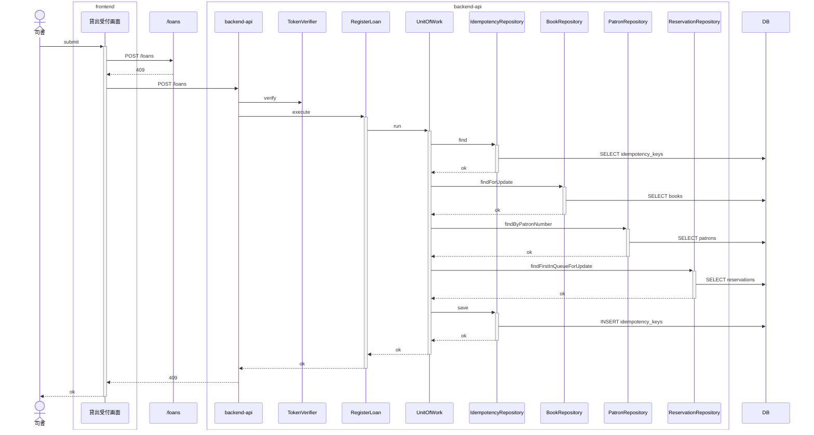
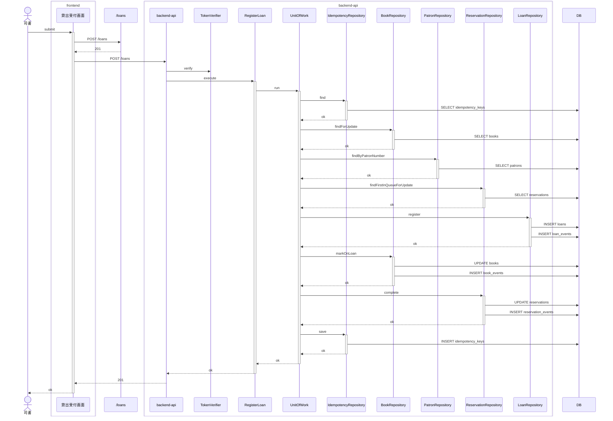
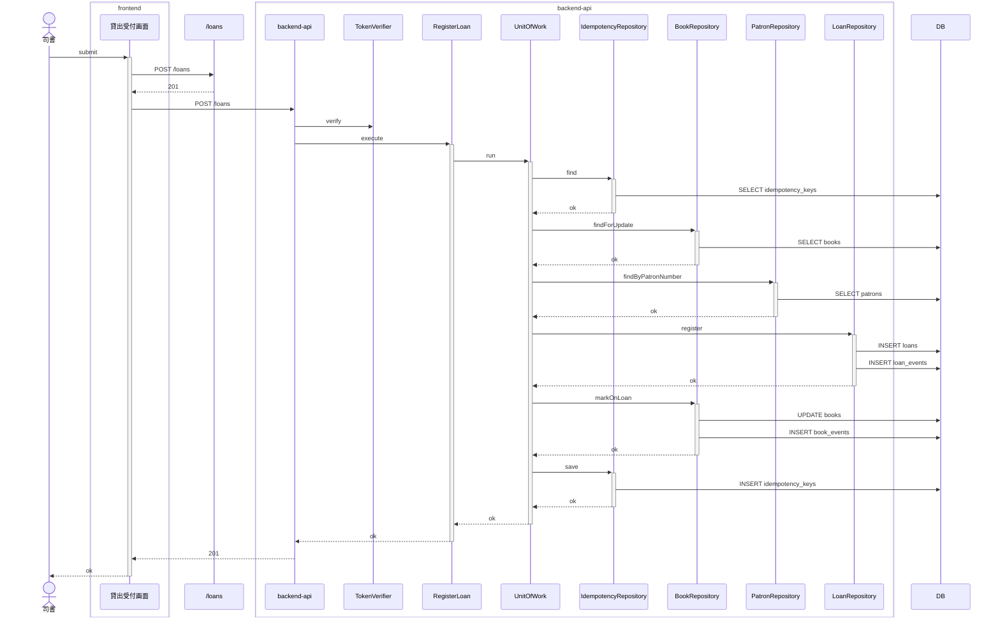
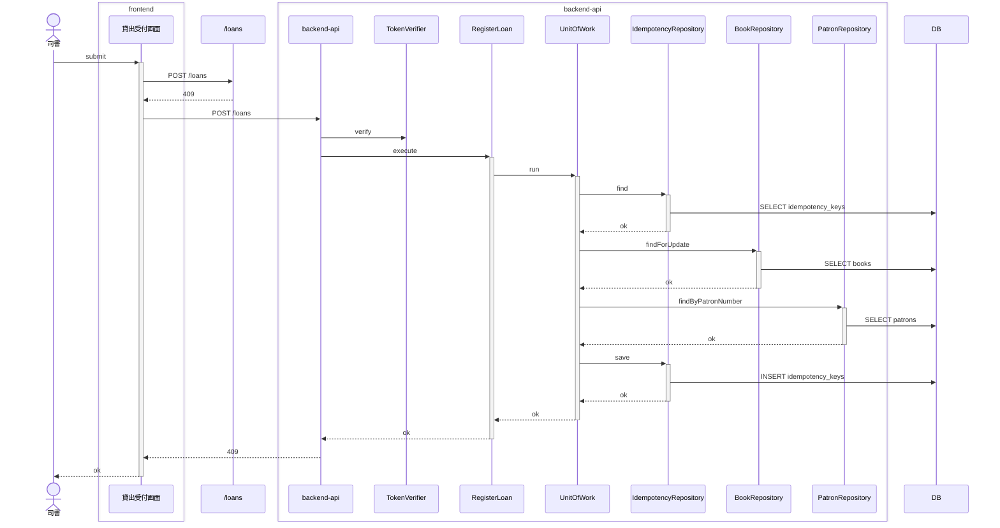

<!-- basis: requirements@6293d33ec217868e80d4dca1f65b7ee2411f83be adr@481506aca70dae9b5b64cefa6ea032e220651c7d contracts@6293d33ec217868e80d4dca1f65b7ee2411f83be | generated_at: 2026-09-26T02:13:22.592Z | slug: register-loan -->

# 貸出業務 / 貸出を登録する — 全シナリオのシーケンス (抽出)

アクターは 司書。正常系は [index.md](index.md) の「どう動くか」にも載せている。

## 予約待ちの書籍は予約順 1 位以外の利用者に貸し出せない

## 予約待ちの書籍を予約順 1 位の利用者に貸し出す

## 在庫ありの書籍を登録済みの利用者に貸し出す

## 登録されていない利用者には貸し出せない

## 貸出を登録すると返却期限が自動で設定される

## 貸出中の書籍は貸し出せない

