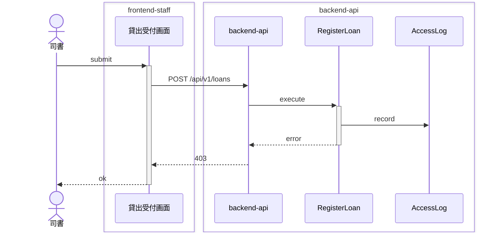
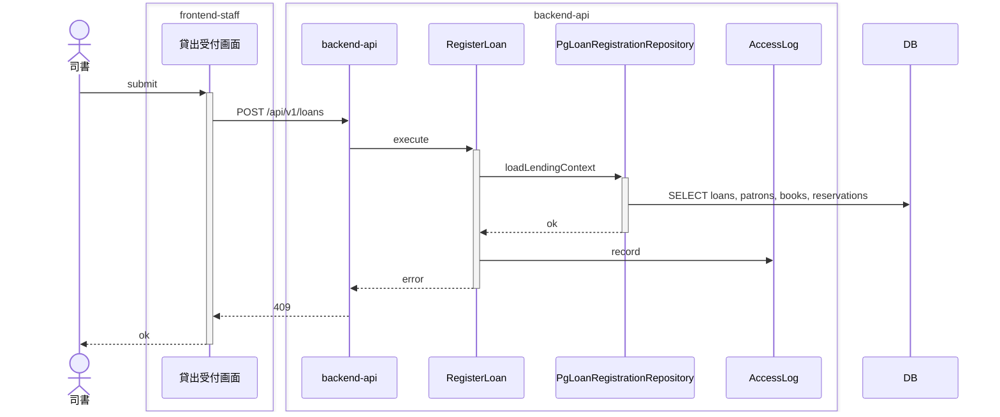
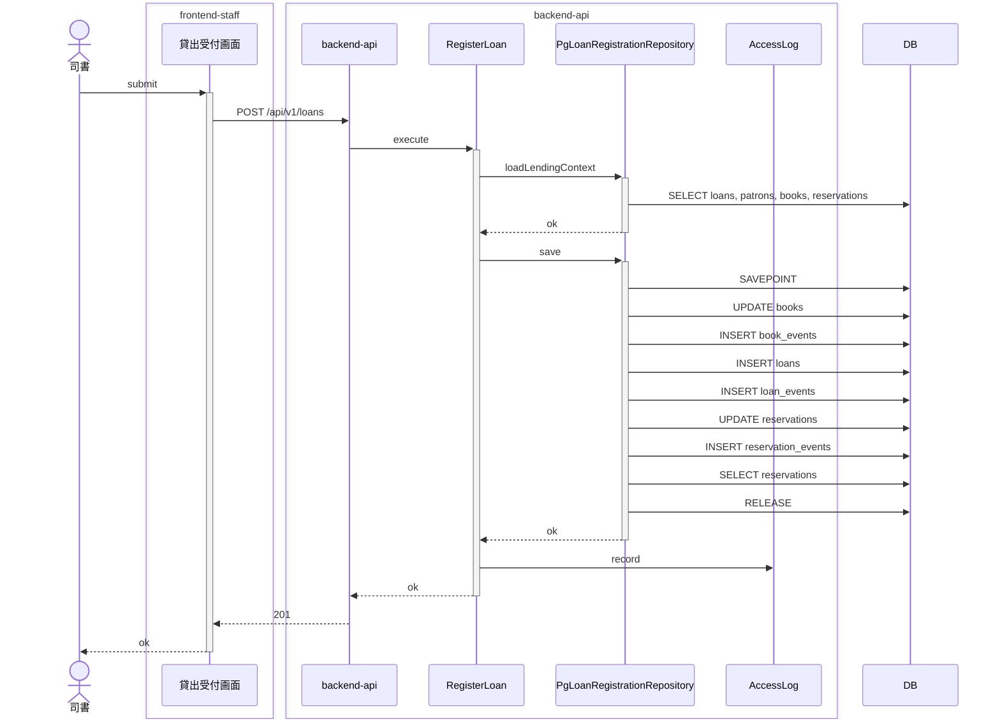
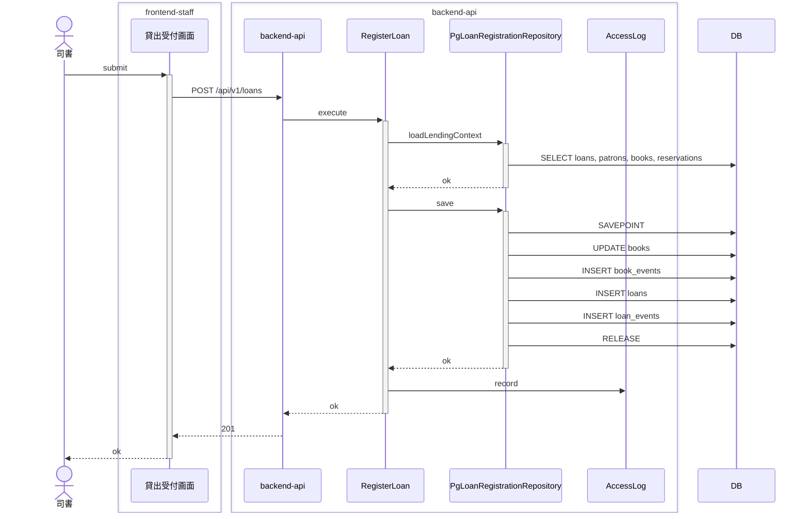

<!-- basis: requirements@10d88a0262c31662f8fc16dcbe00973c396363cd adr@2f9d373dc26f6467cf0f95c62a65831fce0f9659 contracts@10d88a0262c31662f8fc16dcbe00973c396363cd | generated_at: 2026-09-24T00:12:39.628Z | slug: register-loan -->

# 貸出業務 / 貸出を登録する — 全シナリオのシーケンス (抽出)

アクターは 司書。正常系は [index.md](index.md) の「どう動くか」にも載せている。

## 利用者は貸出を登録できない

## 削除済みの利用者には貸し出せない

## 削除済みの書籍は貸し出せない

## 取置の書籍は取置中の予約を持たない利用者には貸し出せない

## 取置中の予約を持つ予約順 1 位の利用者には取置の書籍を貸し出せる

## 在庫ありの書籍を登録済みの利用者に貸し出す

## 延滞中の貸出を持つ利用者には貸し出せない

## 貸出を登録すると返却期限が自動で設定される

## 貸出中の書籍は同じ書籍として貸し出せない

