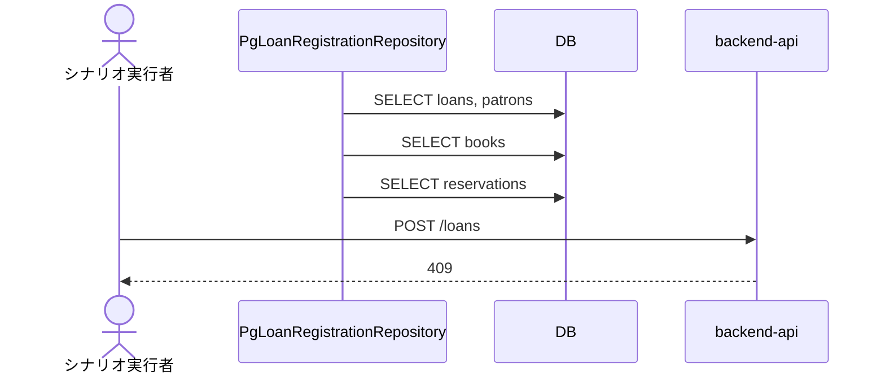
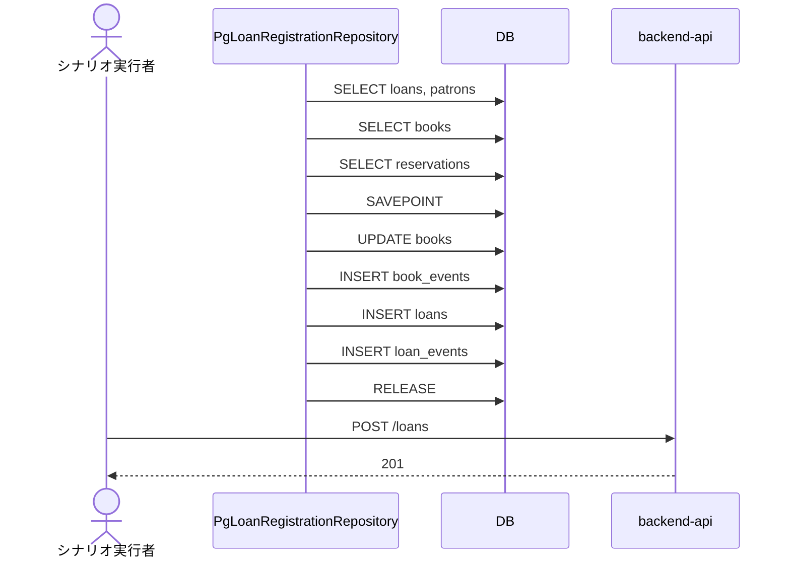
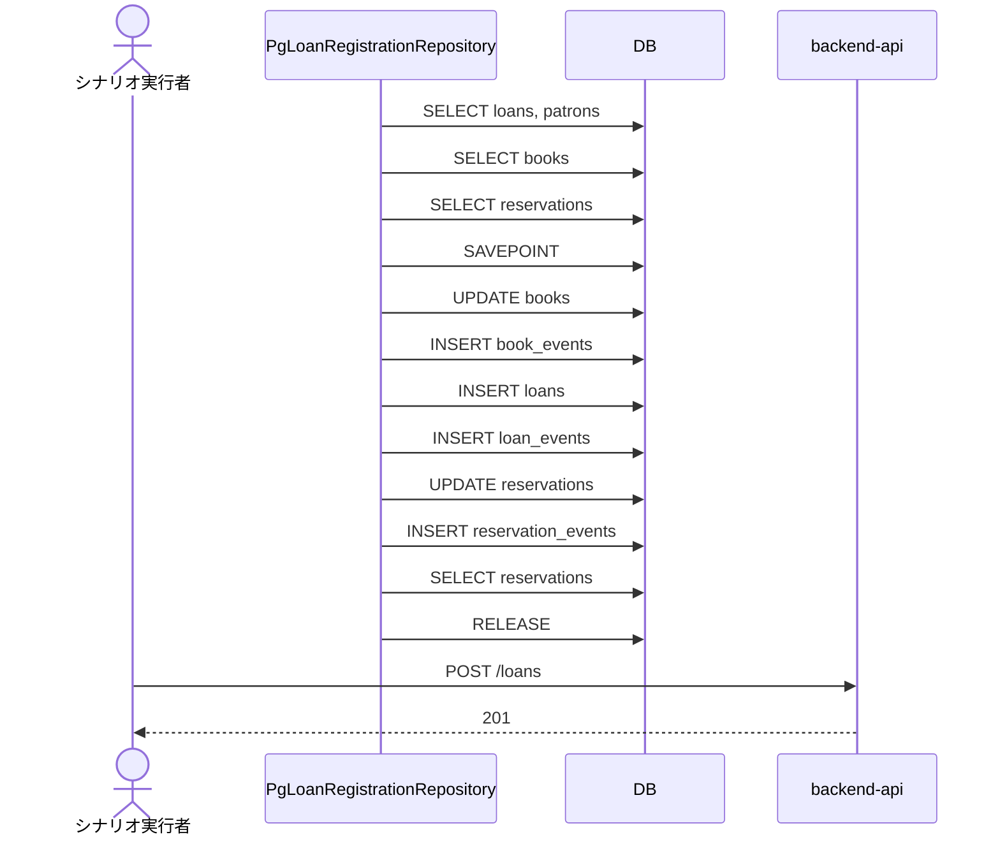
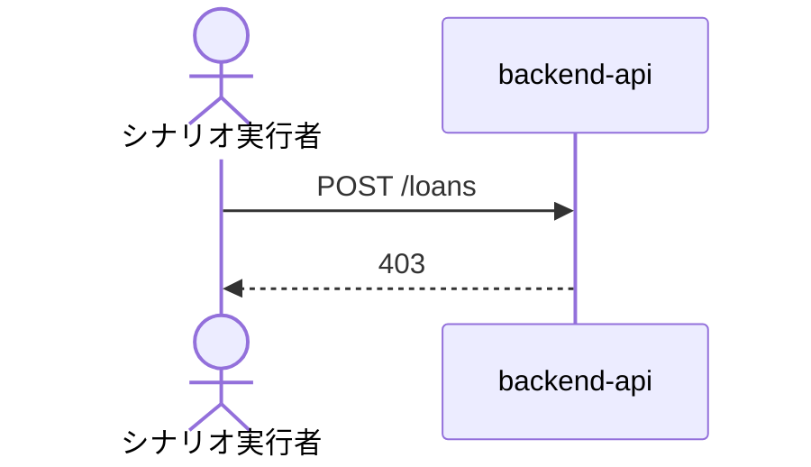

<!-- basis: requirements@c99a17fdd8915399a17cdd205937316c051e9e02 adr@2f9d373dc26f6467cf0f95c62a65831fce0f9659 contracts@c99a17fdd8915399a17cdd205937316c051e9e02 | generated_at: 2026-09-24T00:10:02.802Z | slug: register-loan -->

# 貸出業務 / 貸出を登録する — シーケンス (抽出)

## register-loan#延滞中の貸出を持つ利用者には貸し出せない

## register-loan#在庫ありの書籍を登録済みの利用者に貸し出す

## register-loan#削除済みの書籍は貸し出せない

## register-loan#削除済みの利用者には貸し出せない

## register-loan#取置の書籍は取置中の予約を持たない利用者には貸し出せない

## register-loan#取置中の予約を持つ予約順 1 位の利用者には取置の書籍を貸し出せる

## register-loan#貸出を登録すると返却期限が自動で設定される

## register-loan#貸出中の書籍は同じ書籍として貸し出せない

## register-loan#利用者は貸出を登録できない

