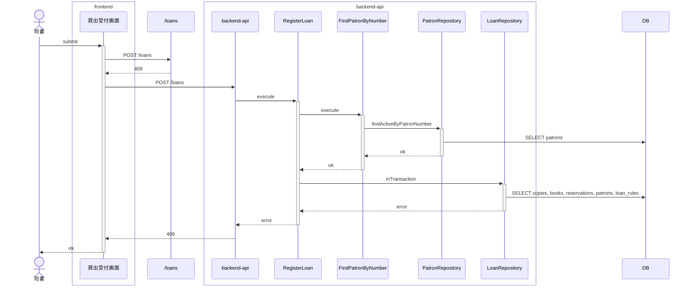
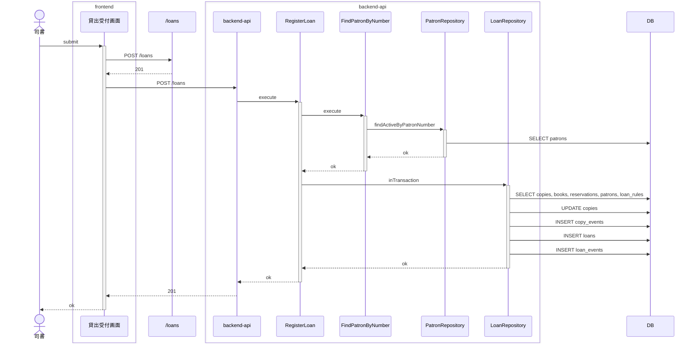
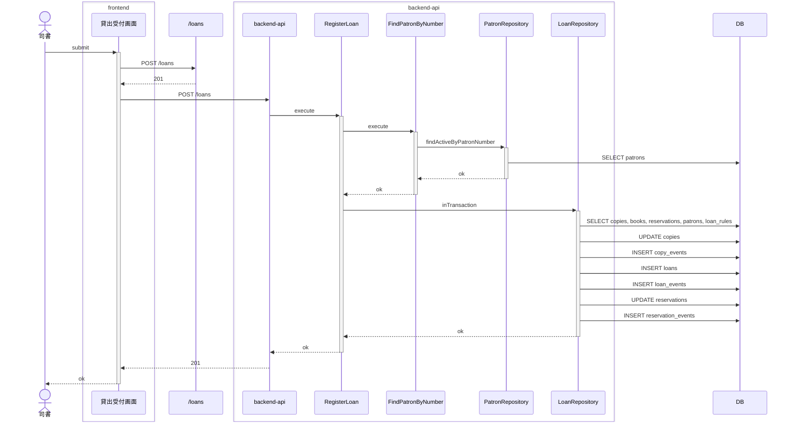

<!-- basis: requirements@2920f64ec5a2cf148b060ab279273d7b2cbc1e18 adr@090e13b71116c495162f84a620b4d303817fac08 contracts@2920f64ec5a2cf148b060ab279273d7b2cbc1e18 | generated_at: 2026-09-25T02:22:44.490Z | slug: register-loan -->

# 貸出業務 / 貸出を登録する — 全シナリオのシーケンス (抽出)

アクターは 司書。正常系は [index.md](index.md) の「どう動くか」にも載せている。

## 他の利用者向けに取り置き中の蔵書は貸し出せない

## 在庫ありの蔵書を貸し出す

## 月をまたぐ返却期限も貸出日に貸出期間を加えて設定される

## 本人向けに取り置き中の蔵書を貸し出すと予約が受取済みになる

## 貸出中の蔵書は貸し出せない

## 貸出登録時に貸出日に貸出期間を加えた返却期限が設定される

