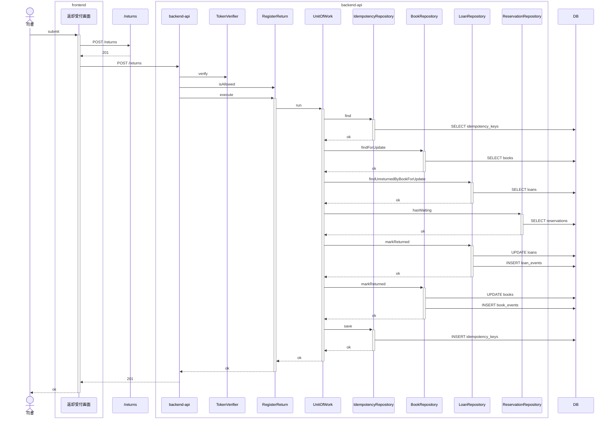
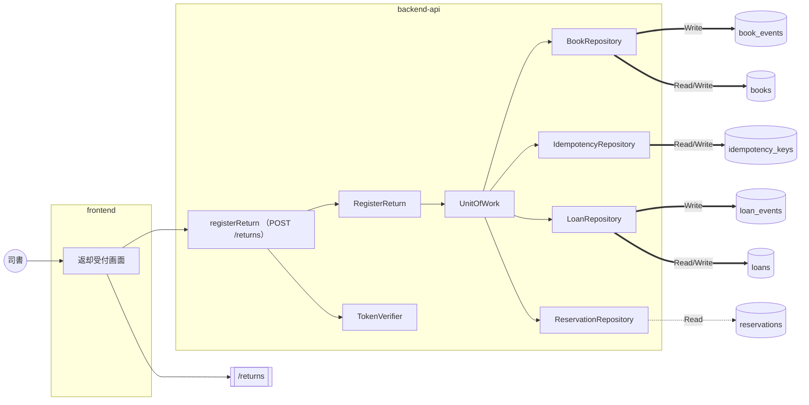

# 貸出業務 / 返却を登録する

<!-- 要約: 表 1 つ (| 項目 | 内容 | 根拠 |)。行は 誰が / 何をする / 完了の条件。内容は 40 字以内、根拠はコード位置 path:line -->
<!-- 要約:begin 概要 -->
| 項目 | 内容 | 根拠 |
|---|---|---|
| 誰が | 司書 (librarian ロール) | apps/backend-api/src/usecase/register-return.ts:120 |
| 何をする | 書籍IDを指定して返却を登録する | apps/backend-api/src/usecase/register-return.ts:84 |
| 完了の条件 | 貸出が返却済みになる 予約中の予約が無ければ書籍が在庫ありになる 予約中の予約があれば書籍が予約待ちになる | apps/backend-api/src/usecase/register-return.ts:103 apps/backend-api/src/usecase/register-return.ts:90 apps/backend-api/src/usecase/register-return.ts:104 |
<!-- 要約:end -->

## 結果 (抽出)

| 項目 | 結果 |
|---|---|
| ゲート | 5 段すべて pass |
| 受入基準 | 2 / 2 をシナリオが覆う |
| シナリオ | 4 本中 4 本 pass (受入 2) |
| 実装者が決めた前提 | 16 件 (人が承認 5、自動承認 11) |
| 未決の課題 | 3 件 (契約 1、要求 2) |
| 計装の範囲 (backend-api) | gateway, presentation, repository, usecase |
| 計装の範囲 (frontend) | api-client, screen |

## 入口 (抽出)

| 種類 | 名前 |
|---|---|
| API | registerReturn (POST /returns) |
| 画面 | ReturnRegister |
| 発行イベント | なし |
| 購読イベント | なし |
| 要求 | SPEC-003-02 ([要求仕様書](../../../requirements/requirements.md)) |
| シナリオ | [register-return.feature](../../../../features/%E8%B2%B8%E5%87%BA%E6%A5%AD%E5%8B%99/register-return.feature) |
| 契約 | [contract-slice.json](../../../../contracts/generated/slices/register-return/contract-slice.json) |

主要な部品 (トレースに現れたもの):

- backend-api: BookRepository、IdempotencyRepository、LoanRepository、RegisterReturn、ReservationRepository、TokenVerifier、UnitOfWork
- frontend: 返却受付画面

## どう動くか (抽出)

正常系: 予約のある貸出中の書籍の返却を登録する

分岐 (他のシナリオとの違い):

| シナリオ | 応答 | 書き込み | 発行 |
|---|---|---|---|
| 予約のない貸出中の書籍の返却を登録する | 201 | book_events, books, idempotency_keys, loan_events, loans | なし |
| 延滞している書籍の返却を登録する | 201 | book_events, books, idempotency_keys, loan_events, loans | なし |
| 未返却の貸出が無い書籍は返却を登録できない | 409 | idempotency_keys | なし |

全シナリオの図は [sequence.md](sequence.md)。

### データの流れ

全シナリオを合算。点線は Read、太線は Write。

## 何を守るか (要約)

<!-- 要約: 表 1 つ (| 守ること | 手段 | 根拠 |)。守ること = 原子性 / 競合 / 冪等 / 障害と副作用。手段は 1 行 1 つ (  区切り、各 40 字以内)、根拠はコード位置 -->
<!-- 要約:begin 整合性 -->
| 守ること | 手段 | 根拠 |
|---|---|---|
| 原子性 | 判定と更新を 1 つの UnitOfWork で行う 貸出の更新と loan_events の追記を続けて行う 書籍の更新と book_events の追記を続けて行う 応答の保存も同じトランザクションで行う | apps/backend-api/src/usecase/idempotent-command.ts:44 apps/backend-api/src/repository/pg-loan-repositories.ts:319 apps/backend-api/src/repository/pg-loan-repositories.ts:107 apps/backend-api/src/usecase/idempotent-command.ts:61 |
| 競合 | 書籍を FOR UPDATE でロックする 未返却の貸出を FOR UPDATE でロックする 予約中の予約の有無はロックせずに読む 更新は version 一致を条件にする 版が合わなければ ConcurrentUpdateError を投げる | apps/backend-api/src/repository/pg-loan-repositories.ts:137 apps/backend-api/src/repository/pg-loan-repositories.ts:287 apps/backend-api/src/repository/pg-loan-repositories.ts:182 apps/backend-api/src/repository/pg-loan-repositories.ts:315 apps/backend-api/src/repository/pg-loan-repositories.ts:127 |
| 冪等 | 同じキー・同じ本文の再送は保存した応答を返す 本文が違う再送は idempotency_key_conflict を返す 本文ハッシュは bookId の JSON の SHA-256 キーの範囲は operationId registerReturn で分ける 画面は書籍IDが変わると新しいキーにする | apps/backend-api/src/usecase/idempotent-command.ts:51 apps/backend-api/src/usecase/idempotent-command.ts:47 apps/backend-api/src/usecase/register-return.ts:75 apps/backend-api/src/usecase/register-return.ts:128 apps/frontend/src/view/return-register/ReturnRegisterScreen.tsx:130 |
| 障害と副作用 | 未返却の貸出が無ければ貸出・書籍に書き込まない 404 と 409 の応答も冪等キーに保存する 版が合わない例外はトランザクションの中で投げる 返却通知の outbox はこの UC で書かない | apps/backend-api/src/usecase/register-return.ts:98 apps/backend-api/src/usecase/idempotent-command.ts:59 apps/backend-api/src/repository/pg-loan-repositories.ts:318 apps/backend-api/src/usecase/register-return.ts:7 |
<!-- 要約:end -->

## 決めたこと (転記)

仕様に書かれておらず、実装者が決めた前提。検証は Verifier の判定、処遇は人のレビューの結果。

### 人が承認した前提 (5)

| ティア | 分類 | 何を決めたか | 検証 | 場所 |
|---|---|---|---|---|
| backend-api | 永続化 | 返却も業務判定後の応答を冪等キーに保存 | **仕様に無い (major)** | register-return.ts:124 |
| backend-api | 永続化 | 書籍と未返却の貸出を行ロックして返却 | **仕様に無い (major)** | pg-loan-repositories.ts:287 |
| backend-api | セキュリティ | 403 を入力検証より先に判定する | **仕様に無い (major)** | http-app.ts:128 |
| backend-api | セキュリティ | テスト入口のヘッダ補完を廃止 | **仕様に無い (major)** | test-app.ts:42 |
| frontend | 永続化 | 再送判定キーは結果確定か書籍ID変更で替える | **仕様に無い (major)** | ReturnRegisterScreen.tsx:128 |

前提の全文

- **返却も業務判定後の応答を冪等キーに保存** (backend-api): Idempotency-Key には、書籍を引いた後の業務判定の応答 (201 返却・409 no_active_loan・404 書籍不在) を返却と同じトランザクションで保存し、同じキー・同じ本文の再送には保存した応答をそのまま返す。401・403・400 は保存しない。本文ハッシュは bookId だけの JSON の SHA-256、キーの範囲は operationId registerReturn で貸出と分ける。本文が違う再送は 409 idempotency_key_conflict
- **書籍と未返却の貸出を行ロックして返却** (backend-api): 1 トランザクションの中で書籍と未返却の貸出を SELECT ... FOR UPDATE でロックしてから判定し、スナップショット更新は version 一致を条件にする。予約中の予約の有無はロックせずに読む。版が合わなければ例外で全体を巻き戻し 500 を返す
- **403 を入力検証より先に判定する** (backend-api): presentation は認証 (401) の直後に usecase の isAllowed (司書ロールか) を問い合わせ、司書以外なら本文と Idempotency-Key の検証 (400) より先に 403 を返す。usecase の execute も同じ判定を持つ。この順序を registerLoan にも当て、司書以外が不正な本文で貸出を呼んだときも 400 でなく 403 を返す
- **テスト入口のヘッダ補完を廃止** (backend-api): テスト用 composition root (createTestApp) は Authorization と Idempotency-Key を補わない (register-loan の A-009 を撤回)。features/support/composition.ts が defaultHeaders false を渡しているため、TestAppOptions に defaultHeaders?: false の型だけ非推奨として残し、値は無視する
- **再送判定キーは結果確定か書籍ID変更で替える** (frontend): Idempotency-Key は UUID v4 (crypto.randomUUID) とする。返却受付画面では、結果が不確かな失敗 (通信できない・契約外の応答) の後は同じキーで再送し、結果が確定した応答 (201 返却済み、Problem で返却できない) の後と、書籍IDの入力が変わったときは新しいキーに替える。入口関数 submitReturnCheckout はキー省略時に呼び出しごとに新しいキーを作る

### 自動承認した前提 (11)

| ティア | 分類 | 何を決めたか | 検証 | 場所 |
|---|---|---|---|---|
| backend-api | データ形式 | 返却日の当日は Asia/Tokyo で決める | 仕様に無い (minor) | register-return.ts:94 |
| backend-api | エラー処理 | 返却可否は未返却の貸出の有無で判定 | 仕様に無い (minor) | register-return.ts:88 |
| backend-api | データ形式 | 返却時のイベント種別の値 | 仕様に無い (minor) | pg-loan-repositories.ts:35 |
| backend-api | データ形式 | 返却の example 前提データの補い方 | 仕様に無い (minor) | contract-examples.ts:37 |
| backend-api | エラー処理 | 401・404 の見出しを契約の文言にそろえる | 仕様に無い (minor) | problem.ts:19 |
| frontend | エラー処理 | Problem 以外の応答は再試行を促す失敗表示 | 仕様に無い (minor) | submit-return-checkout.ts:66 |
| frontend | エラー処理 | 201 で返却日が null なら契約外の失敗扱い | 仕様に無い (minor) | submit-return-checkout.ts:59 |
| frontend | エラー処理 | 通信失敗は返却できない旨を表示 | 仕様に無い (minor) | ReturnRegisterScreen.tsx:142 |
| frontend | データ形式 | 返却前の表は出さず結果は書籍IDで示す | 仕様に無い (minor) | ReturnRegisterScreen.tsx:81 |
| frontend | データ形式 | 返却できない理由は応答の title を表示 | 仕様に無い (minor) | ReturnRegisterScreen.tsx:96 |
| frontend | 入力検証 | 書籍IDは画面で検証せず API に委ねる | 仕様に無い (minor) | submit-return-checkout.ts:47 |

前提の全文

- **返却日の当日は Asia/Tokyo で決める** (backend-api): 返却日 (サーバーの当日の日付) を、貸出日と同じ Asia/Tokyo タイムゾーンの暦日で決める
- **返却可否は未返却の貸出の有無で判定** (backend-api): 返却できるかを書籍状態ではなく、書籍に貸出状態が on_loan または overdue の貸出があるかで判定する。書籍状態が貸出中でも未返却の貸出が無ければ 409 no_active_loan、未返却の貸出が複数あれば貸出日が最も新しいものを返却済にする
- **返却時のイベント種別の値** (backend-api): 返却で追記するイベント種別を 書籍=returned、貸出=returned とし、payload は JSON 文字列 (書籍は loanId と状態の遷移 from/to、貸出は returnedOn と状態の遷移 from/to) にする
- **返却の example 前提データの補い方** (backend-api): 契約テスト用の前提データに、registerReturn の examples の書籍・貸出 (loanId・patronNumber・loanedOn・dueDate と返却前の status) を入れる。successWithReservation の予約は契約に予約IDが無いため仮の UUID e3a9c5b1-6d2f-4b8a-9c4e-7f1a3d5b9e2c で、別の利用者 P-00000002 の予約順 1 位・予約中として置く。時計は 2026-10-01 のままにし、返却日は example の 2026-10-15 ではなく 2026-10-01 になる
- **401・404 の見出しを契約の文言にそろえる** (backend-api): Problem の title を契約 example の文言にそろえ、401 を「認証が必要です」、404 を「対象が見つかりません」に変える。registerLoan の 401 / 404 の title も同じ文言に変わる (registerLoan の 404 の detail は従来の「は登録されていません」のまま)
- **Problem 以外の応答は再試行を促す失敗表示** (frontend): registerReturn の応答が 201 以外で、本文が Problem 形式 (code と title を持つ) なら返却できない旨と title を表示し、Problem 形式でなければ status を保持した failed として固定の再試行を促す文言を表示する
- **201 で返却日が null なら契約外の失敗扱い** (frontend): registerReturn の 201 応答で loan.returnedOn が null の場合は、返却済みと表示せず、契約外の応答として再試行を促す failed を返す
- **通信失敗は返却できない旨を表示** (frontend): fetch 自体が例外を投げた (通信できない) 場合、画面は status 0 の failed として通信状態の確認と再試行を促す文言を表示し、同じ Idempotency-Key で再送できる状態に戻す
- **返却前の表は出さず結果は書籍IDで示す** (frontend): 返却受付画面の Default は書籍IDの入力欄と登録ボタンだけを出し、story の「この書籍の貸出」(LoanTable) は出さない。返却後の Alert は書籍名の代わりに「書籍ID {bookId} の書籍は」と書籍IDで示す
- **返却できない理由は応答の title を表示** (frontend): 返却できなかったときの Alert 本文は、story の固定文言 (この書籍IDの貸出が見つかりません…) ではなく応答 Problem の title をそのまま表示する
- **書籍IDは画面で検証せず API に委ねる** (frontend): 返却受付画面は入力された書籍IDを加工 (trim 等) も事前検証もせずにそのまま送り、形式違反・空欄の判定は backend の 400 (validation_error) に委ねる

### Verifier が見つけた未申告の判断 (2)

| ティア | 判断 | 場所 |
|---|---|---|
| backend-api | registerReturn の 403 の detail を「返却の登録は司書だけが行えます」、401 の detail を「有効なアクセストークンを指定してください」とする | http-app.ts:196 |
| frontend | 201 応答の bookStatus が awaiting_pickup 以外 (契約上ありえない on_loan を含む) なら、success の『返却を登録しました』Alert を出す | ReturnRegisterScreen.tsx:78 |

### Verifier の指摘 (前提以外、3)

minor 3 件

- 返却通知 outbox の書き込みは別 UC へ先送り (backend-api, register-return.ts:7)
- A-006 の分類は error_handling (frontend, ReturnRegisterScreen.tsx:96)
- 画面の状態遷移に単体テストが無い (frontend, ReturnRegisterScreen.tsx:118)

指摘の全文

- **返却通知 outbox の書き込みは別 UC へ先送り** (backend-api, minor): ADR 0005 は返却登録と同じトランザクションで通知の送信待ち記録を書くと定めるが、この UC では書いていない。契約で notify-reserved-book-returned へ先送りと明示されており違反ではないが、後続 UC で返却トランザクションへの追加が必要
- **A-006 の分類は error_handling** (frontend, minor): 返却できなかったときに何を表示するかは失敗時の振る舞いであり、data_format ではなく error_handling に当たる
- **画面の状態遷移に単体テストが無い** (frontend, minor): ReturnRegisterScreen (状態を持つ画面) の再送キー切替 (A-001) と通信例外時の failed (A-004) を確かめる単体テストが無い。UC BDD は入口関数 submitReturnCheckout を直接呼ぶため、この画面の処理を通らない

## 課題 (抽出 + 要約)

| 種類 | 課題 |
|---|---|
| 要求 | 貸出中でない書籍の返却登録の扱いが決まっていない |
| 契約 | registerReturn の 401/403/404 を契約に入れた |
| 要求 | 返却前の貸出の表と書籍名は画面で出せない |

<!-- 要約: 表 1 つ (| 課題 | 背景 | 今の実装 | 対処 | 根拠 |)。課題 1 つ 1 行、セルは 40 字以内、根拠はコード位置 -->
<!-- 要約:begin 課題 -->
| 課題 | 背景 | 今の実装 | 対処 | 根拠 |
|---|---|---|---|---|
| 貸出中でない書籍の返却登録の扱いが決まっていない | 要求に返却の可否を定める条件が無い | 未返却の貸出が無ければ 409 no_active_loan を返す | 要求は変えずシナリオを 1 本足した | apps/backend-api/src/usecase/register-return.ts:98 apps/backend-api/src/presentation/register-return-response.ts:26 |
| registerReturn の 401/403/404 を契約に入れた | シナリオと要求に 401/403/404 が無い | 401・403・400・404/409 の順に判定する | 契約に 401/403/404 の example を足した | apps/backend-api/src/presentation/http-app.ts:127 apps/backend-api/src/presentation/register-return-response.ts:22 |
| 返却前の貸出の表と書籍名は画面で出せない | 返却前に貸出を得る operation が契約に無い | 表を出さず結果は書籍IDで示す | story の変更か契約の追加を選ぶ | apps/frontend/src/view/return-register/ReturnRegisterScreen.tsx:81 |
<!-- 要約:end -->

## 証跡 (抽出)

ゲート: static pass / unit pass / contract pass / uc-bdd pass / acceptance pass

| ティア | 単体 (pass/total) | 契約 (pass/total) |
|---|---|---|
| frontend | 23/23 | - |
| backend-api | 86/86 | 25/25 |

受入基準の対応:

| 基準 | 内容 | シナリオ (結果) |
|---|---|---|
| SPEC-003-02-1 | Given 予約のない貸出中の書籍がある When 司書が返却を登録する Then 貸出が返却済みになり書籍の状態が在庫ありになる | 予約のない貸出中の書籍の返却を登録する (passed) |
| SPEC-003-02-2 | Given 予約のある貸出中の書籍がある When 司書が返却を登録する Then 貸出が返却済みになり書籍の状態が予約待ちになる | 予約のある貸出中の書籍の返却を登録する (passed) |

## 付録 (抽出)

変更ファイル (78)

- backend-api (26)
  - apps/backend-api/src/app.ts
  - apps/backend-api/src/domain/loan/return-book.test.ts
  - apps/backend-api/src/domain/loan/return-book.ts
  - apps/backend-api/src/presentation/http-app.test.ts
  - apps/backend-api/src/presentation/http-app.ts
  - apps/backend-api/src/presentation/problem.ts
  - apps/backend-api/src/presentation/register-loan-request.ts
  - apps/backend-api/src/presentation/register-return-http.test.ts
  - apps/backend-api/src/presentation/register-return-request.ts
  - apps/backend-api/src/presentation/register-return-response.ts
  - apps/backend-api/src/presentation/request-validation.ts
  - apps/backend-api/src/repository/pg-loan-repositories.ts
  - apps/backend-api/src/repository/pg-return-repositories.test.ts
  - apps/backend-api/src/test-app.register-return.test.ts
  - apps/backend-api/src/test-app.test.ts
  - apps/backend-api/src/test-app.ts
  - apps/backend-api/src/test-fixtures/contract-examples.ts
  - apps/backend-api/src/usecase/authorization.ts
  - apps/backend-api/src/usecase/idempotent-command.ts
  - apps/backend-api/src/usecase/ports.ts
  - apps/backend-api/src/usecase/register-loan.ts
  - apps/backend-api/src/usecase/register-return.test.ts
  - apps/backend-api/src/usecase/register-return.ts
  - apps/backend-api/test/contract/db-schema.test.ts
  - apps/backend-api/test/contract/registerLoan.test.ts
  - apps/backend-api/test/contract/registerReturn.test.ts
- frontend (9)
  - apps/frontend/src/api-client/register-return.ts
  - apps/frontend/src/index.ts
  - apps/frontend/src/screens/loan-checkout/submit-loan-checkout.ts
  - apps/frontend/src/screens/return-checkout/submit-return-checkout.test.ts
  - apps/frontend/src/screens/return-checkout/submit-return-checkout.ts
  - apps/frontend/src/screens/shared/idempotency-key.ts
  - apps/frontend/src/screens/shared/problem.ts
  - apps/frontend/src/view/return-register/ReturnRegisterScreen.test.tsx
  - apps/frontend/src/view/return-register/ReturnRegisterScreen.tsx
- その他 (43)
  - "features/\350\262\270\345\207\272\346\245\255\345\213\231/register-return.feature"
  - .distillery/runs/register-return/attempt-1/assumptions.backend-api.yaml
  - .distillery/runs/register-return/attempt-1/assumptions.frontend.yaml
  - .distillery/runs/register-return/attempt-1/findings.backend-api.yaml
  - .distillery/runs/register-return/attempt-1/findings.frontend.yaml
  - .distillery/runs/register-return/events.jsonl
  - .distillery/runs/register-return/invalidated/20260926_042625_review.done.yaml
  - .distillery/runs/register-return/issues/20260926T1300_register-return-not-on-loan.md
  - .distillery/runs/register-return/issues/20260926T1400_register-return-error-responses.md
  - .distillery/runs/register-return/issues/20260926T1500_register-return-story-loan-table.md
  - .distillery/runs/register-return/stages/contract-gate.done.yaml
  - .distillery/runs/register-return/stages/contract.done.yaml
  - .distillery/runs/register-return/stages/integrate.done.yaml
  - .distillery/runs/register-return/stages/review.done.yaml
  - .distillery/runs/register-return/stages/scaffold.done.yaml
  - .distillery/runs/register-return/stages/scenario.done.yaml
  - .distillery/runs/register-return/stages/tier.done.yaml
  - .distillery/runs/register-return/stages/verify.done.yaml
  - .qlty/qlty.toml
  - contracts/generated/openapi.bundle.yaml
  - contracts/generated/slices/register-loan/contract-slice.json
  - contracts/generated/slices/register-return/contract-slice.json
  - contracts/generated/slices/register-return/rdb-slice.yaml
  - contracts/openapi/openapi.yaml
  - contracts/openapi/paths/loans.yaml
  - contracts/openapi/paths/returns.yaml
  - contracts/uc-index.yaml
  - docs/README.md
  - docs/requirements/use-cases.yaml
  - features/step_definitions/register-return.steps.ts
  - features/support/composition.ts
  - features/support/library-scenario.ts
  - packages/contracts/library-api/client.ts
  - packages/contracts/library-api/server.ts
  - packages/contracts/library-api/stubs/.distillery2-generated.json
  - packages/contracts/library-api/stubs/registerReturn.201.json
  - packages/contracts/library-api/stubs/registerReturn.400.json
  - packages/contracts/library-api/stubs/registerReturn.401.json
  - packages/contracts/library-api/stubs/registerReturn.403.json
  - packages/contracts/library-api/stubs/registerReturn.404.json
  - packages/contracts/library-api/stubs/registerReturn.409.json
  - packages/contracts/library-api/types.ts
  - packages/contracts/library-db/tables.ts

シナリオの実行結果 (4)

| シナリオ | 種別 | 結果 | 時間 (ms) |
|---|---|---|---|
| 予約のある貸出中の書籍の返却を登録する | 受入 | passed | 676 |
| 予約のない貸出中の書籍の返却を登録する | 受入 | passed | 937 |
| 延滞している書籍の返却を登録する | UC | passed | 650 |
| 未返却の貸出が無い書籍は返却を登録できない | UC | passed | 748 |

生成情報

- 上流: requirements@affbf16 adr@481506a contracts@affbf16
- コード: d4499d5
- 生成日時: 2026-09-26T04:26:30.681Z / 実行試行: 1
- モデル: 実装 claude-opus-5-5 / 検証 claude-opus-5-5 / オーケストレータ claude-opus-5-5
- 凡例: (抽出) はスクリプトが生成、(要約) は LLM がコード位置を根拠に書く、(転記) は実行記録からの写し

