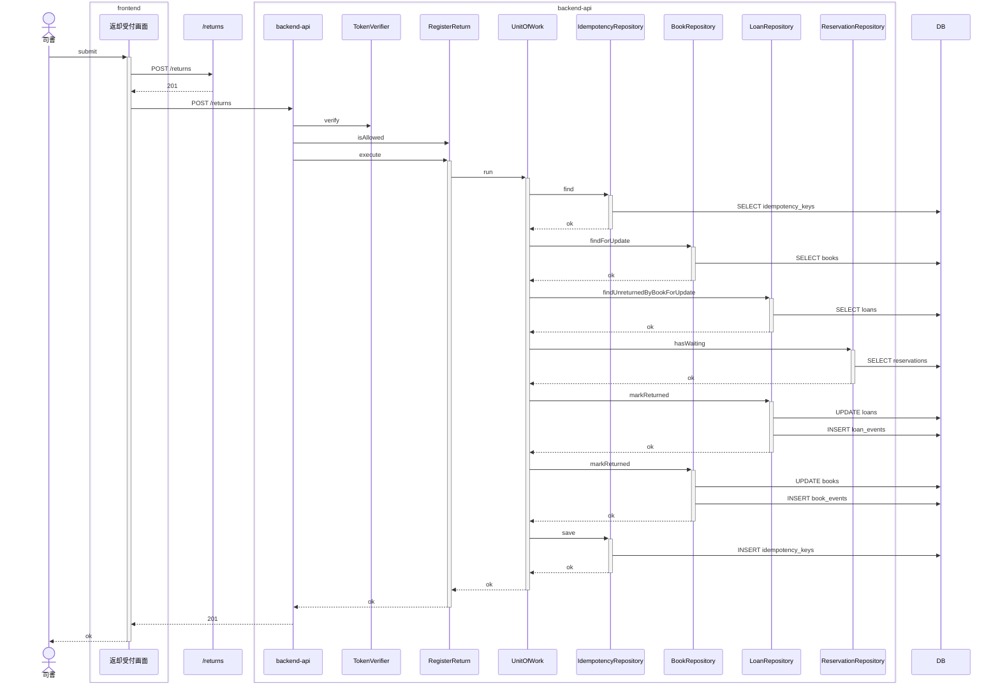
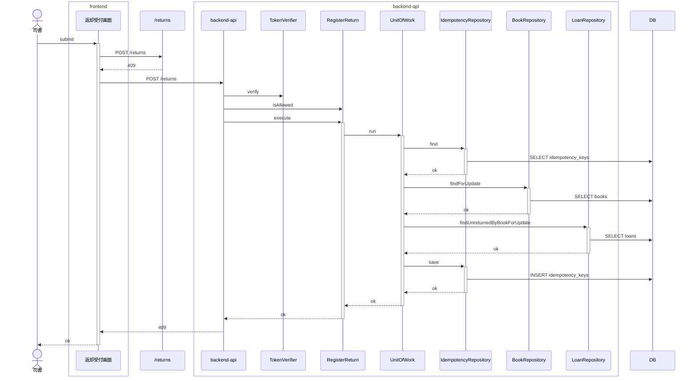

<!-- basis: requirements@affbf164e2f7afdb8468b05d8ca76387d572b634 adr@481506aca70dae9b5b64cefa6ea032e220651c7d contracts@affbf164e2f7afdb8468b05d8ca76387d572b634 | generated_at: 2026-09-26T04:26:30.681Z | slug: register-return -->

# 貸出業務 / 返却を登録する — 全シナリオのシーケンス (抽出)

アクターは 司書。正常系は [index.md](index.md) の「どう動くか」にも載せている。

## 予約のある貸出中の書籍の返却を登録する

## 予約のない貸出中の書籍の返却を登録する

## 延滞している書籍の返却を登録する

## 未返却の貸出が無い書籍は返却を登録できない

